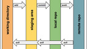
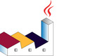
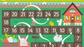
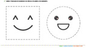

# Repositório de POO

- [00. Introdução](#00-introdução)
- [01. Lógica](#01-lógica)
- [02. Introdução e Modificadores de Acesso](#02-introdução-e-modificadores-de-acesso)
- [03. Agregação Simples](#03-agregação-simples)
- [04. ArrayList I - Listas](#04-arraylist-i---listas)
- [05. ArrayList II - Arrays de Null](#05-arraylist-ii---arrays-de-null)
- [08. ArrayList III - Composição](#08-arraylist-iii---composição)
- [10. Excessões](#10-excessões)
- [11. Mapas Exceções](#11-mapas-exceções)
- [12. Herança I](#12-herança-i)
- [13. Lógica I](#13-lógica-i)
- [14. Herança II](#14-herança-ii)
- [15. Lógica II](#15-lógica-ii)
- [16. Herança III](#16-herança-iii)

---

## 00. Introdução

\________________ | \______________________ 
---------------- | ------------------------
 | [@038 Introdução ao git](base/038/Readme.md#introdução-ao-git)
 | [@046 Configuração do C++](base/046/Readme.md#configuração-do-c)
 | [@045 Instalação Typescript](base/045/Readme.md#instalação-typescript)
 | [@044 Relacionamentos](base/044/Readme.md#relacionamentos)
 | [Rodando os exercícios e os testes no Replit]()

## 01. Lógica

Exercícios de fup para aquecer o coração e o cérebro.

\________________ | \______________________
---------------- | ------------------------
 | [@000 Estressados A: Busca](base/000/Readme.md#estressados-a-busca)
 | [@040 Estressados B: Contagem](base/040/Readme.md#estressados-b-contagem)
 | [@032 Estressados C: Tranformações](base/032/Readme.md#estressados-c-tranformações)
 | [@039 Estressados D: Controles](base/039/Readme.md#estressados-d-controles)

## 02. Introdução e Modificadores de Acesso

\________________ | \______________________
---------------- | ------------------------
 | [@001 Calculadora](base/001/Readme.md#calculadora)
 | [@002 Carro](base/002/Readme.md#carro)
 | [@036 Relógio](base/036/Readme.md#relógio)
 | [@006 Tamagotchi 💎](base/006/Readme.md#tamagotchi-)
 | [@017 Porquinho](base/017/Readme.md#porquinho)

## 03. Agregação Simples

\________________ | \______________________
---------------- | ------------------------
 | [@004 Grafite 🎥](base/004/Readme.md#grafite-)
 | [@003 Motoca](base/003/Readme.md#motoca)

## 04. ArrayList I - Listas

\________________ | \______________________
---------------- | ------------------------
 | [@037 Budega](base/037/Readme.md#budega)
 | [@009 Pula pula](base/009/Readme.md#pula-pula)
 | [@020 Lapiseira](base/020/Readme.md#lapiseira)
 | [@041 Tabuleiro](base/041/Readme.md#tabuleiro)

## 05. ArrayList II - Arrays de Null

\________________ | \______________________
---------------- | ------------------------
 | [@010 Cinema](base/010/Readme.md#cinema)
 | [@012 Topic](base/012/Readme.md#topic)

## 08. ArrayList III - Composição

\________________ | \______________________
---------------- | ------------------------
 | [@007 Tarifas](base/007/Readme.md#tarifas)
 | [@011 JunkFood](base/011/Readme.md#junkfood)
 | [@024 Mensagens](base/024/Readme.md#mensagens)
 | [@014 Contato](base/014/Readme.md#contato)
 | [@015 Busca](base/015/Readme.md#busca)

## 10. Excessões

\________________ | \______________________
---------------- | ------------------------
 | [@008 Agiota](base/008/Readme.md#agiota)
 | [@028 Bilheteria](base/028/Readme.md#bilheteria)

## 11. Mapas Exceções

\________________ | \______________________
---------------- | ------------------------
 | [@029 Anotações](base/029/Readme.md#anotações)
 | [@031 Pets](base/031/Readme.md#pets)

## 12. Herança I

\________________ | \______________________
---------------- | ------------------------
 | [@047 Shapes](base/047/Readme.md#shapes)
 | [@013 Cadastro](base/013/Readme.md#cadastro)
 | [@043 Cofre](base/043/Readme.md#cofre)

## 13. Lógica I

\________________ | \______________________
---------------- | ------------------------
 | [@021 Matrícula](base/021/Readme.md#matrícula)
 | [@025 Twitter](base/025/Readme.md#twitter)

## 14. Herança II

\________________ | \______________________
---------------- | ------------------------
 | [@023 Salário](base/023/Readme.md#salário)
 | [@022 Hospital](base/022/Readme.md#hospital)

## 15. Lógica II

\________________ | \______________________
---------------- | ------------------------
 | [@026 Whatsapp](base/026/Readme.md#whatsapp)
 | [@033 Trem](base/033/Readme.md#trem)

## 16. Herança III

\________________ | \______________________
---------------- | ------------------------
 | [@034 Carga](base/034/Readme.md#carga)
 | [@027 Grupos](base/027/Readme.md#grupos)

