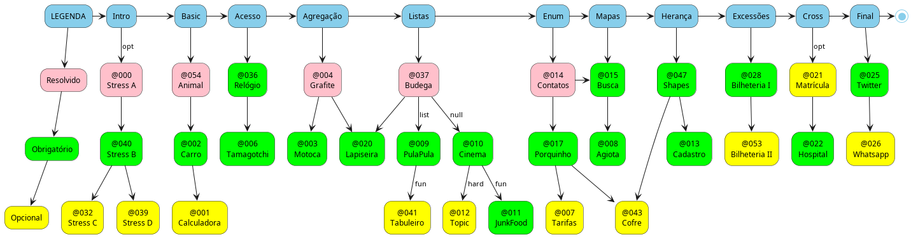

# Repositório de POO

## Guia de atividades 

<!-- toc -->
- [Configuração ](#configuração-)
  - [Configuração de ambiente](#configuração-de-ambiente)
  - [Conteúdo extra](#conteúdo-extra)
- [Operações em Array ](#operações-em-array-)
  - [Estressados Básicos](#estressados-básicos)
  - [Estressados Avançado](#estressados-avançado)
- [Introdução ](#introdução-)
  - [Entendendo Classes, a Main e os Testes](#entendendo-classes-a-main-e-os-testes)
  - [Modificadores de Acesso](#modificadores-de-acesso)
  - [Agregação Simples](#agregação-simples)
- [Listas ](#listas-)
  - [ArrayList I - Listas](#arraylist-i---listas)
  - [ArrayList II - Arrays de Null](#arraylist-ii---arrays-de-null)
  - [ArrayList III - Composição e Enum](#arraylist-iii---composição-e-enum)
- [Melhorando o código ](#melhorando-o-código-)
  - [Mapas && Exceções](#mapas--exceções)
  - [Mapas && Exceções II](#mapas--exceções-ii)
- [Polimorfismo ](#polimorfismo-)
  - [Herança I](#herança-i)
- [Relacionamentos NxN ](#relacionamentos-nxn-)
  - [Referências Cruzadas](#referências-cruzadas)
- [Futuro ](#futuro-)
  - [Em atualização](#em-atualização)
  - [Rascunhos](#rascunhos)
<!-- toc -->

---

## Configuração <!-- group -->

### Configuração de ambiente

- [Introdução ao git](pages/git/README.md)
- [Instalação C++ e TS](pages/instalacao/README.md)
- [Instalando e configurando o tko](https://github.com/senapk/tko#tko---test-kit-operations)
- [Biblioteca auxiliar de Entrada e Saída para C++](https://github.com/senapk/cppaux#requisitos)
- [Rodando questões no Replit](https://github.com/senapk/tko/blob/master/replit/Readme.md)

### Conteúdo extra

- [Relacionamentos](pages/relacionamento/README.md) <!-- @relacionamentos -->
- [Relacionamentos Resumo](pages/uml/README.md) <!-- @uml -->
- [Como fazer os códigos e relatórios](pages/relatorio/README.md) <!-- @relatorios -->
- [Criando a Main](pages/main/README.md) <!-- @main -->
- [Pesquisa sobre alocação de memória](pages/memoria/README.md)

## Operações em Array <!-- group -->

### Estressados Básicos

- [@busca - Operações I](base/busca/Readme.md)
- [@contagem - Operações II](base/contagem/Readme.md)

### Estressados Avançado

- [@manipulacao - Operações III](base/manipulacao/Readme.md)
- [@especiais - Operações IV](base/especiais/Readme.md)

## Introdução <!-- group -->

### Entendendo Classes, a Main e os Testes

- [@animal - Nasce, cresce, morre](base/animal/Readme.md)
- [@carro - Se não pode comprar um, construa](base/carro/Readme.md)
- [@calculadora - Cuidado com a bateria](base/calculadora/Readme.md)

### Modificadores de Acesso

- [Garante uma hora válida no @relogio](base/relogio/Readme.md)

### Agregação Simples

- [@grafite - Porta minas](base/grafite/Readme.md)
- [@motoca - Passeando no parque](base/motoca/Readme.md)
- [@tamagotchi - Alimente, brinque e mate](base/tamagotchi/Readme.md)

## Listas <!-- group -->

### ArrayList I - Listas

- [@budega - Gerencie a fila de espera e atendimento](base/budega/Readme.md)
- [@pula-pula - Gerenciando entradas e saídas](base/pula-pula/Readme.md)
- [@lapiseira - Gerenciando os múltiplos grafites](base/lapiseira/Readme.md)
- [@tabuleiro - Cuidado com as armadilhas](base/tabuleiro/Readme.md)

### ArrayList II - Arrays de Null

- [@cinema - Gerenciando reservas e cancelamentos de uma sala de cinema](base/cinema/Readme.md)
- [@topic - Gerenciando assentos prioritários e normais](base/topic/Readme.md)
- [@junkfood - Comprando comida cara e duvidosa](base/junkfood/Readme.md)

### ArrayList III - Composição e Enum

- [@contato - Gerenciando Telefones](base/contato/Readme.md)
- [@porquinho - Guardando moedas e itens em um cofrinho](base/porquinho/Readme.md)
- [@tarifas - Operações de saque, depósito, extrato](base/tarifas/Readme.md)

## Melhorando o código <!-- group -->

### Mapas && Exceções

- [@agenda - Gerencie os vários contatos](base/agenda/Readme.md)
- [@agiota - Gerencie os empŕestimos](base/agiota/Readme.md)

### Mapas && Exceções II

- [@evento - bilheteria](base/evento/Readme.md)
- [@setor - eventos da bilheteria](base/setor/Readme.md)

## Polimorfismo <!-- group -->

### Herança I

- [@shapes - Utilizando interface em círculos e retângulos](base/shapes/Readme.md)
- [@estacionamento - Cobrando o valor de carros e motos](base/estacionamento/Readme.md)
- [@cofre - Seu porquinho cresceu](base/cofre/Readme.md)
- [@cadastro - Crie as contas poupança e corrente](base/cadastro/Readme.md)
- [@perimetro - De círculos e retângulos, calcule a área e](base/perimetro/Readme.md)

## Relacionamentos NxN <!-- group -->

### Referências Cruzadas

- [Garanta os vínculos cruzados entre alunos e disciplinas na @matricula](base/matricula/Readme.md)
- [Agora é X, mas antes era @twitter](base/twitter/Readme.md)

## Futuro <!-- group -->

### Em atualização

- [@salario](base/salario/Readme.md)
- [@comunicador](base/comunicador/Readme.md)
- [@paciente](base/paciente/Readme.md)
- [@whatsapp](base/whatsapp/Readme.md)
- [Um trem com vagões de @carga](base/carga/Readme.md)
- [@grupo](base/grupo/Readme.md)
- [@mensagem](base/mensagem/Readme.md)
- [@vetores](base/vetores/Readme.md)
- [@ligacao](base/ligacao/Readme.md)
- [@petshop](base/petshop/Readme.md)
- [Adicione título e texto em @anotacoes](base/anotacoes/Readme.md)
- [Cache e redundância em @favoritos](base/favoritos/Readme.md)
- [@trem](base/trem/Readme.md)

### Rascunhos

- [@produto - Padrão Composite e Decorator](base/produto/Readme.md)
