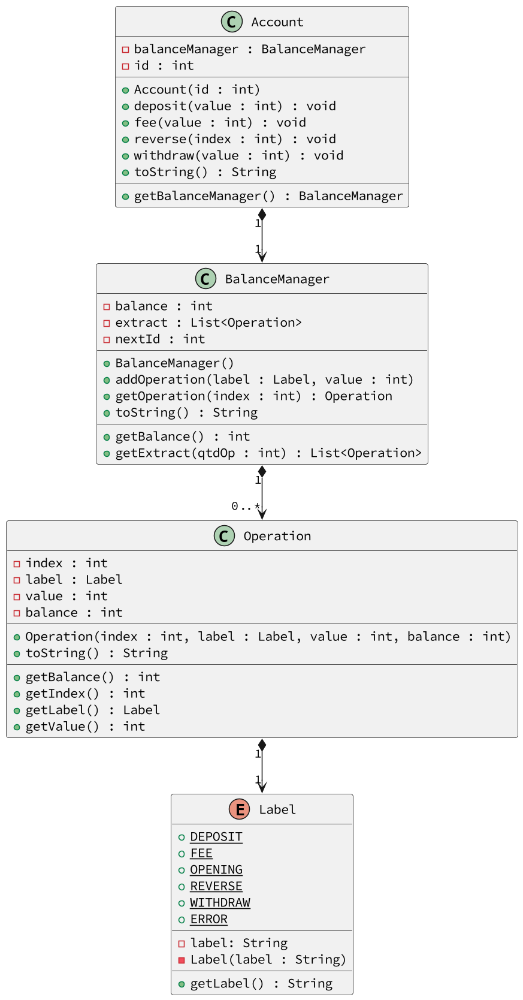

# Tarifas & Banco 1: Saque, Transferência, Depósito, Extrato, Tarifas e Extorno


[](toc)

- [Requisitos](#requisitos)
- [Shell](#shell)
- [Diagrama UML](#diagrama-uml)
- [Esqueleto](#esqueleto)
[](toc)

O objetivo dessa atividade é implementar uma classe responsável por gerenciar a account bancária de um único cliente. Faremos operações de withdraw, depósito e extrato.

## Requisitos

- **Iniciar**
    - Iniciar a account passando número da account.
    - Se a account já existir, resete todos os valores para uma nova account.
    - Inicia a account com a operação de "abertura".
    - Para facilitar a visualização dos dados, utilize inteiros para registrar as operações financeiras.
- **Saque, Depósito e Tarifas**
    - Verifique se o valor é válido.
    - No caso da tarifa, o valor final de saldo poderá ser negativo.
    - No caso do withdraw, verifique se há saldo suficiente efetuar a operação. 
- **Retornar o extrato**.
    - Extrato completo
        - Retornar todas as movimentações da conta desde a abertura
        - A descrição pode ser "opening", "withdraw", "deposit", "fee", "reverse".
        - Os saques devem ter valor negativo e os depósitos positivos.
- **Extrato parcial**
      - Mostre as últimas N operações do extrato.
- **Extornar tarifas**.
    - Deve ser possível extornar, pagando de volta, tarifas passando uma lista de índices.
    - Apenas efetue a operação de extorno dos índices válidos que forem tarifas.

***
## Shell

```bash
#__case iniciar
$init 100
$show 
account:100 balance:0

#__case depositar
$deposit 100
$deposit -10
fail: invalid value
$show
account:100 balance:100

#__case debito
$withdraw 20
$fee 10
$show
account:100 balance:70
$withdraw 150
fail: insuficient balance
$withdraw 30
$fee 5
$deposit 5
$fee 1
$show
account:100 balance:39

#__case extrato
#extrato mostra todas as operações desde a abertura da account
$extract
 0:  opening:    0:    0
 1:  deposit:  100:  100
 2: withdraw:  -20:   80
 3:      fee:  -10:   70
 4: withdraw:  -30:   40
 5:      fee:   -5:   35
 6:  deposit:    5:   40
 7:      fee:   -1:   39

#__case extrato n
#extratoN mostra as ultimas N operacoes
$extractN 2
 6:  deposit:    5:   40
 7:      fee:   -1:   39

#__case extornar
$reverse 1 5 7 50
fail: index 1 is not a fee
fail: index 50 invalid

#__case novo extrato
$extract
 0:  opening:    0:    0
 1:  deposit:  100:  100
 2: withdraw:  -20:   80
 3:      fee:  -10:   70
 4: withdraw:  -30:   40
 5:      fee:   -5:   35
 6:  deposit:    5:   40
 7:      fee:   -1:   39
 8:  reverse:    5:   44
 9:  reverse:    1:   45

#__case extrato tarifa
$fee 50
$extractN 2
 9:  reverse:    1:   45
10:      fee:  -50:   -5

$end
```

***
## Diagrama UML
Os gets e sets estão marcados em separado para facilitar a visualização dos métodos importantes.



***
## Esqueleto
<!--FILTER Solver.java java-->
```java
//Essa enumeração guarda possíveis labels para as operações.
enum Label {
    withdraw("withdraw"), //saque
    deposit("deposit"),   //deposito
    fee("fee"),           //tarifa
    reverse("reverse"),   //extorno de tarifa
    opening("opening");   //abertura da conta
    
    private String name;
    //nas enums o Construtor tem que ser privado
    private Label(String name) {
        this.name = name;
    }
    String getName() {
        return this.name;
    }
    public String toString() {
        return this.name;
    }
}

//Operação guarda os dados de uma única operação.
class Operation {
    private int index;    
    private Label label;
    //O valor em negativo se for débito
    private int value;
    //O saldo residual
    private int balance;
    public Operation(int index, Label label, int value, int balance) {
        this.index = index;
        this.label = label;
        this.value = value;
        this.balance = balance;
    }
    //faz o preenchimento da string com espaços em branco até completar o length
    public static String pad(String string, int length) {
        return String.format("%1$"+length+ "s", string);
    }
    public String toString() {
        return pad("" + index, 2) + ":" + pad("" + label, 9) + ":" + pad("" + value, 5) + ":" + pad("" + balance, 5);
    }
    int getIndex() {
        return this.index;
    }
    Label getLabel() {
        return this.label;
    }
    int getValue() {
        return this.value;
    }
    int getBalance() {
        return this.balance;
    }
};
//Nessa classe são efetivadas e registradas as alterações no saldo
class BalanceManager {
    //O id da próxima operação dessa conta
    private int nextId;
    //A lista de operações realizadas
    private List<Operation> extract;
    private int balance;
    public BalanceManager();
    //Adiciona value ao balance
    //Crie operação e adiciona ao vetor de operações
    //Incrementa o nextId
    public void addOperation(Label label, int value);
    int getBalance();
    List<Operation> getExtract();
    //metodo sobrescrito para retornar apenas as últimas qtdOp operações
    public List<Operation> getExtract(int qtdOp);
    public String toString();
}
class Account {
    //O número da conta
    private int id;
    private BalanceManager balanceManager;
    public Account(int id);
    //só realiza a operação se houver dinheiro suficiente na conta
    public boolean withdraw(int value);
    //retira o dinheiro, mesmo que o balance fique negativo
    public boolean fee(int value);
    //se o índice for válido e representar uma operação de fee
    //adicione o mesmo valor tarifado, mas com label de reverse
    public boolean reverse(int index);
    //adiciona valor à conta
    public boolean deposit(Label label, int value);
    public String toString();
    BalanceManager getBalanceManager();
}
class Solver{
    public static void main(String[] args) {
        Scanner scanner = new Scanner(System.in);
        Account conta = new Account(0);
        while(true){
            String line = scanner.nextLine();
            System.out.println("$" + line);
            List<String> ui = Arrays.asList(line.split(" "));
            if(line.equals("end")) {
                break;
            } else if(ui.get(0).equals("show")) {
                System.out.println(conta);
            } else if(ui.get(0).equals("init")) {
                conta = new Account(Integer.parseInt(ui.get(1)));
            } else if(ui.get(0).equals("withdraw")) {
                conta.withdraw(Integer.parseInt(ui.get(1)));
            } else if(ui.get(0).equals("fee")) {
                conta.fee(Integer.parseInt(ui.get(1)));
            } else if(ui.get(0).equals("deposit")) {
                conta.deposit(Label.deposit, Integer.parseInt(ui.get(1)));
            } else if(ui.get(0).equals("reverse")) {
                final Account aux = conta;
                ui.stream().skip(1).forEach(index -> aux.reverse(Integer.parseInt(index)));
            } else if(ui.get(0).equals("extract")) {
                conta.getBalanceManager().getExtract().forEach(System.out::println);
            } else if(ui.get(0).equals("extractN")) {
                conta.getBalanceManager().getExtract(Integer.parseInt(ui.get(1))).forEach(System.out::println);
            } else {
                System.out.println("fail: comando invalido");
            }
        }
        scanner.close();
    }
}
```
<!--FILTER_END-->

