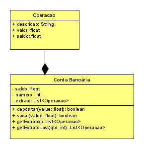

# Agência 1 - Extrato, Saldo, Tarifas


<!--TOC_BEGIN-->
- [Requisitos](#requisitos)
- [Shell](#shell)
- [Main em Java](#main-em-java)
- [Diagrama UML](#diagrama-uml)
- [Recursos Extras](#recursos-extras)

<!--TOC_END-->

O objetivo dessa atividade é implementar uma classe responsável por gerenciar a conta bancária de um único cliente. Faremos operações de saque, depósito e extrato.

## Requisitos

- **Iniciar**
    - Iniciar a conta passando número da conta.
    - Se a conta já existir, resete todos os valores para uma nova conta.
    - Verificar saldo.
- **Saque, Depósito e Tarifas**
    - Verifique se o valor é válido.
    - No caso da tarifa, o valor final de saldo poderá ser negativo.
    - No caso do saque, verifique se há saldo suficiente efetuar a operação. 
- **Retornar o extrato**.
    - Extrato completo
        - Retornar todas as movimentações da conta desde a abertura
        - A descrição pode ser "abertura", "saque", "deposito", "tarifa", "extorno".
        - Os saques devem ter valor negativo e os depósitos positivos.
- **Extrato parcial**
      - Mostre as últimas N operações do extrato.
- **Extornar tarifas**.
    - Deve ser possível extornar, pagando de volta, tarifas passando uma lista de índices.
    - Apenas efetue a operação de extorno dos índices válidos que forem tarifas.

***
## Shell

```bash
#__case iniciar
$init 100
$show 
conta:100 saldo:0

#__case 
$deposito 100
$deposito -10
fail: valor invalido
$show
conta:100 saldo:100

#__case debito
$saque 20
$tarifa 10
$show
conta:100 saldo:70
$saque 150
fail: saldo insuficiente
$saque 30
$tarifa 5
$deposito 5
$tarifa 1
$show
conta:100 saldo:39

#__case extrato
#extrato mostra todas as operações desde a abertura da conta
$extrato
 0: abertura:    0:    0
 1: deposito:  100:  100
 2:    saque:  -20:   80
 3:   tarifa:  -10:   70
 4:    saque:  -30:   40
 5:   tarifa:   -5:   35
 6: deposito:    5:   40
 7:   tarifa:   -1:   39

#__case extrato n
#extratoN mostra as ultimas N operacoes
$extratoN 2
 6: deposito:    5:   40
 7:   tarifa:   -1:   39

#__case extornar
$extornar 1 5 7 50
fail: indice 1 nao e tarifa
fail: indice 50 invalido

#__case novo extrato
$extrato
 0: abertura:    0:    0
 1: deposito:  100:  100
 2:    saque:  -20:   80
 3:   tarifa:  -10:   70
 4:    saque:  -30:   40
 5:   tarifa:   -5:   35
 6: deposito:    5:   40
 7:   tarifa:   -1:   39
 8:  extorno:    5:   44
 9:  extorno:    1:   45

#__case extrato tarifa
$tarifa 50
$extratoN 2
 9:  extorno:    1:   45
10:   tarifa:  -50:   -5

$end
```
## Main em Java
```java
import java.util.*;

interface Conta{
    void depositar(float value);
    void saque(float valor);
    void tarifa(float valor);
    void extrato();
    void extratoN(int valor);
    void extornar(int valor)
}
public class Solver {
    public static void main(String[] args) {
        Conta sys = new Conta(100);
        System.out.println(sys);
/*
    conta:100 saldo:0
*/
        sys.depositar(100);
        sys.depositar(-10);
/*
    fail: valor invalido
*/
        System.out.println(sys);
/*
    conta:100 saldo:100
*/
        sys.saque(20);
        sys.tarifa(10);
        System.out.println(sys);
/*
    conta:100 saldo:70
*/
        sys.saque(150);
/*
    fail: saldo insuficiente
*/
        sys.saque(30);
        sys.tarifa(5);
        sys.depositar(5);
        sys.tarifa(1);
        System.out.println(sys);
/*
    conta:100 saldo:39
*/
        sys.extrato();
/*
0: abertura:    0:    0
1: deposito:  100:  100
2:    saque:  -20:   80
3:   tarifa:  -10:   70
4:    saque:  -30:   40
5:   tarifa:   -5:   35
6: deposito:    5:   40
7:   tarifa:   -1:   39
*/
        sys.extratoN(2);
/*
6: deposito:    5:   40
7:   tarifa:   -1:   39
*/
        for(int id : Arrays.asList(1, 5, 7, 50))
            sys.extornar(id);
/*
fail: indice 1 nao e tarifa
fail: indice 50 invalido
*/
        sys.extrato();
/*
0: abertura:    0:    0
1: deposito:  100:  100
2:    saque:  -20:   80
3:   tarifa:  -10:   70
4:    saque:  -30:   40
5:   tarifa:   -5:   35
6: deposito:    5:   40
7:   tarifa:   -1:   39
8:  extorno:    5:   44
9:  extorno:    1:   45
*/
        sys.tarifa(5);
        sys.extratoN(2);
/*
9:  extorno:    1:   45
10:   tarifa:  -50:   -5
*/
    }
}
```

## Diagrama UML


***
## Recursos Extras
- [Comandos de teste](resources/testes.tio)
- [Modelo em C++](resources/raiox.cpp)
- [Exemplo Main em C++](resources/exemplo_main.cpp)