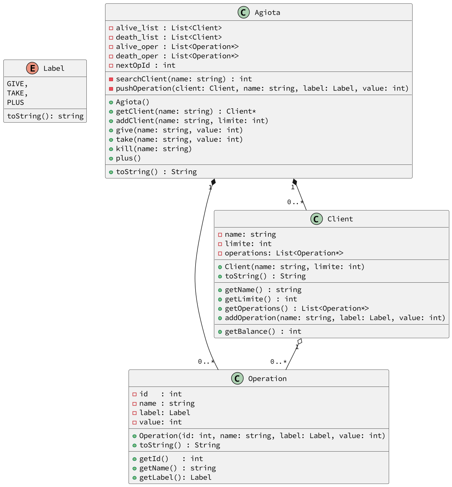

# Agiota


[](toc)

- [Intro](#intro)
- [Shell](#shell)
- [Diagrama](#diagrama)
- [Main](#main)
- [Fim da história](#fim-da-história)
[](toc)

Ptolomeu é o agiota mais carismático de MoneyVille. Sem nenhuma razão foi denunciado e acabou indo pra cadeira. A lasqueira foi que ele afirma que quem implementou o software de controle dos empréstimos e quem apagou os registro dos defuntos foi você.

Seu Plutolomeu é um agiota que empresta dinheiro a juros 0. Ele é uma pessoa muito carismática e amiga de todos. De sorriso largo sempre aberto, Plutolomeu é amigo da vizinhança. Inclusive esse ano, ele ganhou uma festa de aniversário surpresa de todos os seus devedores. Só quem é gente muito fina ganha festa surpresa né?

**Um, pelo menos foi isso que ele disse pra polícia quando foi pego em flagrante com 50 mil reais escondidos debaixo do colchão!**

Vamos abstrair um pouco da história de Plutolomeu e analisar o sistema de empréstimos que ele tinha instalado em seu computador.

***

## Intro

- Iniciar Sistema.
  - Inicia o sistema com uma certa quantidade de dinheiro.

- Cadastrar Clientes
  - Cada cliente cadastrado tem um codenome único e um limite de crédito que ele pode ficar devendo ao agiota.

- Emprestar Dinheiro.
  - Empréstimos são salvos com valor positivo de transação.
  - Cada transação deve receber do sistema um identificador numérico crescente.
  - A primeira transação tem id 0. A segunda tem id 1 e etc.
  - Ptolomeu não pode emprestar dinheiro se não tiver dinheiro suficiente.
  - Uma transação tem um clienteId e um valor numérico.

- Mostrar todos os clientes com o saldo de cada um.

- Mostrar o histórico de transações de Ptolomeu.

- Receber dinheiro.
  - Clientes pagam os empréstimos aos poucos.
  - O cliente não pode pagar mais do que está devendo.

- Matar um cliente.
  - As vezes Ptolomeu dá um chá de sumiço em quem não paga suas dívidas. Pra não deixar pontas soltas ele precisa apagar as transações do histórico e remover o cliente da lista.
  - Apagar as transações não altera o saldo de Ptolomeu.

***

## Shell

```bash
#__case init
$init 500

#__case cadastrar
$addCli maria 500
$addCli josue 60
$addCli maria 300
fail: cliente ja existe

#__case emprestar
$lend maria 300
$lend josue 50
$lend maria 100

#__case show
# Mostra os cliente ordenados por codenome
# Mostra as operações pela ordem que elas ocorreram
$show
clients:
- josue:50/60
- maria:400/500
transactions:
- id:0 maria:300
- id:1 josue:50
- id:2 maria:100
balance: 50

# __case erros no emprestimo
$lend bruno 30
fail: cliente nao existe

$lend maria 60
fail: fundos insuficientes

$lend josue 30
fail: limite excedido

$show
clients:
- josue:50/60
- maria:400/500
transactions:
- id:0 maria:300
- id:1 josue:50
- id:2 maria:100
balance: 50

#__case receber dinheiro
$receive maria 1000
fail: valor maior que a divida
$receive maria 350
$receive josue 1
$receive maria 10
$show
clients:
- josue:49/60
- maria:40/500
transactions:
- id:0 maria:300
- id:1 josue:50
- id:2 maria:100
- id:3 maria:-350
- id:4 josue:-1
- id:5 maria:-10
balance: 411

#__case matar
$kill maria
$show
clients:
- josue:49/60
transactions:
- id:1 josue:50
- id:4 josue:-1
balance: 411

$end
```

***

## Diagrama


***

## Main
```java
    Agiota ag = new Agiota(500);
    ag.addCli("maria", 500);
    ag.addCli("josue", 60);
    ag.addCli("maria", 300); //fail

    ag.lend("maria", 300);
    ag.lend("josue", 50);
    ag.lend("maria", 100);

    System.out.println(ag); //check

    ag.lend("bruno", 30);//fail
    ag.lend("maria", 60);//fail
    ag.lend("josue", 30);//fail

    System.out.println(ag); //check

    ag.receive("maria", 1000);//fail
    ag.receive("maria", 350);
    ag.receive("josue", 1);
    ag.receive("maria", 10);

    System.out.println(ag); //check

    ag.kill("maria");

    System.out.println(ag); //check
}

```

***

## Fim da história

- Então assim ficou Ptolomeu, depois de conseguir explicar pra polícia que tudo não passou me um mal entendido. 
    - *Essa explicação custou 20.000 reais*, mas isso é detalhe, ninguém comenta.


