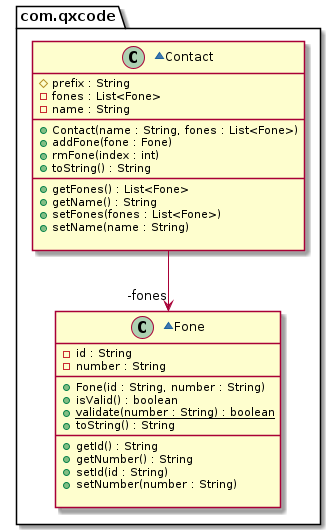

# Contato


[](toc)

- [Intro](#intro)
- [Guide](#guide)
- [Shell](#shell)
[](toc)

O objetivo dessa atividade é implementar uma classe responsável por guardar um **único** contato da agenda telefônica do seu celular. Cada contato pode ter vários telefones.

## Intro

Seu programa deve:

- **Definir nome**
  - Poder inicializar o contato passando o nome.
    - Se já houver contato, inicie um novo contato.
    - Se não houver nome, o nome default é "".
- **Inserir telefones no contato**
  - Um telefone tem um label e um fone.
  - Labels serão nomes como: casa, fixo, oi.
  - Labels podem ser duplicados.
  - Adapte o print para apresentar os índices.

```sh
# Exemplo de saída
- ana [0:tim:3434] [1:casa:4567] [2:oi:8754] [3:casa:4567] [4:oi:8754]
```

- **Remover telefones do contato.**
  - Remove os telefones pelo indice.
- **Validando os números de telefone.**
  - Processe os telefones para apenas permitir nos telefones os seguintes caracteres "0123456789()."
  - Se o usuário tentar inserir individualmente um telefone invalido, avise e não insira o telefone.

***

## Guide



[](load)[](diagrama.puml)[](filter:fenced:plantuml)

```plantuml
class Contact {
  # prefix : String
  - fones : List<Fone>
  - name : String
  __
  
  ' crie um ArrayList para o ATRIBUTO fones
  ' se a variável fones não for null, adicione todos os fones usando o método addFone
  + Contact(name : String, fones : List<Fone>)
  
  ' se fone for válido, insira no atributo fones
  ' se não, informe o erro
  + addFone(fone : Fone)
  
  ' se o índice existir no ArrayList, remova o telefone com esse índice
  + rmFone(index : int)
  
  ' use um contador para mostrar o índice do telefone
  ' use o toString do fone para adicioná-lo à saída
  ' o resultado dever ficar assim:
  ' ex: - david [0:oi:123] [1:tim:9081] [2:claro:5431]
  + toString() : String
  __
  + getFones() : List<Fone>
  + getName() : String
  
  ' limpe a lista de fones
  ' utilize o addFone para adicionar apenas os fones válidos
  + setFones(fones : List<Fone>)
  + setName(name : String)
}

class Fone {
  - id : String
  - number : String
  __
  + Fone(id : String, number : String)
  
  ' utiliza o static validate para retornar se essa instancia do fone é valida
  + isValid() : boolean
  
  ' verifica se o número é um número de telefone válido
  + validate(number : String) : boolean {static}
  
  ' o resultado deve ficar assim
  ' ex: oi:1234
  + toString() : String
  __
  
  + getId() : String
  + getNumber() : String
  + setId(id : String)
  + setNumber(number : String)
}
```

[](load)

***

## Shell

```bash
#__case definindo nome
$init david
$show
- david

#__case inserindo telefones
$add oi 88
$add tim 99
$add tim 98
$add vivo 83
$show
- david [0:oi:88] [1:tim:99] [2:tim:98] [3:vivo:83]

#__case removendo telefone por indice
$rm 2
$show
- david [0:oi:88] [1:tim:99] [2:vivo:83]
$rm 0
$show
- david [0:tim:99] [1:vivo:83]

#__case validando numero de fone
$add tim 9a9
fail: invalid number
$add tim (85)99.99
$show
- david [0:tim:99] [1:vivo:83] [2:tim:(85)99.99]
$end
#__end__
```
