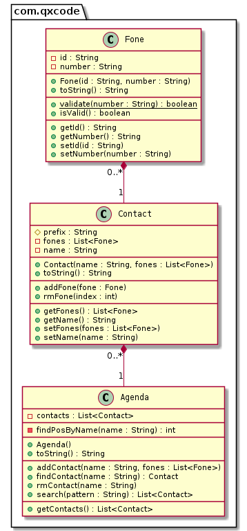

# Busca & Agenda 2: ordenação de vetores, operação de filtragem


[](toc)

- [Requisitos Novos](#requisitos-novos)
- [Shell](#shell)
- [Diagrama](#diagrama)
- [Esqueleto](#esqueleto)
[](toc)

Sua agenda possui vários contatos e cada contato possui vários telefones.

Implemente a classe Contact e Fone utilizando as regras descritas no projeto Contato ou reaproveite o código que você fez.

***

## Requisitos Novos
- Adicionar
    - O contato possui o nome como chave.
    - Se tentar adicionar outro contato com o mesmo nome, adicione os telefones ao contato existente.
    - Adicionar os novos números de telefone no contato já existente.
- Agenda
    - Mostrar os contatos da agenda pela ordem alfabética.
- Remoção
    - Remover contato pela chave.
    - Remover telefone do contato.
- Busca
    - Fazer uma busca por padrão em todos os atributos do contato, nome e telefones.
    - Se o contato tiver qualquer campo que combine com a string pattern de busca, ele deve ser retornado. Se o pattern é maria, devem ser retornados os contatos como "maria julia", "mariana", "ana maria", etc. Também inclua na busca o id do telefone ou o número do telefone.


## Shell

```python
#__case adicionando em lote
$add eva oio:8585 cla:9999
$add ana tim:3434 
$add bia viv:5454

# como ana já existe, não crie um novo contato
# adicione os telefones ao contato existente
$add ana cas:4567 oio:8754

$show
- ana [0:tim:3434] [1:cas:4567] [2:oio:8754]
- bia [0:viv:5454]
- eva [0:oio:8585] [1:cla:9999]


#__case removendo telefone
# remove o elemento indice 0 da ana
$rmFone ana 0

$show
- ana [0:cas:4567] [1:oio:8754]
- bia [0:viv:5454]
- eva [0:oio:8585] [1:cla:9999]

#__case removendo contato
$rm bia

$show
- ana [0:cas:4567] [1:oio:8754]
- eva [0:oio:8585] [1:cla:9999]

$add ava tim:5454
$add rui viv:2222 oio:9991
$add zac rec:3131

$show
- ana [0:cas:4567] [1:oio:8754]
- ava [0:tim:5454]
- eva [0:oio:8585] [1:cla:9999]
- rui [0:viv:2222] [1:oio:9991]
- zac [0:rec:3131]

#__case busca por padrao
$search va
- ava [0:tim:5454]
- eva [0:oio:8585] [1:cla:9999]

$search 999
- eva [0:oio:8585] [1:cla:9999]
- rui [0:viv:2222] [1:oio:9991]

$end

#__end__
```
***

## Diagrama


## Esqueleto

<!--FILTER Solver.java java-->
```java
class Agenda {
    private List<Contact> contacts;
    public Agenda();
    //retorna a posição do contato com esse nome no vetor ou -1 se não existir.
    private int findPosByName(String name);
    //retorna o objeto contato com esse nome ou null se não existir
    //utilize o método findPos
    public Contact findContact(String name);
    //se nenhum contato existir com esse nome, adicione
    //se ja existir, faça o merge adicionando os telefones
    //se tiver adicionado um novo contato, ordene a lista para ficar em ordem alfabética
    public void addContact(Contact contact);
    //Utilize o método findPos
    public void rmContact(String name);
    //Monte uma lista auxiliar procurando no .toString() de cada contato
    //se ele possui a substring procurada.
    public List<Contact> search(String pattern);
    public List<Contact> getContacts();
    public String toString();
}
class Solver {
        //cria um contato a partir do vetor de entrada tal como
        //add joao oi:123 tim:432 claro:09123
        static Contact parseContact(String[] ui) {
            return new Contact(ui[1], Arrays.asList(ui).stream()
                .skip(2).map(token -> new Fone(token.split(":")[0], token.split(":")[1]))
                .collect(Collectors.toList()));
        }
        public static void main(String[] args) {
            Scanner scanner = new Scanner(System.in);
            Agenda agenda = new Agenda();
            while(true){
                String line = scanner.nextLine();
                System.out.println("$" + line);
                String ui[] = line.split(" ");
                if(ui[0].equals("end")) {
                    break;
                } else if(ui[0].equals("init")) {
                    agenda = new Agenda();
                } else if(ui[0].equals("add")) { //name label:fone label:fone label:fone
                    agenda.addContact(Solver.parseContact(ui));
                } else if(ui[0].equals("rm")) { //name
                    agenda.rmContact(ui[1]);;
                } else if(ui[0].equals("rmFone")) { //name index
                    agenda.findContact(ui[1]).rmFone(Integer.parseInt(ui[2]));
                } else if(ui[0].equals("show")) {
                    System.out.println(agenda);
                } else if(ui[0].equals("search")) {
                    System.out.println(agenda.search(ui[1]).stream().map(c -> "" + c).collect(Collectors.joining("\n")));
                } else {
                    System.out.println("fail: invalid command");
                }
            }
            scanner.close();
        }
    }
```
<!--FILTER_END-->