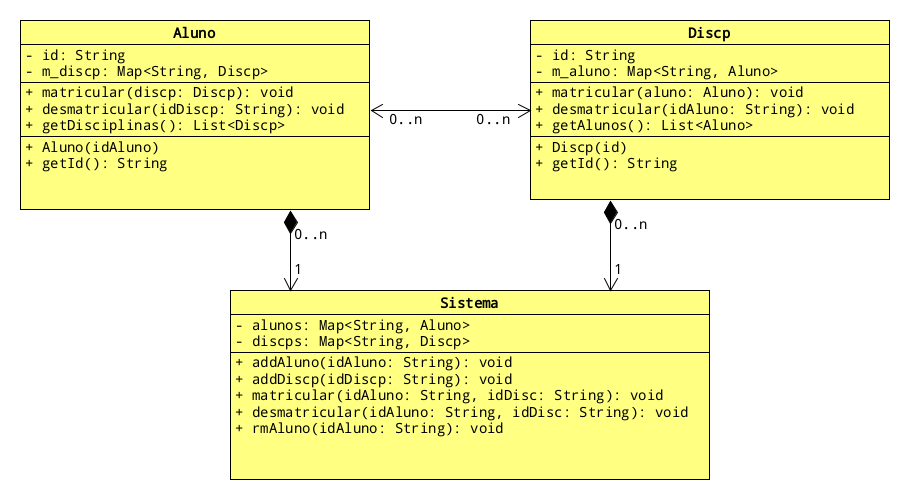

# Época de Matrícula - Associação NxN

<!--TOC_BEGIN-->
- [Funcionalidades](#funcionalidades)
- [Shell](#shell)
- [Diagrama](#diagrama)
- [Raio X em Java](#raio-x-em-java)
- [Raio X em C++](#raio-x-em-c)
- [Main interativa em C++](#main-interativa-em-c)
- [Comandos de Teste](#comandos-de-teste)
- [Main não interativa em C++](#main-não-interativa-em-c)

<!--TOC_END-->


Vamos criar um sistema da cadastro de alunos e disciplinas. Após isso, vamos matricular e remover alunos das disciplinas. Aqui, cada aluno sabe quais as disciplinas em que está matriculado e a disciplina sabe os alunos que ela contém.

## Funcionalidades

- **Repositórios Individuais - 3.0 P**
    - Adicionar aluno passando id do aluno.
    - Mostrar os todos os alunos cadastrados.
    - Adicionar disciplina passando o id da disciplina.
    - Mostrar as todas as disciplinas cadastradas.

- **Realizar Matrícula - 4 P**
    - Matricular o aluno em uma ou mais disciplinas.
    - Mostrar as disciplinas de um aluno.
    - Mostrar os alunos de uma disciplina.

- **Desmatricular - 2.0 P**
    - Remover disciplinas de um aluno.

- **Removendo alunos do sistema - 1.0 P**
    - Remover aluno mantendo a integridade do sistema.

## Shell

```bash
#__case adicionando alunos ao sistema
# nwalu _name _name ...
$nwalu alice edson bruno

# adicionando disciplinas ao sistema
# nwdis _disc _disc
$nwdis poo aps
$nwdis fup

# show mostra alunos e disciplinas
$show
alunos:
    alice [ ]
    bruno [ ]
    edson [ ]
discps:
    aps [ ]
    fup [ ]
    poo [ ]

#__case matriculando alunos
# tie _aluno _disc _disc ...
$tie bruno fup aps poo
$tie alice fup poo
$tie edson fup

$show
alunos:
    alice [ fup poo ]
    bruno [ aps fup poo ]
    edson [ fup ]
discps:
    aps [ bruno ]
    fup [ alice bruno edson ]
    poo [ alice bruno ]

#__case desmatriculando alunos
# untie _aluno _disc _disc ...
$untie bruno poo aps
$show
alunos:
    alice [ fup poo ]
    bruno [ fup ]
    edson [ fup ]
discps:
    aps [ ]
    fup [ alice bruno edson ]
    poo [ alice ]

#__case removendo alunos do sistema
# rmalu _aluno
$rmalu alice

$show
alunos:
    bruno [ fup ]
    edson [ fup ]
discps:
    aps [ ]
    fup [ bruno edson ]
    poo [ ]
$end
```

***
## Diagrama


***
## Raio X em Java

````java
class Aluno
- id: String
- m_discp: Map<String, Discp>
--
+ matricular(discp: Discp): void
+ desmatricular(idDiscp: String): void
+ getDisciplinas(): List<Discp>
--
+ Aluno(idAluno)
+ getId(): String


class Discp
- id: String
- m_aluno: Map<String, Aluno>
--
+ matricular(aluno: Aluno): void
+ desmatricular(idAluno: String): void
+ getAlunos(): List<Aluno>
--
+ Discp(id)
+ getId(): String

class Sistema
- alunos: Map<String, Aluno>
- discps: Map<String, Discp>
--
+ addAluno(idAluno: String): void
+ addDiscp(idDiscp: String): void
+ matricular(idAluno: String, idDisc: String): void
+ desmatricular(idAluno: String, idDisc: String): void
+ rmAluno(idAluno: String): void
````

***
## Raio X em C++

````c++
class Discp{
    string id;
    map<string, Aluno*> m_aluno;
public:
    Discp(string nome = "");
    string getId();
    void addAluno(Aluno* aluno);
    void rmAluno(string idAluno);
    friend ostream& operator<<(ostream& os, Discp& discp);
};

class Aluno{
    string id;
    map<string, Discp*> m_discp;
public:
    Aluno(string nome = "");
    string getId();
    vector<Discp*> getDiscps();
    friend ostream& operator<<(ostream& os, Aluno& aluno);
    friend void Discp::addAluno(Aluno*);
    friend void Discp::rmAluno(string);
};

class Sistema {
    map<string, Aluno> m_aluno;
    map<string, Discp> m_discp;
public:
    void addAluno(string idAluno);
    void addDiscp(string idDiscp);
    void matricular(string idAluno, string idDiscp);
    void desmatricular(string idAluno, string idDiscp);
    void rmAluno(string idAluno);
    friend ostream& operator<<(ostream& os, Sistema& sis);
};

````

***
## Main interativa em C++

```c++
template <class T>
T get(stringstream& ss){
    T value;
    ss >> value;
    return value;
}

struct Solver{
    Sistema sistema;

    void exec(){
        while (true){
            string line;
            getline(cin, line);
            cout << "$" << line<< "\n";
            if(line == "end")
                break;
            else{
                try{
                    shell(line);
                }catch(exception &e){
                    cout << e.what() << "\n";
                }
            }
        }
    }

    void shell(string line){
        stringstream ss(line);
        string cmd, value;
        ss >> cmd;
        if(cmd == "nwalu"){
            while(ss >> value)
                sistema.addAluno(value);
        }else if(cmd == "nwdis"){
            while(ss >> value)
                sistema.addDiscp(value);
        }else if(cmd == "show"){
            cout << sistema;
        }else if(cmd == "tie"){
            string aluno = get<string>(ss);
            while(ss >> value)
                sistema.matricular(aluno, value);
        }else if(cmd == "untie"){
            string aluno = get<string>(ss);
            while(ss >> value)
                sistema.desmatricular(aluno, value);
        }else if(cmd == "rmalu"){
            sistema.rmAluno(get<string>(ss));
        }else{
            cout << "comando invalido " << "[" << cmd << "]\n";
        }
    }
};

int main(){
    Solver().exec();
}
```

***
## Comandos de Teste
[LINK](.t.tio)

***
## Main não interativa em C++

```c++
int main(){
    Sistema sys;
    for(auto aluno : {"alice", "edson", "bruno"})
        sys.addAluno(aluno);
    for(auto discp : {"fup", "aps", "poo"})
        sys.addDiscp(discp);
    cout << sys;
/*
alunos:
    alice [ ]
    bruno [ ]
    edson [ ]
discps:
    aps [ ]
    fup [ ]
    poo [ ]
*/
    for(auto discp : {"fup", "aps", "poo"})
        sys.matricular("bruno", discp);
    for(auto discp : {"fup", "poo"})
        sys.matricular("alice", discp);
    sys.matricular("edson", "fup");
    cout << sys;
/*
alunos:
    alice [ fup poo ]
    bruno [ aps fup poo ]
    edson [ fup ]
discps:
    aps [ bruno ]
    fup [ alice bruno edson ]
    poo [ alice bruno ]
*/
    sys.desmatricular("bruno", "poo");
    sys.desmatricular("bruno", "aps");
    cout << sys;
/*
alunos:
    alice [ fup poo ]
    bruno [ fup ]
    edson [ fup ]
discps:
    aps [ ]
    fup [ alice bruno edson ]
    poo [ alice ]
*/
    sys.rmAluno("alice");
    cout << sys;
/*
alunos:
    bruno [ fup ]
    edson [ fup ]
discps:
    aps [ ]
    fup [ bruno edson ]
    poo [ ]
*/
}
```