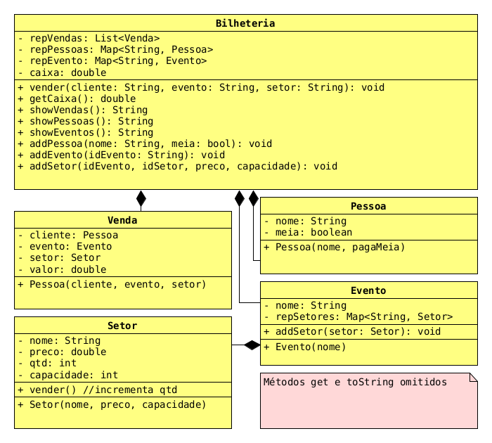

# Bilheteria I


<!-- toc -->
- [Diagrama de classes](#diagrama-de-classes)
- [Draft](#draft)
- [Descrição dos métodos](#descrição-dos-métodos)
- [Shell](#shell)
<!-- toc -->

Fazer vendas usando papel e caneta é coisa do passado. Você foi contratado para modernizar a bilheteria do seu bairro e trazer ela pro século XXI.

Você deve desenvolver um sistema para gerenciar as vendas de uma bilheteria de shows.

## Diagrama de classes



## Draft

- Main em typescript: [draft.ts](.cache/draft.ts)

## Descrição dos métodos

[](load)[](diagrama.puml)[](fenced:puml:filter)

```puml

class Bilheteria {
  - repVendas: Venda[]
  - repPessoas: Map<string, Pessoa>
  - repEventos: Map<string, Evento>
  __

  + constructor()    

  ' retorna a lista das vendas
  + getVendas(): Venda[]

  ' retorna a lista das pessoas como array
  + getPessoas(): Pessoa[]

  ' retorna a lista dos eventos como array
  + getEventos(): Evento[]
  
  __

  ' lançar exceção se a pessoa não existir
  + getPessoa(nome: string): Pessoa

  ' lançar exceção se o evento não existir
  + getEvento(nome: string): Evento

  __

  ' lançar exceção se nome for repetido
  + addPessoa(nome: string, meia:bool):void 
  
  ' lançar exceção se nome for repetido
  + addEvento(nome: string, preco: valor):void 
  
  ' esse método usa os métodos getPessoa e getEvento
  ' para fazer a venda, não é necessário lançar exceção aqui
  + vender(nome_pessoa: string, nome_evento: string):void 
}

class Pessoa {
  - nome: string
  - meia: boolean
  __
  + constructor(nome:string, meia:boolean)
  + getNome():string
  + getMeia():boolean
  + toString():string
}

class Evento {
  - nome: string
  - preco: number
  __
  + constructor(nome: string, preco: number)
  + getNome():string
  + getPreco():number
  + toString():string
}

class Venda {
  - pessoa: Pessoa
  - evento: Evento
  - valor: number
  __

  ' o valor da venda é calculado no construtor
  + constructor(pessoa: Pessoa, evento: Evento)

  + getPessoa():Pessoa
  + getEvento():Evento
  + getValor():number
  + toString():string
}

```

[](load)

## Shell

```sh
#__case cadastro pessoas
# addPessoa _nome _meia
$addPessoa bruno meia
$addPessoa chico meia
$addPessoa aline inteira

#__case cadastro duplicado

$addPessoa chico meia
fail: pessoa chico ja existe

#__case show pessoas
# imprima os dados ordenados pela chave
$pessoas
[aline:inteira, bruno:meia, chico:meia]

#__case cadastro eventos

# addEvento _nome _preco: inteiro
$addEvento samba 70
$addEvento forro 50
$addEvento piano 15

#__case show eventos
# imprima ordenado pelo nome
$eventos
[forro:50.00, piano:15.00, samba:70.00]

#__case cadastro duplicado
$addEvento samba 90
fail: evento samba ja existe

#__case vender ingressos

# vender _pessoa _evento
# se a pessoa for meia, aplique 50% de desconto no preço do evento
$vender bruno samba
$vendas
[bruno:samba:35.00]

$vender chico samba
$vender aline samba
$vendas
[bruno:samba:35.00, chico:samba:35.00, aline:samba:70.00]

$vender chico piano
$vendas
[bruno:samba:35.00, chico:samba:35.00, aline:samba:70.00, chico:piano:7.50]

#__case erro nas vendas
$vender chico arraia
fail: evento arraia nao existe

$vender joao samba
fail: pessoa joao nao existe
$end
```
