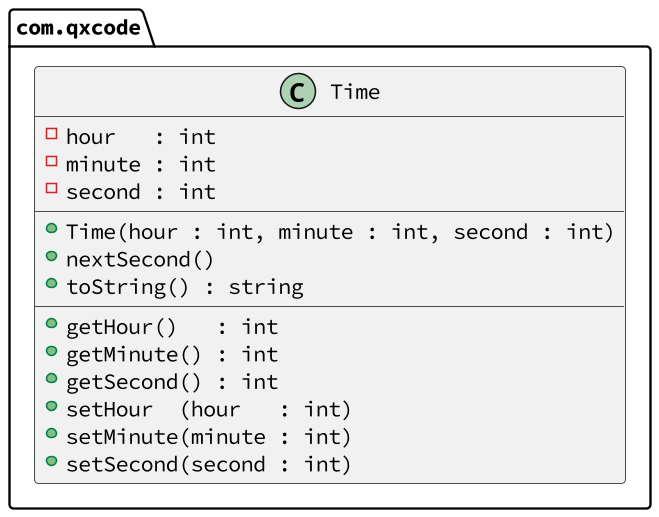

# Relógio & Utilizando os comandos set para manter a hora correta


[](toc)

- [Intro](#intro)
- [Guide](#guide)
- [Shell](#shell)
[](toc)

***
## Intro
O sistema deverá:

- Gerenciar uma classe que guarda a hora, minuto e segundo.
- Ao iniciar a classe, hora, minuto e segundo devem ser setados para 0.
    - O construtor deve receber 3 parâmetros, hora, minuto e segundo.
    - Para fazer a inicialização dos 3 parâmetros, utilize os métodos set.
- Crie os métodos getters e setters para cada atributo.
    - Os métodos set devem garantir que os valor atribuúido sempre seja válido, ou não realize nenhuma mudança.
- Crie um método que imprime a hora no formato HH:MM:SS.
- Crie um método que incrementa o segundo em 1.

***
## Guide


- [Solver.java](.cache/draft.java)
- [solver.cpp](.cache/draft.cpp)
- [solver.js](.cache/draft.js)
- [solver.ts](.cache/draft.ts)

***
## Shell

```bash
#__case set
$show
00:00:00

$set 10 02 30
$show 
10:02:30

#__case error

$set 25 70 90
fail: hora invalida
fail: minuto invalido
fail: segundo invalido

$show
10:02:30


#__case next
$set 15 59 59
$show
15:59:59

$next
$show
16:00:00

$end
```

```bash
#__case set
$show
00:00:00

$set 10 60 59
fail: minuto invalido


$show
10:00:59

$next
$show
10:01:00

$end
```
