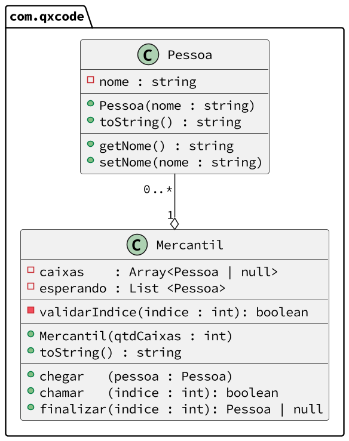

# Budega


[](toc)

- [Intro](#intro)
- [Guide](#guide)
- [Shell](#shell)
[](toc)

Nosso objetivo no trabalho é modelar uma fila de atendimento de um Mercatil.

## Intro

- Quando o mercantil é incializado, é definido a quantidade de caixas que ele terá.
- Os caixas são modelados como um vetor de clientes de tamanho fixo. Uma posição do caixa ou terá o valor
null para indicar que o caixa está vazio ou terá um objeto cliente.
- A fila de espera é uma lista de clientes de tamanho variável. Todo cliente que chega é inserido no final da fila.
- As operações são entrar, chamarNoCaixa e finalizarAtendimento.

- Em Java
  - Os caixas devem ser implementados com um ArrayList e a fila de espera como um LinkedList.
- Em C++
  - Os caixas devem ser implementados com um vector e a fila de espera como um list.
  - Os clientes devem ser criados dinamicamente e gerenciados por um shared_ptr.

***

## Guide



[](load)[](diagrama.puml)[](fenced:filter:plantuml)

```plantuml
class Pessoa {
  - nome : string
  __
  + Pessoa(nome : string)
  + toString() : string
  __
  + getNome() : string
  + setNome(nome : string)
}

class Mercantil {
  '
  ' se estiver em java , utilize ArrayList<Pessoa>
  ' se estiver em c++  , utilize vector<shared_ptr<Pessoa>>
  ' se estiver em ts   , utilize Array<Pessoa|null>
  - caixas    : Array<Pessoa | null>
  '
  ' se estiver em java, utilize LinkedList<Pessoa>
  ' se estiver em c++ , utilize list<shared_ptr<Pessoa>>
  ' se estiver em ts  , utilize Array<Pessoa>
  - esperando : List <Pessoa>
  __
  '
  ' verifica se existe essa posição no caixa
  ' emite erro se não existir
  - validarIndice(indice : int): boolean
  __
  '
  ' inicializa os caixas com qtdCaixas posições iguais a null
  ' inicializa esperando como uma lista vazia
  + Mercantil(qtdCaixas : int)
  '
  + toString() : string
  __
  '
  ' adicione um cliente na fila de espera
  + chegar   (pessoa : Pessoa)
  '
  ' verifica se indive é valido
  ' verifica se caixa[indice] está vazio
  ' verifica se tem alguém na fila de espera
  ' move o primeiro da fila de espera para o caixa[indice]
  + chamar   (indice : int): boolean
  '
  ' verifica se indive é valido
  ' verifica se caixa[indice] tem alguém
  ' coloca o caixa[indice] como vazio
  + finalizar(indice : int): Pessoa | null
}
```

[](load)

- [solver.cpp](.cache/draft.cpp)

***

## Shell

```sh
#__case iniciar
$init 2
$show
Caixas: | 0:----- | 1:----- |
Espera: []

#__case arrive
$arrive joao
$arrive maria
$arrive ana

$show
Caixas: | 0:----- | 1:----- |
Espera: [joao, maria, ana]

#__case call
$call 0
$show
Caixas: | 0: joao | 1:----- |
Espera: [maria, ana]

#__case finish
$finish 0
$show
Caixas: | 0:----- | 1:----- |
Espera: [maria, ana]

$end

```

```sh
#__case iniciar2
$init 3
$show
Caixas: | 0:----- | 1:----- | 2:----- |
Espera: []

$arrive joao
$arrive maria

$show
Caixas: | 0:----- | 1:----- | 2:----- |
Espera: [joao, maria]

#__case call
$call 0
$call 0
fail: caixa ocupado
$show
Caixas: | 0: joao | 1:----- | 2:----- |
Espera: [maria]

#__case empty waiting
$call 1
$show
Caixas: | 0: joao | 1:maria | 2:----- |
Espera: []

#__case empty waiting
$call 2
fail: sem clientes

#__case finish
$finish 0
$finish 1
$show
Caixas: | 0:----- | 1:----- | 2:----- |
Espera: []

#__case error
$finish 3
fail: caixa inexistente
$finish 1
fail: caixa vazio

$end

```
