# Relacionamentos

<!-- toc -->
- [Caracterı́sticas das Associações](#caracterısticas-das-associações)
- [Multiplicidades](#multiplicidades)
- [Conectividade](#conectividade)
- [Navegabilidade](#navegabilidade)
- [Papéis](#papéis)
- [Associações Reflexivas](#associações-reflexivas)
- [Agregação e Composição](#agregação-e-composição)
- [Agregação](#agregação)
- [Composição](#composição)
- [Agregação](#agregação)
- [Classes Associativas](#classes-associativas)
- [Exercícios](#exercícios)
<!-- toc -->

Todos os diagramas desse tutorial foram criados com o plantuml. Você pode ver mais em [LINK](https://plantuml.com/class-diagram).

Um **objeto** de uma classe pode ter um **relacionamentos** com os **objetos** de outras classes de maneira que essa conexão tem um significado definido.

Um relacionamento entre duas ou mais classes é chamada de **associação**


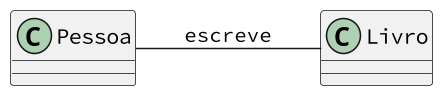

Representamos as associações por meio de linhas retas que ligam as
classes envolvidas.

A forma mais comum de implementar associação é ter um objeto como
atributo de outro.

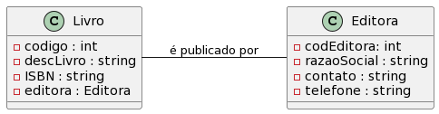

Neste caso, o livro possui um atributo editora que pertence a classe Editora.

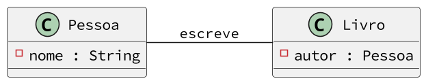

Neste caso, o livro possui um atributo autor da classe Pessoa.

## Caracterı́sticas das Associações

* Nome
* Multiplicidade
* Conectividade
* Navegabilidade
* Papéis

## Multiplicidades

A multiplicidade define quantas instâncias de uma classe A podem estar
relacionadas a uma instância da classe B.

Cada associação em um diagrama de classes possui duas multiplicidades,
uma em cada extremo da linha que a representa.


Um livro pode ser publicado por 1 ou mais editoras.

Uma editora pode publicar um ou mais livros.

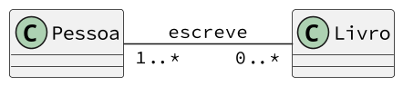

Uma pessoa escreve 0 ou mais livros.

Um livro pode ser escrito por 1 ou mais pessoas.

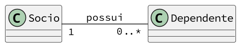

Um sócio pode ter 0 ou mais dependentes.

Um dependente é dependente de um sócio.


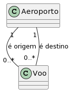

Um aeroporto pode ser origem ou destino de 0 ou mais vôos. Cada vôo parte ou chega em 1 aeroporto. 

## Conectividade

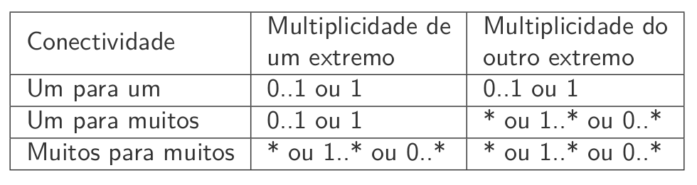


**Um para Um**


Um empregado pode gerenciar no máximo um departamento, e um departamento possui um gerente.

**Um para Muitos**


Um sócio pode ter 0 ou mais dependentes e cada dependente depende de um sócio.


Um empregado está lotado em um único departamento, mas um departamento pode ter diversos empregados.

**Muitos para Muitos**


Um livro pode ser publicado por várias editoras e uma editora pode editar vários livros.


## Navegabilidade

*  A navegabilidade indica como a associação deve ser lida.

* As associações entre classes UML podem ter uma direção navegável, de
uma classe para a outra ou em ambas as direções (bidirecional).
* As associações também podem ter direção não especificada, que na
maioria dos casos será a mesma que bidirecional, mas esta opção pode
gerar dúvidas.
* A navegabilidade descreve como as implementações do modelo podem ser
navegadas e é simbolizada por setas no diagrama.


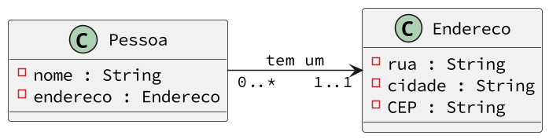

Neste caso, a pessoa sabe seu endereço, mas o endereço não sabe quem vive lá.

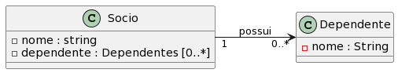

Neste caso, o sócio conhece seus dependentes, mas o dependente não sabe de quem ele depende.

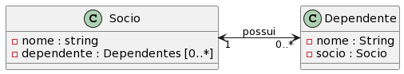

Neste caso, o sócio conhece seus dependentese  o dependente sabe de quem ele depende.


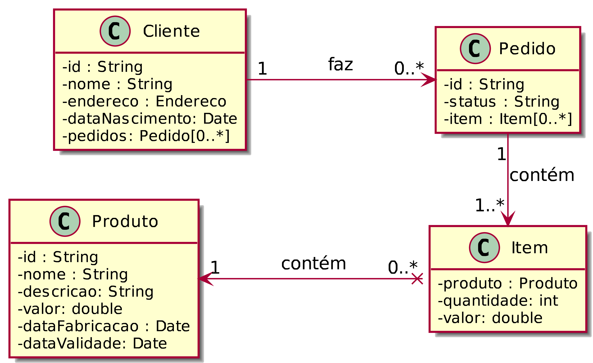

O cliente conhece seus pedidos. O pedido conhece seus itens. Cada item do pedido conhece o produto comprado.


## Papéis

Quando um objeto participa de uma associação, ele tem um papel
especı́fico nela.


O objeto Pessoa assume o papel de autor e o livro de obra.


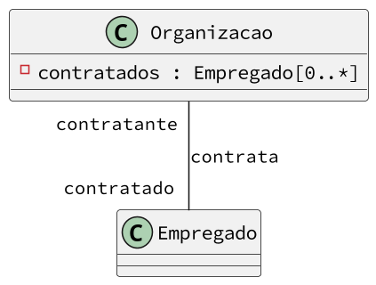

O empregado desempenha o papel de contratado e a Organizacao desempenha o papel de contratante.


## Associações Reflexivas

Uma associação reflexiva associa objetos da mesma classe.

Cada objeto tem um papel distinto nessa associação.


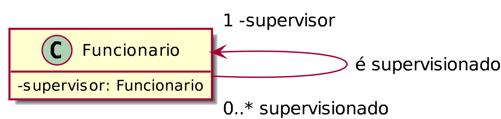

Cada supervisionado conhece seu supervisor, mas o supervisor não conhece seus supervisionados.

## Agregação e Composição

Uma relação todo-parte entre dois objetos indica que um dos objetos está contido no outro. Ou então, que as informações de um objeto (o todo) é composta pelas informações de um outro objeto (a parte).


**Agregação** e **Composição** são dois tipos especiais de associação que relacionam um objeto (o todo) com suas partes.


## Agregação

A agregação é um caso especial de associação que relaciona um objeto (o todo) com suas partes.

A agregação é representada como uma linha de associação com um diamante junto à Classe agregadora.

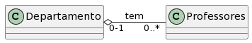


Na agregação, a destruição de um objeto todo não implica necessariamente a destruição do objeto parte. Por exemplo, na relação acima, a exclusão de um departamento não necessariamente implica a exclusão de todos os professores do departamento.

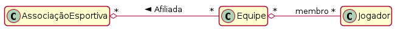


Uma associação esportiva é formada por várias equipes.

Cada equipe é formada por diversos jogadores.

Por outro lado, um jogador pode fazer parte de diversas equipes.

Se uma das equipes das quais o jogador é membro for extinta, este jogador ainda poderá continuar membro de outras equipes.

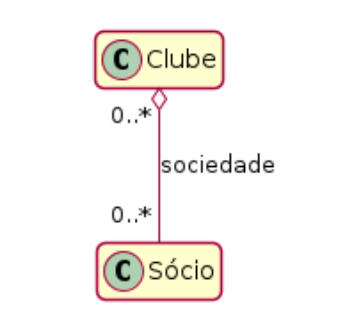

```Java
public class Socio {
    private String nome;
 
    public Socio(String nome) { 
        setNome(nome); 
    }
 
    public String getNome() { 
        return nome; 
    }
 
    public void setNome(String nome) {
       if (nome == null || nome.length() == 0) {
          throw new RuntimeException("Nome não pode ser nulo ou vazio.");
       }
       this.nome = nome;
    }

    public String toString() {
        return nome;
    }
 }
 ```


 ```Java
 import java.util.ArrayList;

public class Clube {
    private ArrayList<Socio> sociedade;
 
    public Clube() {
       sociedade = new ArrayList<>();
    }
 
    public void addSocio(Socio socio) {
       if (socio == null) {
          throw new RuntimeException("Sócio não pode ser nulo.");
       }
       sociedade.add(socio);
    }

    public int numeroDeSocios() { return sociedade.size(); }
    public Socio getSocio(int n) { return sociedade.get(n); }
    public Socio removeSocio(int n) { return sociedade.remove(n); }
 }
 ```


## Composição

A composição é um caso especial de associação que relaciona um objeto (o todo) com suas partes. Porém, em uma composição, a destruição do objeto todo implica a destruição do objeto parte.


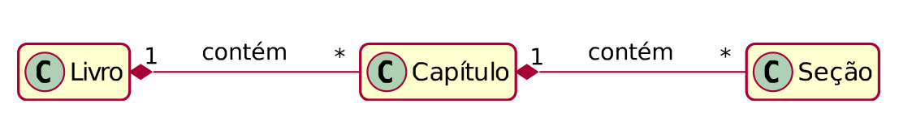

A composição é representada como uma linha de associação com um diamante preenchido junto à Classe agregadora.

Read more: http://www.linhadecodigo.com.br/artigo/943/uml-unified-modeling-language-generalizacao-agregacao-composicao-e-dependencia.aspx#ixzz7eybpZLwp

Na composição, os objetos parte pertencem a um único todo. Por essa razão, a composição é também denominada agregação não compartilhada.

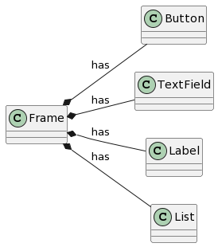

Os objetos das classes Button, TextField, Label, List não tem existência fora do Frame que eles estão conectados. Um Button não pode estar ao mesmo tempo em dois frames.

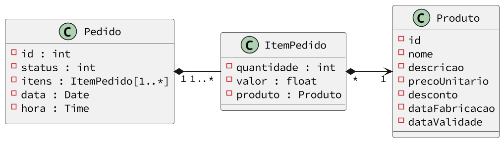

Os itens não têm existência independente do pedido ao qual estão conectados. Quando o pedido deixa de existir, o mesmo acontece com os seus itens.

## Agregação

Por outro lado, em uma agregação, pode ser que um objeto participe como componente de vários outros objetos. Por essa razão, a agregação é também denominada agregação compartilhada.

Ou também que o objeto possa existir fora do todo ao qual está agregado. A lapiseira tem grafites, mas esses não são criados por ela e podem existir fora dela.


## Classes Associativas

São necessárias quando existem atributos relacionados à associação que
não podem ser armazenados por nenhuma das classes envolvidas.

São produzidas quando ocorrem associações com multiplicidade muitos
(*) em todas as extremidades.


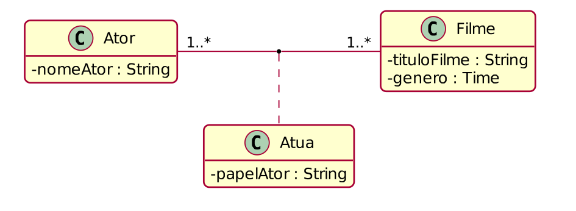

Um ator pode atuar em muitos filmes e um filme pode ter vários atores
atuando nele. Existe a necessidade de saber qual o papel interpretado por
um ator em um determinado filme, mas onde armazenar essa informação?

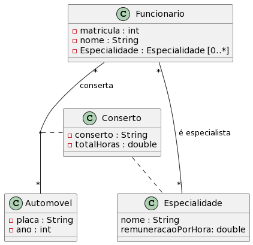

Há funcionários com várias especialidades. Consertos em automóveis são realizados por funcionários, mas é necessário saber que especialidade foi utilizada pelo funcionário em certo conserto. Para isso, uma classe associativa é criada entre as classes Funcionário e
Automóvel. Além disso, essa mesma classe associativa está associada à classe Especialidade para permitir conhecer qual a especialidade utilizada em um conserto.

## Exercícios

1. Uma Associação entre a lapiseira e o grafite.

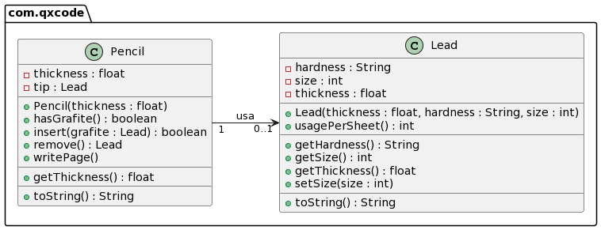

2. Uma agregação entre uma motoca e uma pessoa

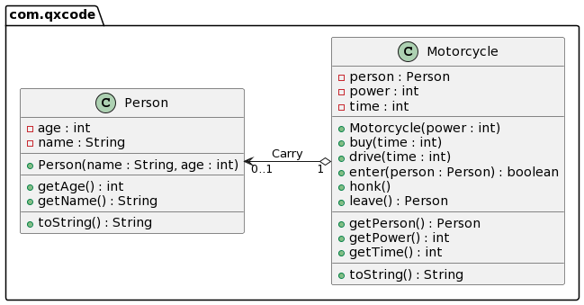


