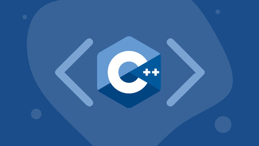

# Configuração do C++

## Caminho mais fácil

Instale o Linux Subsystem for windows 10.
[Tutorial](https://www.ssl.com/pt/como/ativar-o-subsistema-linux-instalar-o-ubuntu-windows-10/)

## Caminho não tão fácil

Instale o [MinGW](https://www.geeksforgeeks.org/complete-guide-to-install-c17-in-windows/)

Verifique se a versão do gcc é a pelo menos a 9.2 para ter acesso ao C++17 utilizando o comando `gcc --version` no terminal.

## IDES sugeridas

- Vscode (mais rápido, leve e personalizável) 
- QtCreator (mais completo, com recursos avançados, porém mais pesado)