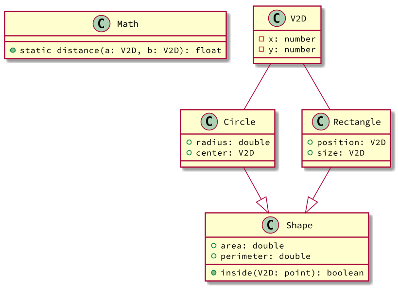

# Shapes


[](toc)

- [Intro](#intro)
- [Guide](#guide)
- [Shell](#shell)
[](toc)

- Faça um programa para gerenciar figuras geométricas.
- Deve ser possível conseguir obter a área e o perímetro de cada figura.
- Também deve ser possível checar se um ponto está dentro de uma figura ou não.

## Intro

As figuras geométricas podem ser círculos ou retângulos.

O retângulo é definido por dois pontos: o ponto inferior esquerdo e o ponto superior direito.

O círculo pode ser definido pelo ponto do centro e pelo raio.

## Guide

- [solver.cpp](.cache/draft.cpp)



[](load)[](diagrama.puml)[](fenced:filter:plantuml)

## Shell

```sh
$circle (2,3) 5
$rect (1,1) (3,3) 
$rect (2,4.53) (5,10)
$circle (1,1) 1.5

$names
circle
rect
rect
circle 

$show
Circle: C=(2.00, 3.00), R=5.00
Rectangle: LU=(1.00, 1.00) BD=(3.00, 3.00)
$end
```