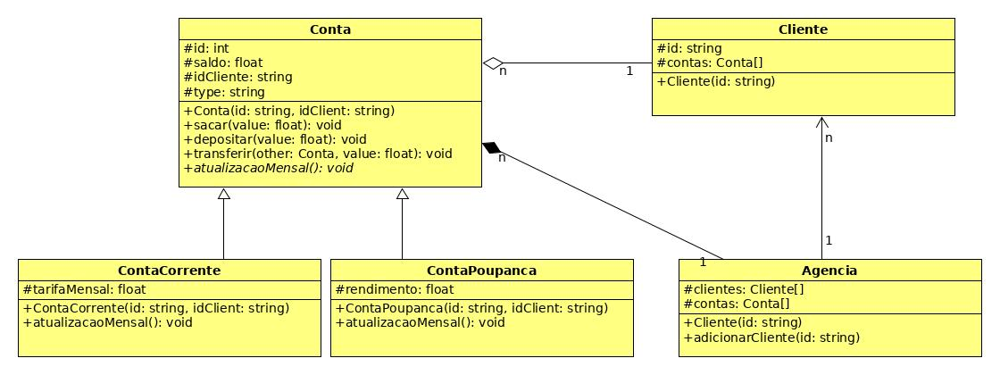

## 31 Agencia Bancária 2 #heranca
###


O objetivo dessa atividade é implementar uma agência bancária simplificada. Deve ser capaz de cadastrar cliente. Cada cliente inicia com uma conta poupança e uma conta corrente. Contas correntes tem taxa de administração e contas poupanças rendem juros.

## Funcionalidades

- Cadastrar um cliente com idCliente único
    - Quando o cliente é cadastrado no sistema, automaticamente é aberta uma conta corrente e uma conta poupança para ele.
- Mensalmente:
    - Contas corrente vão receber uma tarifa de 20 reais podendo inclusive ficar negativas.
    - Contas poupança vão aumentar de 1 porcento.
- Sua agência deve ter uma "lista" de clientes e de contas.
    - A lista pode ser linear ou usando mapas.
- O cliente só tem duas contas, mas imagine que no futuro ele poderá ter várias.
- As contas devem ser tratadas utilizando polimorfismo.


## Exemplos

```bash
#__case first clients
# addCli _idCliente
# adiciona um cliente na lista de clientes.
# cria uma conta poupança e uma conta corrente para cada cliente usando numeração de forma sequencial.
$addCli Diego
$addCli Aline
$addCli Andre

# show mostra as contas do banco, com id:usuario:saldo:tipo
# em tipo use CC para conta corrente e CP para conta poupança.
$show
0:Diego:0.00:CC
1:Diego:0.00:CP
2:Aline:0.00:CC
3:Aline:0.00:CP
4:Andre:0.00:CC
5:Andre:0.00:CP

######################################
#__case operações básicas
#faça as operações básicas de saque, depósito e transferência entre contas
#verifique se as contas existem antes de efetuar as operações
# $saque _conta _value
# para sacar verifique o saldo
#
# $deposito _conta _value
#
# $transf _contaDe _contaPara _value

$deposito 0 100
$deposito 1 200
$deposito 2 50
$deposito 3 300
$saque 3 50
$saque 0 70
$saque 1 300
fail: saldo insuficiente

$show
0:Diego:30.00:CC
1:Diego:200.00:CP
2:Aline:50.00:CC
3:Aline:250.00:CP
4:Andre:0.00:CC
5:Andre:0.00:CP

$transf 3 5 200
$transf 0 4 25
$transf 9 1 30
fail: conta nao encontrada
$transf 2 8 10
fail: conta nao encontrada

$show
0:Diego:5.00:CC
1:Diego:200.00:CP
2:Aline:50.00:CC
3:Aline:50.00:CP
4:Andre:25.00:CC
5:Andre:200.00:CP

#__case update mensal
# No comando update todas as contas serão atualizadas.
# Contas corrente vão receber uma tarifa de 20 reais podendo inclusive ficar negativas.
# Contas poupança vão aumentar de 1 porcento.
$update

$show
0:Diego:-15.00:CC
1:Diego:202.00:CP
2:Aline:30.00:CC
3:Aline:50.50:CP
4:Andre:5.00:CC
5:Andre:202.00:CP

$end

```

---
## UML


