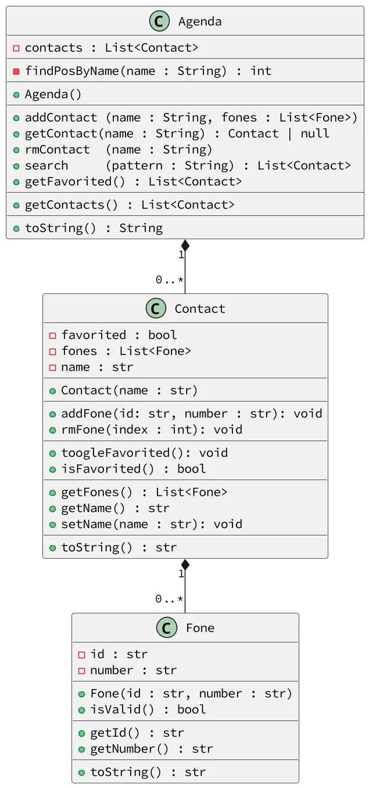

# Gerencie os vários contatos de uma agenda

<!-- toch -->
[Intro](#intro) | [Guide](#guide) | [Drafts](#drafts) | [Shell](#shell)
-- | -- | -- | --
<!-- toch -->


Sua agenda possui vários contatos e cada contato possui vários telefones.

Essa atividade é uma continuação da @contato. Lá é explicado com mais detalhes como criar a classe `Contact` e a classe `Fone`.

***

## Intro

- Adicionar contato
  - O contato possui o nome como chave.
  - Se tentar adicionar outro contato com o mesmo nome, adicione os telefones ao contato existente.
  - Adicionar os novos números de telefone no contato já existente.
- Mostrar
  - Mostrar os contatos da agenda pela ordem alfabética.
- Remoção
  - Remover contato pela chave.
  - Remover telefone do contato.
- Busca
  - Fazer uma busca por padrão em todos os atributos do contato, nome e telefones.
  - Se o contato tiver qualquer campo que combine com a string pattern de busca, ele deve ser retornado. Se o pattern é maria, devem ser retornados os contatos como "maria julia", "mariana", "ana maria", etc. Também inclua na busca o id do telefone ou o número do telefone.
- Favoritos
  - Favoritar e Desfavoritar um contato.
  - Mostrar os favoritos.
***

## Guide



[](https://youtu.be/jK5lhWprt3U?si=y-qGvrvG6DoqpXQ4)

## Drafts

<!-- links .cache/drafts -->
- cpp
  - [shell.cpp](.cache/drafts/cpp/shell.cpp)
- go
  - [shell.go](.cache/drafts/go/shell.go)
- java
  - [Shell.java](.cache/drafts/java/Shell.java)
- ts
  - [shell.ts](.cache/drafts/ts/shell.ts)
<!-- links -->

## Shell

```py
#TEST_CASE adicionando em lote
$add eva oio:8585 cla:9999
$add ana tim:3434
$add bia viv:5454

$show
- ana [tim:3434]
- bia [viv:5454]
- eva [oio:8585, cla:9999]


#TEST_CASE adicionando a um contato existente

# como ana já existe, não crie um novo contato
# adicione os telefones ao contato existente
$add ana cas:4567 oio:8754

$show
- ana [tim:3434, cas:4567, oio:8754]
- bia [viv:5454]
- eva [oio:8585, cla:9999]


#TEST_CASE removendo telefone
# remove o elemento indice 0 da ana
$rmFone ana 0

$show
- ana [cas:4567, oio:8754]
- bia [viv:5454]
- eva [oio:8585, cla:9999]

#TEST_CASE removendo contato
$rm bia

$show
- ana [cas:4567, oio:8754]
- eva [oio:8585, cla:9999]

#TEST_CASE adicionando mais contatos

$add ava tim:5454
$add rui viv:2222 oio:9991
$add zac rec:3131

$show
- ana [cas:4567, oio:8754]
- ava [tim:5454]
- eva [oio:8585, cla:9999]
- rui [viv:2222, oio:9991]
- zac [rec:3131]

#TEST_CASE busca por padrao
$search va
- ava [tim:5454]
- eva [oio:8585, cla:9999]

$search 999
- eva [oio:8585, cla:9999]
- rui [viv:2222, oio:9991]

#TEST_CASE toggle favoritos
$tfav ana
$tfav rui

$show
@ ana [cas:4567, oio:8754]
- ava [tim:5454]
- eva [oio:8585, cla:9999]
@ rui [viv:2222, oio:9991]
- zac [rec:3131]

#TEST_CASE favoritos
$favs
@ ana [cas:4567, oio:8754]
@ rui [viv:2222, oio:9991]

$end
```
