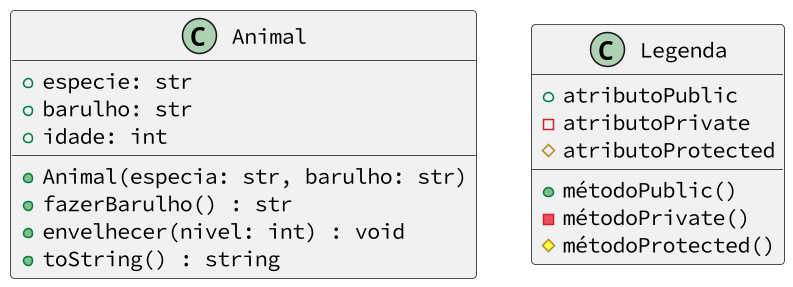

# Atividade modelo resolvida: @animal2

<!-- toch -->
[Model](#model) | [Intro](#intro) | [Guide](#guide) | [Shell](#shell) | [Draft](#draft) | [Cheat](#cheat)
-- | -- | -- | -- | -- | --
<!-- toch -->


## Model

Essa atividade utiliza um padrão de projeto de requisições e respostas.

- Os testes são feitos através de requisições de texto e podem ser vistos na seção [Shell](#shell).
- A classe `Shell` é responsável por ler as requisições de texto, decodificar e chamar os métodos da classe `Adapter`.
- Na classe `Adapter` é onde você deve implementar e conectar seu código.
- A classe `Adapter` é apenas a classe de conexão, você deve as classes que implementam a lógica do problema. Use como base o diagrama de classes e a descrição do problema.
- Mensagens de erros podem ser lançadas por exceções ou comandos de `print` diretamente para o terminal.
- Ao mostrar uma string formatada, será utilizado o modelo do python `f"{variavel:param}"`.
- Na seção de [Cheat](#cheat), você pode conferir as respostas dessa atividade.

## Intro

O objetivo dessa atividade é implementar um animal que passa pelas diversas fases de crescimento até a morte.

- Descrição
  - O animal tem uma espécie, um estágio de vida e um barulho que ele faz.
  - Os estágios pelos quais o animal passa são:
    - 0: Bebê
    - 1: Criança
    - 2: Adulto
    - 3: Idoso
    - 4: MORTO
  - Ao fazer barulho, o animal emite o som característico da sua espécie, com as seguintes restrições:
    - Se for bebê, emite um "---".
    - Se for idoso, emite um "RIP".
  - Ao crescer, o animal passa para o próximo estágio de vida.
    - Se atingir o estágio 4, ele morre e deve aparecer a mensagem
    - `f"warning: {especie} morreu"`
- Responsabilidades
  - O código deve ser implementado na classe `Animal`.
  - Os métodos da classe `Animal` devem ser chamados na classe `Adapter`.
  - A classe `Shell` é responsável por ler as requisições de texto e chamar os métodos da classe `Adapter`.
- Comandos
  - Todos os comandos seguem o modelo `$comando arg1 arg2 ...`.
  - `$show`: Mostra o estado atual do animal.
    - formato: `f"{especie}:{estagio}:{barulho}"`
    - exemplo: `gato:0:miau`
  - `$init especie barulho`: Inicializa o animal passando a espécie e o barulho.
  - `$grow`: Faz o animal crescer uma etapa da vida
  - `$noise`: Faz o animal emitir um som
  - `$end`: Finaliza a execução

***

## Guide



- Parte 1
  - Crie uma classe `Animal` com os atributos `especie`, `estagio` e `barulho`.
  - Crie um método `String toString()` que retorna a representação do animal no formato `especie:estagio:barulho`.
  - Teste seu código
- Parte 2
  - Crie um método `void envelhecer()` que envelhece o animal em um estágio.
  - Implemente a lógica de crescimento do animal e verifique se ele morreu.
  - Certifique-se de que o animal não pode crescer após a morte.
- Parte 3
  - Crie um método `fazerBarulho()` que faz o animal fazer barulho.
  - Implemente a lógica de barulho do animal fazendo tratamento especial para bebês e mortos.
- Parte 4: Adapter
  - Na classe `Adapter`, crie um atributo `animal` e o inicialize no construtor.
  - Faça os ajustes necessários para chamar os métodos da classe Animal na classe Adapter.

## Shell

### Primeira simulação

```bash
#TEST_CASE iniciando

$init gato miau
$show
gato:0:miau

$init cachorro auau
$show
cachorro:0:auau

$init galinha cocorico
$show
galinha:0:cocorico

$end
```

### Segunda simulação

```bash
#TEST_CASE grow

$init vaca muu
$show
vaca:0:muu

$grow 2
$show
vaca:2:muu

$grow 2
warning: vaca morreu

$show
vaca:4:muu

$grow 3
warning: vaca morreu

$show
vaca:4:muu

$end
```

### Terceira simulação

```bash
#TEST_CASE noise

$init cabra beeh

$noise
---

$grow 1
$noise
beeh
$grow 3
warning: cabra morreu

$noise
RIP

$end
```

### Quarta simulação

```bash
#TEST_CASE extra

$init passaro piupiu

$show
passaro:0:piupiu

$noise
---

$grow 1
$noise
piupiu

$grow 2
$noise
piupiu

$grow 1
warning: passaro morreu

$noise
RIP

$end
```

## Draft

<!-- links base/animal2/base/animal2/.cache/lang -->
<!-- links -->

## Cheat

<!-- links base/base/.cache/cheat -->
<!-- links -->
