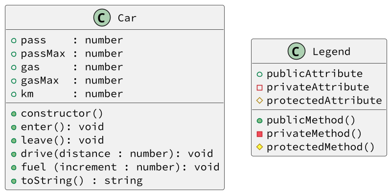

# Um carro simples

<!-- toch -->
[Model](#model) | [Guide](#guide) | [Intro](#intro) | [Shell](#shell) | [Draft](#draft)
-- | -- | -- | -- | --
<!-- toch -->


UML | Testes | Rascunho | Adapter | Esqueleto
--- | ------ | -------- | ------- | ---------
sim | sim    | sim      | sim     | não

## Model

Essa atividade utiliza testes através de requisições e respostas em texto. Ela é composta por três componentes.

- `Suas classes de resolução`: Classes que você deve implementar e que resolvem o problema proposto.
- `Shell`: Responsável por ler as requisições de texto e chamar os métodos da classe `Adapter`.
  - Normalmente, você não precisa alterar essa classe.
- `Adapter`: Responsável por instanciar e chamar os métodos das `Suas classes de resolução`.
  - Todos os métodos do `Adapter` são `void`, sem retorno.
  - Todos os métodos possuem o mesmo nome e parâmetros das requisições dos testes.
    - `linha de teste`: `$somar 1 2`
    - `método Adapter`: `void somar(int a, int b)`
  - Se a requisição exigir uma resposta, ela deve ser impressa no `Adapter`.
    - `print(calculadora.somar(a, b))`

## Guide

- Implemente a sua classe se orientando pela descrição, pelo UML(se houver) e pelos testes cadastrados.
- Começe analisando os testes e entendendo tudo que seu código precisa fazer.
- Depois que tiver uma ideia do que vai implementar, se deixe guiar pelos testes, implementando apenas o que é pedido para passar em cada teste.
- Após implementar sua classe e conectar no `Adapter`, rode os testes para verificar se a atividade está correta.
- Passe para o próximo teste até implementar tudo que é pedido.

## Intro

Nesta atividade, vamos implementar um carro ecológico. Ele deve ser capaz de embarcar e desembarcar pessoas, abastecer e andar.

- O carro deve ser inicializado com o tanque vazio, sem ninguém dentro e com 0 quilômetros percorridos. Suporta até 2 pessoas e até 100 litros de combustível.
- Construtor do Carro
  - `pass`: 0 passageiros.
  - `km`: 0 quilômetros percorridos.
  - `passMax`: Máximo de 2 pessoas.
  - `gas`: 0 litros de gasolina.
  - `gasMax`: Máximo de 100 litros de gasolina.
- `toString` - Retorna uma string com o estado atual do carro no formato:
  - `"pass:{pass}, gas:{gas}, km:{km}"`.
- Entrar `enter`
  - Embarca uma pessoa por vez, mas não além do máximo.
  - Se o carro estiver lotado, emite a mensagem de erro.
    - `fail: limite de pessoas atingido`.
- Sair `$leave`
  - Desembarca uma pessoa por vez.
  - Se não houver ninguém no carro, emite a mensagem de erro.
    - `fail: nao ha ninguem no carro`.
- Abastecer
  - Abastece o tanque com a quantidade de litros de combustível passada.
  - Caso tente abastecer acima do limite, descarta o valor excedente.
- Dirigir
  - Para dirigir, o carro consome combustível e aumenta a quilometragem.
  - Só pode dirigir se houver combustível e se houver alguém no carro.
  - Caso não haja ninguém no carro, emite a mensagem de erro.
    - `fail: não há ninguém no carro`
  - Caso não haja combustível, emite a mensagem de erro.
    - `fail: tanque vazio`
  - Caso não exista combustível suficiente para completar a viagem inteira, dirija o máximo possível e emite uma mensagem indicando quanto foi percorrido
    - `fail: tanque vazio após andar {distancia} km`.



<!--

- Parte 1: entrar
  - Crie a classe Car com os atributos pass, passMax, gas, gasMax e km;
  - Inicialize os atributos no construtor;
  - Crie o método enter que incrementa pass;
  - Crie um if para impedir que pass ultrapasse passMax;
  - Crie o método toString mostrar o estado do carro.
  - Teste seu código.
- Parte 2: desembarcar
  - Crie o método `leave` que decrementa `pass`.
  - Crie um condicional para impedir que `pass` seja menor que 0.
  - Teste seu código.
- Parte 3: abastecer
  - Crie o método `fuel` que incrementa `gas` com o valor passado.
  - Crie um condicional para impedir que `gas` ultrapasse `gasMax`.
  - Teste seu código.
- Parte 4: dirigir
  - Crie o método `drive` que incrementa `km` e decrementa `gas` com o valor passado.
  - Crie testes para impedir que o carro dirija sem passageiros ou sem combustível.
  - Teste seu código.
- Parte 5: dirigir longas distâncias
  - Crie testes para impedir que o carro dirija mais do que o combustível permite.
  - Teste seu código.
- Parte 6: Adapter
  - Na classe `Adapter`, crie um atributo `carro` e o inicialize no construtor.
  - Nos outros métodos de `Adapter`, chame o método equivalente da classe `Car`.
-->

## Shell

```bash
#TEST_CASE inicializar
$show
pass: 0, gas: 0, km: 0

#TEST_CASE entrar
$enter
$enter
$show
pass: 2, gas: 0, km: 0

#TEST_CASE limite
$enter
fail: limite de pessoas atingido
$show
pass: 2, gas: 0, km: 0

#TEST_CASE sair
$leave
$show
pass: 1, gas: 0, km: 0

#TEST_CASE limite saida
$leave
$leave
fail: nao ha ninguem no carro
$show
pass: 0, gas: 0, km: 0
$end
```

***

```bash
#TEST_CASE abastecer
$fuel 60
$show
pass: 0, gas: 60, km: 0

#TEST_CASE dirigir vazio
$drive 10
fail: nao ha ninguem no carro

#TEST_CASE dirigir
$enter
$drive 10
$show
pass: 1, gas: 50, km: 10

#TEST_CASE para longe
$drive 70
fail: tanque vazio apos andar 50 km
$drive 10
fail: tanque vazio
$show
pass: 1, gas: 0, km: 60

#TEST_CASE enchendo o tanque
$fuel 200
$show
pass: 1, gas: 100, km: 60
$end
#
```

## Draft

<!-- links .cache/draft -->
- cpp
  - [fn.hpp](.cache/draft/cpp/fn.hpp)
  - [shell.cpp](.cache/draft/cpp/shell.cpp)
- java
  - [Shell.java](.cache/draft/java/Shell.java)
- py
  - [shell.py](.cache/draft/py/shell.py)
  - [student.py](.cache/draft/py/student.py)
- ts
  - [shell.ts](.cache/draft/ts/shell.ts)
<!-- links -->
