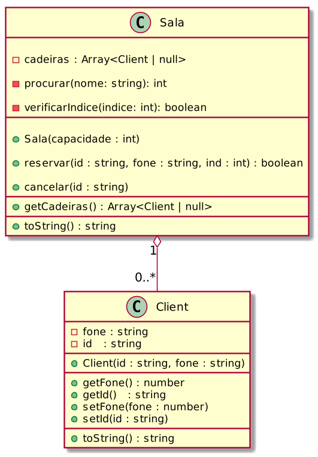

# Gerenciando reservas e cancelamentos de uma sala de @cinema

<!-- toch -->
[Intro](#intro) | [Guide](#guide) | [Shell](#shell)
-- | -- | --
<!-- toch -->


## Intro

O objetivo desta atividade é implementar métodos para manipular uma sala de cinema, permitindo a reserva, cancelamento e consulta de cadeiras.

- **Descrição**
  - A sala de cinema é representada pela classe `Sala`, que possui um conjunto de cadeiras, cada uma associada a um cliente ou vazia.
  - Os métodos a serem implementados permitirão reservar uma cadeira para um cliente, cancelar a reserva de uma cadeira e consultar o estado das cadeiras na sala.
  - Cada cadeira pode estar associada a um objeto `Client`, representando um cliente que reservou a cadeira, ou ser nula, indicando que a cadeira está vazia.
  - Os métodos fornecidos devem lidar com validações, como verificar se a cadeira existe, se está ocupada e se o cliente já está presente na sala.

- **Responsabilidades**
  - A classe `Sala` é responsável por gerenciar as operações relacionadas às cadeiras na sala de cinema.
    - Métodos a serem implementados:
      - `reservar(id: string, fone: string, ind: number)`: Reserva uma cadeira para um cliente com o ID e telefone especificados.
      - `cancelar(id: string)`: Cancela a reserva de uma cadeira para o cliente com o ID especificado.
      - `procurar(nome: string)`: Procura o índice da cadeira reservada pelo cliente com o nome especificado.
      - `verificarIndice(indice: number)`: Verifica se um índice de cadeira é válido na sala.
      - `getCadeiras(): (Client | null)[]`: Retorna um array contendo o estado atual de todas as cadeiras na sala.
      - `toString(): string`: Retorna uma representação em string do estado atual das cadeiras na sala.

  - A classe `Client` é responsável por representar os clientes que reservam cadeiras na sala de cinema.
    - A classe possui métodos para obter e definir o ID e telefone do cliente, bem como uma representação em string do cliente.

  - A classe `Adapter` atua como uma ponte entre os métodos de teste e as operações da sala de cinema.
    - Ela integra os métodos de teste com as operações da sala de cinema, permitindo a execução de comandos como reserva, cancelamento e consulta de cadeiras.
    - O método `procurar` é especialmente relevante, pois permite encontrar a cadeira reservada por um cliente pelo nome do cliente.

## Guide



<!-- load diagrama.puml fenced=ts:filter -->

### Parte 1: Reservar Cadeira

- **Passo 1:** Crie a classe `Client` com os atributos `id` e `fone`.

- **Passo 2:** Crie a classe `Sala` com o atributo `cadeiras`, um array de cadeiras que pode conter objetos `Client` ou ser nulo.

- **Passo 3:** Implemente o método `procurar(nome: string): number` na classe `Sala`:
  - Percorra o array de cadeiras.
  - Se encontrar uma cadeira ocupada com o ID fornecido, retorne o índice da cadeira.
  - Se não encontrar, retorne -1.

- **Passo 4:** Implemente o método `verificarIndice(indice: number): boolean` na classe `Sala`:
  - Verifique se o índice fornecido está dentro dos limites do array de cadeiras.
  - Retorne true se estiver dentro dos limites, caso contrário, retorne false.

- **Passo 5:** Implemente o método `reservar(id: string, fone: string, ind: number): boolean` na classe `Sala`:
  - Verifique se o índice da cadeira fornecido é válido.
  - Verifique se a cadeira está vazia.
  - Verifique se o cliente já não está na sala.
  - Se todas as verificações passarem, crie um novo objeto `Client` e insira na cadeira.
  - Retorne true se a reserva for bem-sucedida, caso contrário, retorne false.

- **Passo 6:** Implemente o método `cancelar(id: string): void` na classe `Sala`:
  - Verifique se o cliente está na sala.
  - Se estiver, remova o cliente da cadeira.

- **Passo 7:** Implemente o método `toString(): string` na classe `Sala`:
  - Percorra o array de cadeiras.
  - Para cada cadeira ocupada, adicione a representação do cliente à string resultante.
  - Para cadeiras vazias, adicione '-' à string resultante.

- **Passo 8:** Crie um objeto `sala` e verifique se está vazia.

- **Passo 9:** Reserva uma cadeira para um cliente usando o método `reservar(id, fone, ind)`.

- **Passo 10:** Verifique se a cadeira foi reservada corretamente.

### Parte 2: Cancelar Reserva de Cadeira

- **Passo 1:** Implemente o método `cancelar(id: string): void` na classe `Sala` conforme mencionado na Parte 1.

- **Passo 2:** Tente cancelar a reserva de uma cadeira usando o método `cancelar(id)`.

- **Passo 3:** Verifique se a reserva foi cancelada corretamente.

### Parte 3: Consultar Estado das Cadeiras

- **Passo 1:** Implemente o método `toString(): string` na classe `Sala` conforme mencionado na Parte 1.

- **Passo 2:** Chame o método `toString()` da sala para obter uma representação do estado atual das cadeiras.

- **Passo 3:** Verifique se a representação das cadeiras está correta.

### Integração com a Classe Adapter

- **Passo 1:** Utilize a classe `Adapter` para integrar os métodos de reserva, cancelamento e consulta de cadeiras na sala de cinema.

- **Passo 2:** Utilize os métodos fornecidos pela classe `Adapter` para realizar as operações na sala de cinema de forma simplificada e integrada.

***

## Shell

```bash
#__case init 1
$show
[]
#__case init 2
$init 5
$show
[- - - - -]
#__case init 3
$init 4
$show
[- - - -]
$end
```

```sh

#__case reservas
$init 4
$reservar davi 3232 0
$reservar joao 3131 3
$show
[davi:3232 - - joao:3131]

#__case ocupado
$reservar rute 3030 0
fail: cadeira ja esta ocupada

#__case duplicado
$reservar davi 3234 2
fail: cliente ja esta no cinema
$end
```

```sh
#__case cadeira invalida
$init 4
$reservar davi 3232 5
fail: cadeira nao existe
#__case cancelamentos
$reservar davi 3232 0
$reservar joao 3131 3
$cancelar davi
$show
[- - - joao:3131]
#__case cancelamentos errado
$cancelar rita
fail: cliente nao esta no cinema
$show
[- - - joao:3131]
$end
#__end__
```
