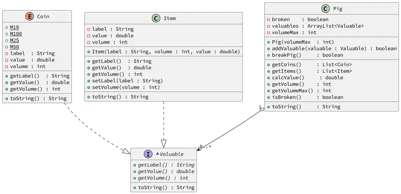

# Seu porquinho cresceu

<!-- toch -->
[Intro](#intro) | [Draft](#draft) | [Guide](#guide) | [Shell](#shell)
-- | -- | -- | --
<!-- toch -->


## Intro

O sistema deverá:

- Gerenciar um cofrinho do tipo Porquinho capaz de guardar moedas e itens.
- As moedas devem ser criadas através de uma `enum`.
- Ambos moedas e itens deve implementar a Interaface `Valuable`.
- O volume do cofre incrementa conforme ele recebe itens e moedas.
- A lógica da utilização do cofre é:
  - Para inserir moedas e itens, o cofre deve estar inteiro.
  - Para obter moedas e itens, o cofre deve estar quebrado.
  - Ao quebrar, o volume do porco deve ser zerado e o status de broken deve ser alterado para `true`.
  - Ao obter moedas e itens, você deve retornar os objetos armazenados.
  - Calcular o valor e o volume atual do porco deve ser feito através do método getValue() e getVolume().
  - Moedas e Itens devem ser armazenados em uma mesma lista de Valuables.

***

## Draft

<!-- links .cache/drafts -->
- cpp
  - [shell.cpp](.cache/drafts/cpp/shell.cpp)
- java
  - [Shell.java](.cache/drafts/java/Shell.java)
- ts
  - [shell.ts](.cache/drafts/ts/shell.ts)
<!-- links -->


## Guide



[](https://youtu.be/vzGO1V1nGpY?si=mZZ9da229M9KTf3b)


## Shell

```sh
#TEST_CASE init
$init 20
$show
[] : 0.00$ : 0/20 : intact

#TEST_CASE insert
$addCoin 10
$show
[M10:0.10:1] : 0.10$ : 1/20 : intact

$addCoin 50
$show
[M10:0.10:1, M50:0.50:3] : 0.60$ : 4/20 : intact

#TEST_CASE itens
$addItem ouro 50.0 3
$show
[M10:0.10:1, M50:0.50:3, ouro:50.00:3] : 50.60$ : 7/20 : intact

$addItem passaporte 0.0 2
$show
[M10:0.10:1, M50:0.50:3, ouro:50.00:3, passaporte:0.00:2] : 50.60$ : 9/20 : intact

#TEST_CASE failed break
$extractItems
fail: you must break the pig first

$extractCoins
fail: you must break the pig first

$show
[M10:0.10:1, M50:0.50:3, ouro:50.00:3, passaporte:0.00:2] : 50.60$ : 9/20 : intact

#TEST_CASE breaking
$break
$show
[M10:0.10:1, M50:0.50:3, ouro:50.00:3, passaporte:0.00:2] : 50.60$ : 0/20 : broken

#TEST_CASE extractItems

$extractItems
[ouro:50.00:3, passaporte:0.00:2]

$show
[M10:0.10:1, M50:0.50:3] : 0.60$ : 0/20 : broken

#TEST_CASE extractCoins

$extractCoins
[M10:0.10:1, M50:0.50:3]

$show
[] : 0.00$ : 0/20 : broken
$end
```

```sh
#TEST_CASE
$init 10

$break

$addCoin 10
fail: the pig is broken

$show
[] : 0.00$ : 0/10 : broken

$addItem bilhete 0.00 2
fail: the pig is broken

$show
[] : 0.00$ : 0/10 : broken

$end
```

```sh
#TEST_CASE full coin
$init 5

$addCoin 10
$addCoin 25
$show
[M10:0.10:1, M25:0.25:2] : 0.35$ : 3/5 : intact

$addCoin 50
fail: the pig is full

$show
[M10:0.10:1, M25:0.25:2] : 0.35$ : 3/5 : intact

#TEST_CASE full item
$addItem ouro 100.0 1

$show
[M10:0.10:1, M25:0.25:2, ouro:100.00:1] : 100.35$ : 4/5 : intact

$addItem pirulito 5.50 2
fail: the pig is full

$show
[M10:0.10:1, M25:0.25:2, ouro:100.00:1] : 100.35$ : 4/5 : intact

$end
```
