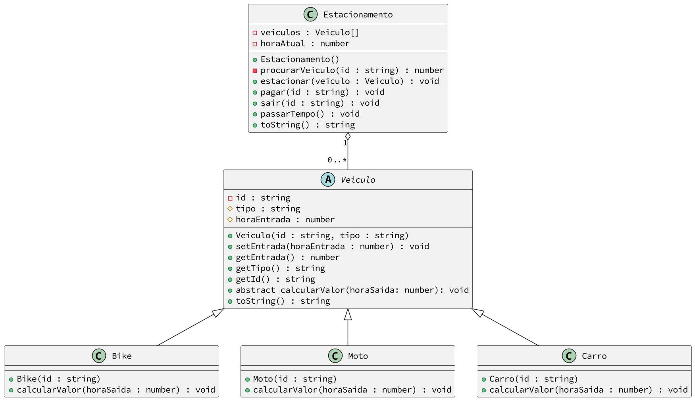

# Cobrando o valor de carros e motos no @estacionamento


## Intro

O sistema de estacionamento é responsável por gerenciar veículos em um estacionamento, registrando a entrada e saída de veículos, calculando o valor a ser pago pelo tempo de permanência e fornecendo informações sobre os veículos estacionados.

- Você deve utilizar herança para construir um sistema para gerenciar um estacionamento de bicicletas, carros e motos.
- A classe Veículo é uma classe abstrata que possui os atributos `id`, `entrada` e `tipo`.
- A classe Veículo possui um método abstrato `calcularValor()` que deve ser implementado pelas classes filhas.
- A classe Veículo possui um método `toString()`.

### Responsabilidades

- **Registrar Entrada de Veículo:**
  - O sistema deve permitir que novos veículos entrem no estacionamento, registrando o tipo de veículo e seu identificador.
  - O tempo de entrada do veículo deve ser registrado.

- **Registrar Saída de Veículo:**
  - O sistema deve permitir que veículos saiam do estacionamento, registrando o tempo de saída do veículo.
  - Com base no tempo de entrada e saída, o sistema deve calcular o valor a ser pago pelo estacionamento.

- **Calcular Valor a Pagar:**
  - O valor a ser pago pelo estacionamento é calculado com base no tipo de veículo estacionado e no tempo de permanência.
  - O cálculo do valor varia de acordo com o tipo de veículo:
    - **Bike:** paga R$3 fixos.
    - **Moto:** paga o valor em minutos dividido por 20.
    - **Carro:** paga o valor em minutos dividido por 10, mas o valor mínimo é 5.00.

- **Obter Lista de Veículos Estacionados:**
  - O sistema deve ser capaz de fornecer uma lista de todos os veículos atualmente estacionados, incluindo o tipo de veículo, identificador e tempo de entrada.

## Guide



<!-- load diagrama.puml fenced=ts:filter -->

### Classe Veiculo

A classe `Veiculo` é uma classe abstrata que representa um veículo no estacionamento. Ela possui os seguintes atributos e métodos:

- **Atributos:**
  - `id`: Identificador do veículo.
  - `tipo`: Tipo do veículo.
  - `entrada`: Tempo de entrada do veículo no estacionamento.

- **Métodos:**
  - `constructor(id: string)`: Construtor da classe, que recebe o `id` do veículo como parâmetro e inicializa os atributos `id`, `tipo` e `entrada`. O tipo deve ser inicializado como uma string vazia e a entrada como 0.
  - `setEntrada(entrada: number): void`: Define o tempo de entrada do veículo no estacionamento.
  - `getEntrada(): number`: Retorna o tempo de entrada do veículo.
  - `getTipo(): string`: Retorna o tipo do veículo.
  - `getId(): string`: Retorna o identificador do veículo.
  - `toString(): string`: Retorna uma representação em string do veículo.

### Classes Específicas de Veículos

- **Classe `Bike`:**
  - Representa uma bicicleta no estacionamento.
  - Valor fixo de R$3,00 pelo estacionamento.

- **Classe `Moto`:**
  - Representa uma motocicleta no estacionamento.
  - Valor de R$0,05 por minuto pelo estacionamento.

- **Classe `Carro`:**
  - Representa um carro no estacionamento.
  - Valor de R$0,10 por minuto pelo estacionamento, com valor mínimo de R$5,00.

### Classe Estacionamento

A classe `Estacionamento` é responsável por gerenciar os veículos no estacionamento. Ela possui os seguintes atributos e métodos:

- **Atributos:**
  - `veiculos`: Array contendo todos os veículos estacionados.
  - `tempo`: Tempo atual do estacionamento.

- **Métodos:**
  - `estacionar(veiculo: Veiculo): void`: Adiciona um veículo ao estacionamento.
  - `pagar(id: string): void`: Calcula e imprime o valor a ser pago pelo estacionamento de um veículo.
  - `sair(id: string): void`: Remove um veículo do estacionamento.
  - `passarTempo(tempo: number): void`: Atualiza o tempo do estacionamento.

### Classe Adapter

A classe `Adapter` é responsável por adaptar a interface de entrada/saída para o sistema de estacionamento.

1. **Definição da Classe Adapter:**

   - Definir a classe `Adapter` com os métodos de entrada/saída necessários para interagir com o sistema de estacionamento.

2. **Implementação dos Métodos:**

   - `estacionar(tipo: string, id: string): void`: Adiciona um veículo ao estacionamento.
   - `passarTempo(tempo: number): void`: Atualiza o tempo do estacionamento.
   - `pagar(id: string): void`: Calcula e imprime o valor a ser pago pelo estacionamento de um veículo.
   - `sair(id: string): void`: Remove um veículo do estacionamento.

<!-- load -->

## Shell

```sh

#__case entrada bike
$show
Hora atual: 0
$tempo 30
$estacionar bike elias
$show
______Bike : _____elias : 30
Hora atual: 30

#__case entrada moto
$tempo 20
$estacionar moto abc1234
$show
______Bike : _____elias : 30
______Moto : ___abc1234 : 50
Hora atual: 50
#__case entrada carro
$tempo 50
$estacionar carro pog1000
$show
______Bike : _____elias : 30
______Moto : ___abc1234 : 50
_____Carro : ___pog1000 : 100
Hora atual: 100
$tempo 100
$estacionar carro uva9999
$tempo 30
$show
______Bike : _____elias : 30
______Moto : ___abc1234 : 50
_____Carro : ___pog1000 : 100
_____Carro : ___uva9999 : 200
Hora atual: 230

#__case saida
$pagar elias
Bike chegou 30 saiu 230. Pagar R$ 3.00
$pagar abc1234
Moto chegou 50 saiu 230. Pagar R$ 9.00
$pagar pog1000
Carro chegou 100 saiu 230. Pagar R$ 13.00
$pagar uva9999
Carro chegou 200 saiu 230. Pagar R$ 5.00
$end
```
