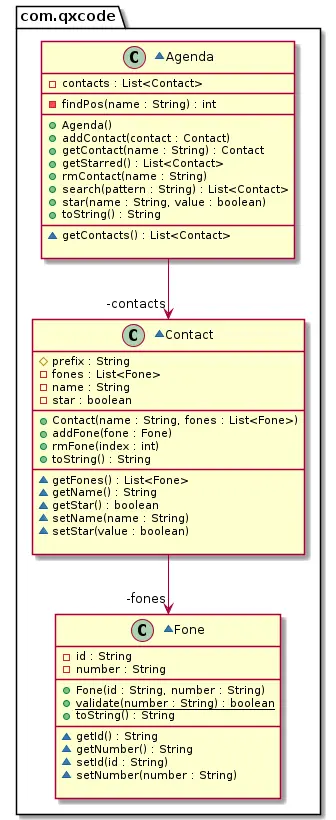

# Cache e redundância em @favoritos

<!-- toch -->
[Intro](#intro) | [Shell](#shell) | [Guide](#guide)
-- | -- | --
<!-- toch -->


Ampliando a atividade de agenda 2, vamos criar uma agenda que gerencia os nossos contatos.

## Intro

O sistema deverá:

- Partida
  - Você deve utilizar o código construído na atividade busca.
  - Você deverá modificar o contato e a classe agenda para permitir a operação de favoritar contatos.
  - Para isso, o contato ganhará um atributo "star" que marca se ele está favoritado.
  - A agenda ganhará os métodos star e getStarred para favoritar e pegar os favoritos.
- Mostrando
  - Ordenar os contatos pelo idContato.
  - Se o contato não for favorito (starred) use - antes do idContato.
  - Marque os contatos que são favoritados com um @ antes do idContato.
- Favoritando
  - Favoritar contatos. (star)
  - Desfavoritar contatos. (unstar)
  - Mostrar apenas os favoritos. (starred)

## Shell

```bash
#TEST_CASE iniciando agenda
$add eva oi:8585 claro:9999
$add ana tim:3434 
$add ana casa:4567 oi:8754
$add bia vivo:5454
$add rui casa:3233
$add zac fixo:3131

$show
- ana [0:tim:3434] [1:casa:4567] [2:oi:8754]
- bia [0:vivo:5454]
- eva [0:oi:8585] [1:claro:9999]
- rui [0:casa:3233]
- zac [0:fixo:3131]

#TEST_CASE favoritando
$star eva
$star ana
$star ana
$star zac

$show
@ ana [0:tim:3434] [1:casa:4567] [2:oi:8754]
- bia [0:vivo:5454]
@ eva [0:oi:8585] [1:claro:9999]
- rui [0:casa:3233]
@ zac [0:fixo:3131]

#TEST_CASE lista de favoritos
$starred
@ ana [0:tim:3434] [1:casa:4567] [2:oi:8754]
@ eva [0:oi:8585] [1:claro:9999]
@ zac [0:fixo:3131]

#TEST_CASE removendo contato
$rm zac

$show
@ ana [0:tim:3434] [1:casa:4567] [2:oi:8754]
- bia [0:vivo:5454]
@ eva [0:oi:8585] [1:claro:9999]
- rui [0:casa:3233]

$starred
@ ana [0:tim:3434] [1:casa:4567] [2:oi:8754]
@ eva [0:oi:8585] [1:claro:9999]

#TEST_CASE desfavoritando
$unstar ana

$starred
@ eva [0:oi:8585] [1:claro:9999]

$show
- ana [0:tim:3434] [1:casa:4567] [2:oi:8754]
- bia [0:vivo:5454]
@ eva [0:oi:8585] [1:claro:9999]
- rui [0:casa:3233]
$end
```

***

## Guide


