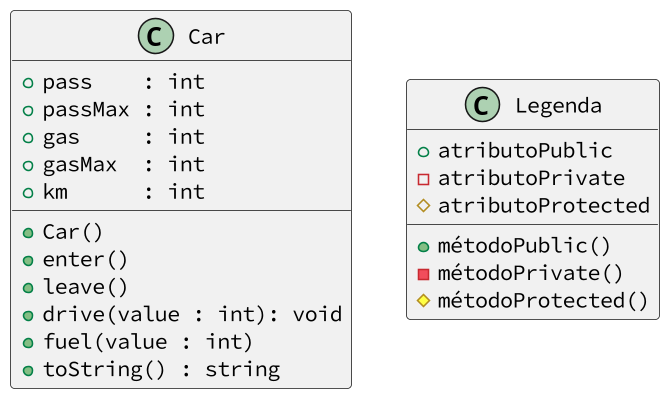

# @fusca - carro com testes sem o shell

<!-- toch -->
[Model](#model) | [Intro](#intro) | [Guide](#guide) | [Shell](#shell) | [Draft](#draft) | [Cheat](#cheat)
-- | -- | -- | -- | -- | --
<!-- toch -->


## Model

Esta atividade utiliza um padrão de projeto de requisições e respostas.

- Os testes são feitos através de requisições de texto e podem ser vistos na seção [Shell](#shell).
- A classe `Shell` é responsável por ler as requisições de texto, decodificar e chamar os métodos da classe `Adapter`.
- Na classe `Adapter`, você deve implementar e conectar seu código.
- A classe `Adapter` é apenas a classe de conexão. Você deve implementar as classes que contêm a lógica do problema. Utilize como base o diagrama de classes e a descrição do problema.
- Mensagens de erro podem ser lançadas por exceções ou por comandos de `print` diretamente para o terminal.
- Ao mostrar uma string formatada, será utilizado o modelo do Python `f"{variavel:param}"`.
- Se houver, na seção [Cheat](#cheat), você pode conferir as respostas desta atividade.

## Intro

Nesta atividade, vamos implementar um carro ecológico. Ele deve ser capaz de embarcar e desembarcar pessoas, abastecer e andar.

- Descrição
  - O carro deve ser inicializado com o tanque vazio, sem ninguém dentro e com 0 quilômetros percorridos. Para simplificar, nosso carro esportivo suporta até 2 pessoas e seu tanque suporta até 100 litros de combustível.
- Responsabilidades
  - O código deve ser implementado na classe `Carro`.
  - A classe `Adapter` é responsável por chamar os métodos da classe `Carro`.
  - A classe `Shell` é responsável por ler as requisições de texto e chamar os métodos da classe `Adapter`.
- Comandos
  - Todos os comandos seguem o modelo `$comando arg1 arg2 ...`.
  - `$show` - Mostra o estado atual do carro.
    - `f"pass:{this.pass},gas:{this.gas},km:{this.km}"`.
    - Exemplo: `pass: 0, gas: 0, km: 0`.
  - `$init` - Inicializa todos os atributos.
    - Tanque vazio.
    - 0 passageiros.
    - 0 quilômetros percorridos.
    - Máximo de 2 pessoas.
    - Máximo de 100 litros de gasolina.
  - `$enter` - Embarca uma pessoa por vez, mas não além do máximo.
    - Se o carro estiver lotado, emite a mensagem de erro `fail: limite de pessoas atingido`.
  - `$leave` - Desembarca uma pessoa por vez.
    - Se não houver ninguém no carro, emite a mensagem de erro `fail: nao ha ninguem no carro`.
  - `$fuel qtd` - Abastece o tanque com a quantidade de litros de combustível passada.
    - Caso tente abastecer acima do limite, descarta o valor excedente.
  - `$drive dist` - Para dirigir, o carro consome combustível e aumenta a quilometragem.
    - Só pode dirigir se houver combustível e se houver alguém no carro.
    - Caso não haja ninguém no carro, emite a mensagem de erro “fail: não há ninguém no carro”.
    - Caso não haja combustível, emite a mensagem de erro “fail: tanque vazio”.
    - Caso não exista combustível suficiente para completar a viagem inteira, dirige o máximo possível e emite uma mensagem indicando quanto foi percorrido, como no exemplo `fail: tanque vazio após andar {qtd} km`.

## Guide



- Parte 1: entrar
  - Crie a classe Car com os atributos pass, passMax, gas, gasMax e km;
  - Inicialize os atributos no construtor;
  - Crie o método enter que incrementa pass;
  - Crie um if para impedir que pass ultrapasse passMax;
  - Crie o método toString mostrar o estado do carro.
  - Teste seu código.
- Parte 2: desembarcar
  - Crie o método `leave` que decrementa `pass`.
  - Crie um condicional para impedir que `pass` seja menor que 0.
  - Teste seu código.
- Parte 3: abastecer
  - Crie o método `fuel` que incrementa `gas` com o valor passado.
  - Crie um condicional para impedir que `gas` ultrapasse `gasMax`.
  - Teste seu código.
- Parte 4: dirigir
  - Crie o método `drive` que incrementa `km` e decrementa `gas` com o valor passado.
  - Crie testes para impedir que o carro dirija sem passageiros ou sem combustível.
  - Teste seu código.
- Parte 5: dirigir longas distâncias
  - Crie testes para impedir que o carro dirija mais do que o combustível permite.
  - Teste seu código.
- Parte 6: Adapter
  - Na classe `Adapter`, crie um atributo `carro` e o inicialize no construtor.
  - Nos outros métodos de `Adapter`, chame o método equivalente da classe `Car`.

## Shell

```py
#INPUT
entrando
#OUTPUT
$Carro criado
pass: 0, gas: 0, km: 0
$Entrando no carro
pass: 1, gas: 0, km: 0
$Entrando no carro
pass: 2, gas: 0, km: 0
$Entrando no carro
fail: limite de pessoas atingido
pass: 2, gas: 0, km: 0
#END
```

```py
#INPUT
saindo
#OUTPUT
$Carro criado
pass: 0, gas: 0, km: 0
$Entrando 2 pessoas no carro
pass: 2, gas: 0, km: 0
$Saindo do carro
pass: 1, gas: 0, km: 0
$Saindo do carro
pass: 0, gas: 0, km: 0
$Saindo do carro
fail: nao ha ninguem no carro
pass: 0, gas: 0, km: 0
#END
```

```py
#INPUT
abastecendo
#OUTPUT
$Carro criado
pass: 0, gas: 0, km: 0
$Abastecendo 10 litros
pass: 0, gas: 10, km: 0
$Abastecendo 30 litros
pass: 0, gas: 40, km: 0
$Abastecendo 100 litros
pass: 0, gas: 100, km: 0
#END
```

```py
#INPUT
dirigindo
#OUTPUT
$Carro criado
pass: 0, gas: 0, km: 0
$Tentando dirigir com carro vazio
fail: nao ha ninguem no carro
pass: 0, gas: 0, km: 0
$Entrando no carro
pass: 1, gas: 0, km: 0
$Testando dirigir sem gasolina
fail: tanque vazio
pass: 1, gas: 0, km: 0
$Abastecendo 30 litros
pass: 1, gas: 30, km: 0
$Testando dirigir com gasolina
pass: 1, gas: 20, km: 10
$Testando dirigir só parte do caminho
fail: tanque vazio apos andar 20 km
pass: 1, gas: 0, km: 30
#END
```

## Draft

<!-- links .cache/draft -->
- cpp
  - [fn.hpp](.cache/draft/cpp/fn.hpp)
  - [shell.cpp](.cache/draft/cpp/shell.cpp)
  - [student.cpp](.cache/draft/cpp/student.cpp)
- java
  - [Shell.java](.cache/draft/java/Shell.java)
  - [Student.java](.cache/draft/java/Student.java)
- py
  - [shell.py](.cache/draft/py/shell.py)
  - [student.py](.cache/draft/py/student.py)
- ts
  - [shell.ts](.cache/draft/ts/shell.ts)
  - [student.ts](.cache/draft/ts/student.ts)
<!-- links -->

## Cheat

<!-- links .cache/cheat -->
<!-- links -->