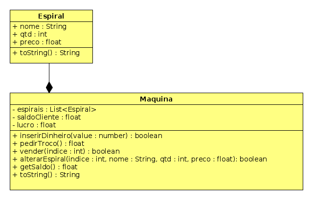

# Comprando comida cara e duvidosa

<!-- toch -->
[Intro](#intro) | [Draft](#draft) | [Guide](#guide) | [Shell](#shell) | [Resolução](#resolução)
-- | -- | -- | -- | --
<!-- toch -->


## Intro

Máquinas de junk food só servem pra 2 coisas, 1 vender comidas que fazem mal pra saúde, 2 rejeitar as notas velhas que você tem.

O objetivo dessa atividade é implementar uma classe responsável por uma máquina de vender JunkFood. Na máquina existem várias espirais (slots). Uma espiral contém uma certa quantidade de produtos do mesmo tipo e mesmo preço. O usuário coloca o dinheiro, compra o produto e recebe o troco.

- **Descrição**
  - A máquina de vendas é representada pela classe `Machine`, que contém um conjunto de "espirais", cada uma associada a um produto.
  - Os métodos implementados permitem configurar os produtos disponíveis na máquina, inserir dinheiro, solicitar troco, comprar produtos e visualizar o estado atual da máquina.
  - Cada espiral pode conter um produto, representado pela classe `Slot`, que armazena o nome, quantidade e preço do produto.
  - Os métodos fornecidos incluem validações para garantir a integridade das operações, como verificar se o saldo é suficiente para a compra, se há produtos disponíveis, entre outros.

- **Responsabilidades**
  - Na classe Slot
    - Inicialize as variáveis do construtor
      - name: string = "empty",
      - qtd: number = 0 e
      - preco: number = 0.0
    - Implemente os gets e sets
    - Crie o retorno do toString como no modelo: `[   empty : 0 U : 0.00 RS]`
  - A classe `Machine` é responsável por gerenciar as operações da máquina de vendas.
    - Métodos a serem implementados:
      - `getSlot(index: int) : Slot`:  Se houver slot nessa posição, retorna.
      - `setSlot(indice: number, name: string, qtd: number, price: number)`: Altera o valor slot na posição indice.
        - erro: `fail: indice nao existe`.
      - `limpar(indice: number)`: Limpa as informações do slot nessa posição.
      - `inserirDinheiro(value: number)`: Insere dinheiro na máquina.
      - `pedirTroco(): number`: Retorna o troco para o cliente.
      - `comprar(ind: number)`: Realiza a compra de um produto de um slot na máquina. A compra só pode ser realizada se existir produto nessa posição, se o saldo for suficiente e se a quantidade do produto for maior que zero. Caso positivo, quantidade é reduzida em 1 e o valor do produto é decrementado no saldo.
        - erros: `fail: indice nao existe`, `fail: saldo insuficiente`, `fail: espiral sem produtos`.
      - `getSaldo(): number`: Retorna o saldo atual na máquina.
      - `toString(): string`: Retorna uma representação em string do estado atual da máquina.
  - A classe `Adapter` atua como uma interface entre os métodos de teste e as operações da máquina de vendas.
    - Ela permite a execução de comandos como configuração de slots, inserção de dinheiro, compra de produtos, entre outras operações.
    - A classe `Adapter` delega as operações para a classe `Machine`, mantendo a separação de responsabilidades.

## Draft

- [draft.cpp](.cache/draft.cpp)
- [draft.ts](.cache/draft.ts)

## Guide



<!-- load diagrama.puml fenced=ts:filter -->

```ts

@startuml

skinparam defaultFontName "Source Code Pro"
skinparam dpi 150


class Slot {
    - name : String
    - price : float
    - quantity : int
    __
    + Slot(name : String, price: float, quantity: int)
    __
    + getName() : String
    + getPrice() : float
    + getQuantity() : int
    + setName(name: String) : void
    + setPrice(price: float) : void
    + setQuantity(quantity: int) : void
    __
    + toString() : String
}

class VendingMachine {
    - slots : Array<Slot>
    - profit : float
    - cash   : float
    - capacity : int
    __

    ' inicialize a máquina criando todos os slots
    + VendingMachine(capacity: int)
    __

    ' se houver slot nessa posição, retorne
    ' se não, retorne null ou lançe uma excessão
    + getSlot(index: int) : Slot

    ' altere o valor slot nessa posição
    + setSlot(index: int, slot: Slot) : void

    ' limpe as informações do slot nessa posição
    + clearSlot(index: int) : void
    __

    ' adicione dinheiro no cash da máquina
    + insertCash(cash: float) : void

    ' retorne o valor do cash da máquina e zere o cash
    + withdrawCash() : float

    ' informe o valor do cash sem zerar o cash
    + getCash() : float

    ' informe o valor apurado com todas as vendas
    + getProfit() : float
    __

    ' se existir produto nessa posição
    ' se o dinheiro do cash for suficiente
    ' se a quantidade do produto for maior que zero
    ' deduza da quantidade 1
    ' deduza do cash o valor do produto
    + buyItem(index: int) : void
    --
    + toString() : String
}

VendingMachine "1" o-- "1..*" Slot
@enduml
```

<!-- load -->

***

- Faça primeiro a classe Espiral.
- No construtor da class Maquina receba a quantidade de espirais. Para iniciar o vetor de espirais você pode fazer um laço inserindo qtd Espirais no vetor (Java).

- Exemplo em Java

```java
class Espiral{
    ...
    public Espiral({
    ...
    }
}

class Machine{
    ...
    espirais : ArrayList<Espiral>;
    public Machine(nespirais : number){
        this.espirais = new ArrayList<>();
        for(int i = 0; i < nespirais; i++){
            this.espirais.add(new Espiral("empty", 0, 0f)); //adicionando nespirais vazias
        }
    }
}
```

- Exemplo c++

```c++
//c++
class Espiral{
    //atributos
    Espiral(){
        //inicializacao
    }
}
class Maquina{
    std::vector<Espiral> espirais;
    //outros atributos
public:
    //invocando o construtor na lista de inicialização
    Maquina(int nespirais): espirais{nespirais}{ 
    }
}
```

## Shell

```bash
#TEST_CASE init

# init _espirais
$init 3
$show
saldo: 0.00
0 [   empty : 0 U : 0.00 RS]
1 [   empty : 0 U : 0.00 RS]
2 [   empty : 0 U : 0.00 RS]

#TEST_CASE inserindo comida
# set _ind _nome _qtd _valor 
$set 2 todinho 3 2.50
$show
saldo: 0.00
0 [   empty : 0 U : 0.00 RS]
1 [   empty : 0 U : 0.00 RS]
2 [ todinho : 3 U : 2.50 RS]

$set 0 tampico 1 1.50
$set 1 xaverde 3 5.00
$show   
saldo: 0.00
0 [ tampico : 1 U : 1.50 RS]
1 [ xaverde : 3 U : 5.00 RS]
2 [ todinho : 3 U : 2.50 RS]

#TEST_CASE limpando
# limpar _ind
$limpar 2
$show
saldo: 0.00
0 [ tampico : 1 U : 1.50 RS]
1 [ xaverde : 3 U : 5.00 RS]
2 [   empty : 0 U : 0.00 RS]
$set 4 ovo 2 4.30
fail: indice nao existe

#TEST_CASE dinheiro
# dinheiro _valor
$dinheiro 5
$dinheiro 4
$show   
saldo: 9.00
0 [ tampico : 1 U : 1.50 RS]
1 [ xaverde : 3 U : 5.00 RS]
2 [   empty : 0 U : 0.00 RS]

#TEST_CASE troco
$troco
voce recebeu 9.00 RS
$show
saldo: 0.00
0 [ tampico : 1 U : 1.50 RS]
1 [ xaverde : 3 U : 5.00 RS]
2 [   empty : 0 U : 0.00 RS]
$dinheiro 8

#TEST_CASE comprar
# comprar _ind
$comprar 1
voce comprou um xaverde

#TEST_CASE comprar sem dinheiro
$comprar 1
fail: saldo insuficiente

#TEST_CASE comprar
$comprar 0
voce comprou um tampico
$show
saldo: 1.50
0 [ tampico : 0 U : 1.50 RS]
1 [ xaverde : 2 U : 5.00 RS]
2 [   empty : 0 U : 0.00 RS]

#TEST_CASE comprar sem produtos
$comprar 0
fail: espiral sem produtos

#TEST_CASE comprar fora do indice
$comprar 4
fail: indice nao existe

$troco
voce recebeu 1.50 RS
$end
#__end__
```

## Resolução

Não assista sem antes tentar resolver o problema: [LINK](https://youtu.be/wabygPIeP2w)
