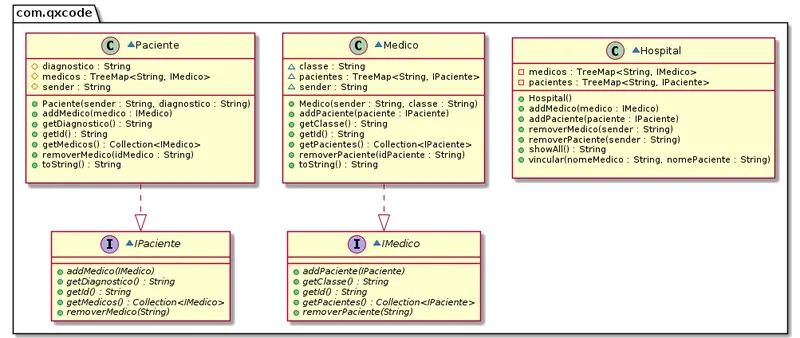

# @paciente

<!-- toch -->
[Intro](#intro) | [Guide](#guide)
-- | --
<!-- toch -->


## Intro

Na UTI do nosso hospital existem vários pacientes. Cada paciente é atendico por médicos de várias especialidades. Pacientes e médicos podem se comunicar via mensagens. O sistema deve ser capaz de.

- cadastrar pacientes e médicos.
- informar quais os médicos que atendem determinado paciente.
- informar quais pacientes que são atendidos por um médico.

- **Repositórios Individuais - 3.0 P**
  - Adicionar pacientes.
    - Cada paciente tem um id(nome) e uma diagnóstico.
  - Adicionar médicos.
    - Cada médico tem um id(nome) e uma especialidade.

```sh
#TEST_CASE inserir
$addPacs fred-fratura alvis-avc goku-hemorragia silva-sinusite
$addMeds bisturi-cirurgia snif-alergologia facada-cirurgia
$show
Pac: alvis:avc        Meds: []
Pac: fred:fratura     Meds: []
Pac: goku:hemorragia  Meds: []
Pac: silva:sinusite   Meds: []
Med: bisturi:cirurgia Pacs: []
Med: facada:cirurgia  Pacs: []
Med: snif:alergologia Pacs: []


#    - Vincular pacientes e médicos.
#        - Dois médicos da mesma especialidade não podem ser responsáveis pelo mesmo paciente.
#        - O paciente não deve entrar duas vezes na lista do médico e vice-versa.

#TEST_CASE vincular
# tie _med _pac _pac ...
$tie bisturi fred alvis goku
$tie snif silva alvis
$tie facada goku
fail: ja existe outro medico da especialidade cirurgia
$show
Pac: alvis:avc        Meds: [bisturi, snif]
Pac: fred:fratura     Meds: [bisturi]
Pac: goku:hemorragia  Meds: [bisturi]
Pac: silva:sinusite   Meds: [snif]
Med: bisturi:cirurgia Pacs: [alvis, fred, goku]
Med: facada:cirurgia  Pacs: []
Med: snif:alergologia Pacs: [alvis, silva]

$end
```

***

## Guide

