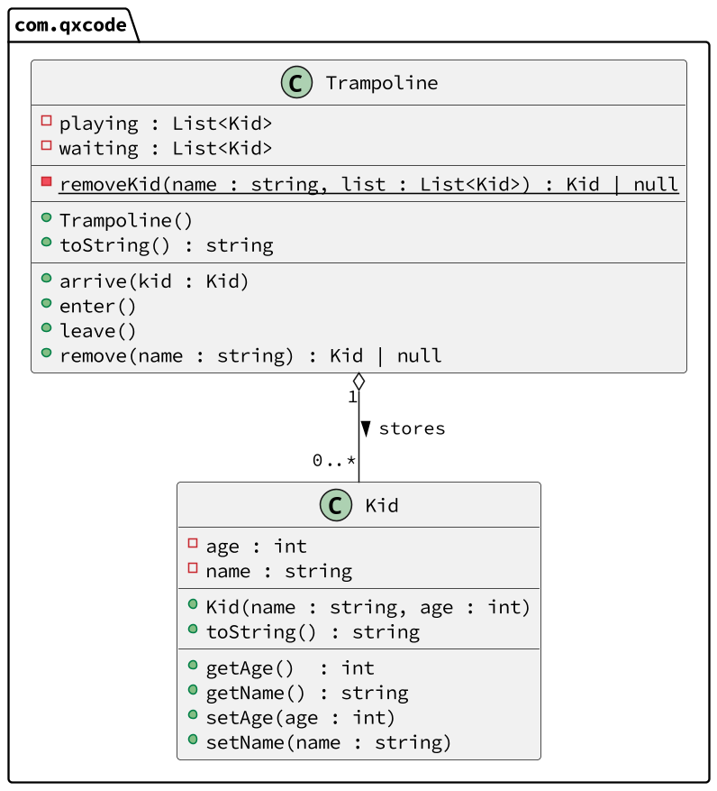

# Gerenciando entradas e saídas do pula pula

<!-- toch -->
[Intro](#intro) | [Draft](#draft) | [Guide](#guide) | [Shell](#shell)
-- | -- | -- | --
<!-- toch -->


Nosso objetivo no trabalho é modelar um gestor de pula pulas em um parquinho, controlando as pessoas que entram e saem do pula pula, além de coordenar as pessoas que estão na fila de espera.

## Intro

- Inserir crianças na fila de espera do pula pula
- Mover a primeira criança da fila de espera do pula pula para dentro do pula pula.
- Mover a primeira criança que entrou no pula pula para o final da fila de espera.

***

## Draft

<!-- links .cache/draft -->
- cpp
  - [fn.hpp](.cache/draft/cpp/fn.hpp)
  - [shell.cpp](.cache/draft/cpp/shell.cpp)
- java
  - [Shell.java](.cache/draft/java/Shell.java)
- ts
  - [shell.ts](.cache/draft/ts/shell.ts)
<!-- links -->

## Guide



<!-- load diagrama.puml fenced=ts:filter -->

```ts
@startuml

skinparam defaultFontName "Source Code Pro"
skinparam dpi 150
left to right direction

class Kid {
  - age : number
  - name: string
  __
  + Kid(name: string, age: number)
  + toString(): string
  __
  + getAge()    : number
  + getName()   : string
  + setAge (age : number): void
  + setName(name: string): void
}

class Trampoline {
  - playing: List<Kid>
  - waiting: List<Kid>
  __
  - {static} removeFromList(name: string, list: List<Kid>): Kid | null
  __
  + Trampoline()
  + toString(): string
  __
  + arrive(kid: Kid): void
  + enter()         : void
  + leave()         : void
  + removeKid(name: string): Kid | null
}


Trampoline "1" o--  "0..*" Kid : > stores
@enduml
```

<!-- load -->

***

## Shell

```bash
#TEST_CASE unico
# $chegou _nome _idade
# insere uma criança na fila de entrada do brinquedo
$arrive mario 5
$arrive livia 4
$arrive luana 3

# show
# mostra a fila de entrada e o pula pula
$show
[luana:3, livia:4, mario:5] => []

#TEST_CASE entrando
# entrar
# tira a primeira criança da fila de entrada e insere no pula pula

$enter
$show
[luana:3, livia:4] => [mario:5]

#TEST_CASE segunda pessoa
$enter
$show
[luana:3] => [livia:4, mario:5]

#TEST_CASE saindo
$leave
$show
[mario:5, luana:3] => [livia:4]

#TEST_CASE remove
$remove luana

$show
[mario:5] => [livia:4]
$remove livia
$show
[mario:5] => []
$end
```

***

```bash
#TEST_CASE 2
$show
[] => []
$arrive mario 5
$show
[mario:5] => []
#TEST_CASE empty enter
$enter
$show
[] => [mario:5]
#TEST_CASE empty leave
$leave
$show
[mario:5] => []
$leave
$show
[mario:5] => []
#TEST_CASE remove from waiting
$remove mario
$show
[] => []
#TEST_CASE remove empty
$remove rebeca
$show
[] => []
$end
```
