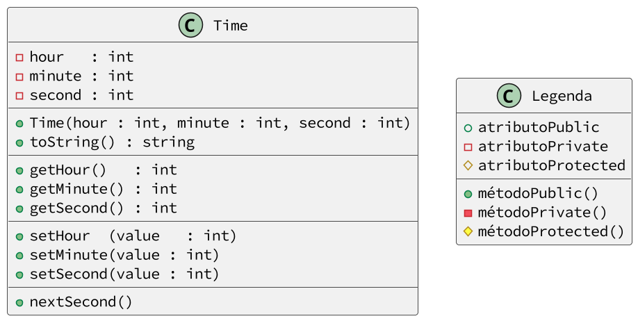

# Garante uma hora válida no relógio

<!-- toch -->
[Intro](#intro) | [Treino](#treino) | [Draft](#draft) | [Guide](#guide) | [Shell](#shell)
-- | -- | -- | -- | --
<!-- toch -->


## Intro

Utilizando os comandos set para manter a hora correta

O sistema deverá:

- Gerenciar uma classe que guarda a hora, minuto e segundo.
- Ao iniciar a classe, hora, minuto e segundo devem ser setados para 0.
  - O construtor deve receber 3 parâmetros, hora, minuto e segundo.
  - Para fazer a inicialização dos 3 parâmetros, utilize os métodos set.
- Crie os métodos getters e setters para cada atributo.
  - Os métodos set devem garantir que os valor atribuído sempre seja válido, ou não realize nenhuma mudança.
- Crie um método que imprime a hora no formato HH:MM:SS.
- Crie um método que incrementa o segundo em 1.

## Treino

- Parte 1: atributos públicos
  - Crie a classe relógio com os atributos públicos hora, minuto e segundo.
  - Crie o método construtor que inicializa os atributos com 0.
  - Crie o método toString que retorna a hora no formato HH:MM:SS.
  - Crie um objeto relógio, atribua valores para hora, minuto e segundo e imprima a hora.
  - Atribua valores inválidos para hora, minuto e segundo e imprima a hora.
- Parte 2: atributos privados
  - Torne os atributos hora, minuto e segundo privados.
  - Crie os métodos getters e setters para cada atributo.
    - Nos métodos set, NÃO realize nenhuma validação.
  - Crie um objeto relógio, atribua valores para hora, minuto e segundo e imprima a hora.
  - Atribua valores inválidos para hora, minuto e segundo e imprima a hora.
- Parte 3: validação
  - Nos métodos set, realize a validação dos valores.
    - Hora deve ser entre 0 e 23. Minuto e segundo devem ser entre 0 e 59.
  - Crie um objeto relógio, atribua valores para hora, minuto e segundo e imprima a hora.
  - Tente atribuir valores inválidos para hora, minuto e segundo e verifique se a hora permaneceu a mesma.
- Parte 4: construtor
  - Crie um método construtor que recebe hora, minuto e segundo.
  - Utilize os métodos set para fazer a inicialização dos atributos.
  - Tente atribuir valores inválidos para hora, minuto e segundo através do construtor e verifique se a hora permaneceu a mesma.
- Parte 5: nextSecond
  - Crie um método nextSecond que incrementa o segundo em 1.
  - Crie um objeto relógio, atribua valores para hora, minuto e segundo e imprima a hora.
  - Teste o método nextSecond criando horas com os seguintes valores e testando:
    - 10:02:30
    - 15:50:59
    - 21:59:59
    - 23:59:59

***

## Draft

<!-- links .cache/draft -->
- cpp
  - [fn.hpp](.cache/draft/cpp/fn.hpp)
  - [shell.cpp](.cache/draft/cpp/shell.cpp)
  - [time.hpp](.cache/draft/cpp/time.hpp)
- java
  - [Shell.java](.cache/draft/java/Shell.java)
  - [Time.java](.cache/draft/java/Time.java)
- ts
  - [aashell.ts](.cache/draft/ts/aashell.ts)
  - [adapter.ts](.cache/draft/ts/adapter.ts)
<!-- links -->

## Guide



***

## Shell

```bash
#TEST_CASE set
$show
00:00:00

#TEST_CASE set

$set 10 02 30
$show 
10:02:30

#TEST_CASE set2
$set 15 50 59
$show
15:50:59

#TEST_CASE error

$set 25 10 30
fail: hora invalida

$show
15:10:30

#TEST_CASE error2
$set 1 70 50
fail: minuto invalido
$show
01:10:50

#TEST_CASE error3
$set 23 59 70
fail: segundo invalido
$show
23:59:50

#TEST_CASE next
$set 15 59 59
$show
15:59:59

#TEST_CASE next2

$next
$show
16:00:00

$end
```

***

```bash
#TEST_CASE set
$set 23 59 59
$show
23:59:59

#TEST_CASE next3

$next
$show
00:00:00

$end
```

***

```bash
#TEST_CASE init
$init 10 20 30
$show
10:20:30

#TEST_CASE init2

$init 90 20 30
fail: hora invalida

$show
00:20:30

#TEST_CASE init3
$init 90 100 60
fail: hora invalida
fail: minuto invalido
fail: segundo invalido

$show
00:00:00

$end
```
