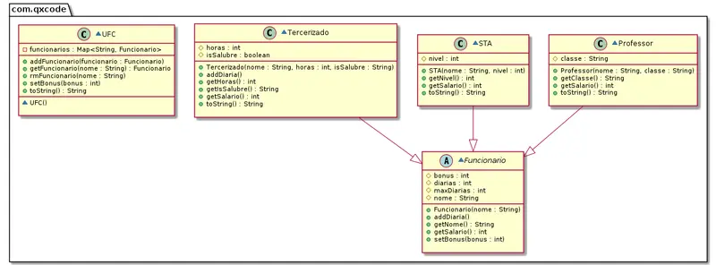

# @salario

<!-- toch -->
[Intro](#intro) | [Shell](#shell) | [Guide](#guide)
-- | -- | --
<!-- toch -->


A UFC está precisando de um novo sistema de geração de folhas de pagamento, você aceita o desafio?'

Você deve desenvolver um sistema para calcular o salário de um funcionário de acordo com sua função e adicionais

## Intro

- Cadastrar funcionario pelo nome.
  - nome do funcionario é único
  - funcionário pode ser professor, servidor tec. administrativo ou terceirizado
- Mostrar funcionário
- Remover funcionário

### Regras de negócio parte 1

- O salário de professor deve ser calculado com base na sua classe
  - A 3000
  - B 5000
  - C 7000
  - D 9000
  - E 11000
- O Sta(Servidor Técnico Administrativo) tem um salario base de 3000 e é acrescentado mais 300 de acordo com seu nível
  - salario = 3000 + 300 * nivel
- O salário do Ter(Terceirizado) é obtido do produto das horas trabalhadas e 4
    e é acrescentado 500 se for insalubre
  - salario = 4 * horas (+ 500 se insalubre)

### Regras de negócio parte 2

- Adicionar diárias
- Prof podem receber no máximo 2 diárias, Sta no máximo 1 e Ter não podem receber.
- Diarias aumentam 100 reais no salario

### Requisitos e Regras de negócio parte 3

- Adicionar bônus. O valor do bônus é definido e então é dividido igualmente entre todos os funcionários.
- O valor do bônus pode mudar e o salário deve ser recalculado.

## Shell

```bash
#TEST_CASE begin
$addProf david C
$addProf elvis D
$addSta gilmario 3
$addTer helder 40 sim
$showAll
prof:david:C:7000
prof:elvis:D:9000
sta:gilmario:3:3900
ter:helder:40:sim:660
$rm elvis
$showAll
prof:david:C:7000
sta:gilmario:3:3900
ter:helder:40:sim:660

#TEST_CASE diaria
$addDiaria david
$addDiaria david
$addDiaria david
fail: limite de diarias atingido
$show david
prof:david:C:7200
$addDiaria gilmario
$addDiaria gilmario
fail: limite de diarias atingido
$show gilmario
sta:gilmario:3:4000
$addDiaria helder
fail: terc nao pode receber diaria

#TEST_CASE bonus

# um bonus de 600, para 3 funcionários vai dar 200 reais pra cada
$setBonus 600
$show gilmario 
sta:gilmario:3:4200

$setBonus 300
$show gilmario
sta:gilmario:3:4100
$end
```

## Guide

- Faça com que prof, sta e ter sejam subclasses de Funcionário, ou seja herdem todos os atributos e métodos da classe Funcionário.
- Utilize apenas um repositório (tire proveito do polimorfismo).
- As classes filhas devem sobrescrever os métodos herdados da classe pai sempre que você achar necessário.


