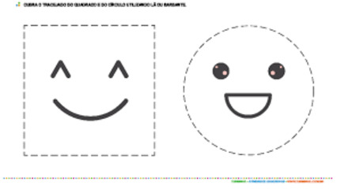

# Utilizando interface em círculos e retângulos

<!-- toch -->
[Intro](#intro) | [Guide](#guide) | [Shell](#shell) | [Draft](#draft)
-- | -- | -- | --
<!-- toch -->



## Intro

O objetivo desta atividade é implementar um sistema para gerenciar formas geométricas. Você precisará criar classes para representar pontos, círculos e retângulos.

- **Descrição**
  - A interface `Shape` define métodos que todas as formas geométricas devem implementar.
  - A classe `Point2D` representa um ponto no plano bidimensional.
  - As classes `Circle` e `Rectangle` implementam a interface `Shape` e representam um círculo e um retângulo, respectivamente.

### Interface Shape

A interface `Shape` exige a implementação dos seguintes métodos (os métodos abaixo não são implementadas na classe Shape, apenas nas classes filhas):

- `getArea()`: Retorna a área da forma.
- `getPerimeter()`: Retorna o perímetro da forma.
- `getName()`: Retorna o nome da forma.

### Classe Point2D

A classe `Point2D` representa um ponto no plano bidimensional e possui:

- **Atributos:**
  - `x`: coordenada x do ponto.
  - `y`: coordenada y do ponto.
- **Métodos:**
  - `constructor(x: number, y: number)`: Inicializa os atributos x e y.
  - `toString()`: Retorna a representação do ponto no formato `(x, y)`. Exemplo: `(0.00, 0.00)`.

### Classe Circle

A classe `Circle` implementa a interface `Shape` e representa um círculo. Deve incluir:

- **Atributos:**
  - `name`: Nome da forma, que é "Circ".
  - `center`: Centro do círculo, representado por um `Point2D`.
  - `radius`: Raio do círculo.
- **Métodos:**
  - `constructor(center: Point2D, radius: number)`: Inicializa os atributos center e radius.
  - `getName()`: Retorna o nome "Circ".
  - `getArea()`: Calcula e retorna a área do círculo usando a fórmula `π * raio²`.
  - `getPerimeter()`: Calcula e retorna o perímetro do círculo usando a fórmula `2 * π * raio`.
  - `toString()`: Retorna uma string no formato `Circ: C=(x, y), R=radius`.

### Classe Rectangle

A classe `Rectangle` também implementa a interface `Shape` e representa um retângulo. Deve incluir:

- **Atributos:**
  - `name`: Nome da forma, que é "Rect".
  - `p1`: Um vértice do retângulo (ponto superior esquerdo), representado por um `Point2D`.
  - `p2`: O vértice oposto do retângulo (ponto inferior direto), representado por um `Point2D`.
- **Métodos:**
  - `constructor(p1: Point2D, p2: Point2D)`: Inicializa os atributos p1 e p2.
  - `getName()`: Retorna o nome "Rect".
  - `getArea()`: Calcula e retorna a área do retângulo usando a fórmula `largura * altura`.
    - `largura` é a diferença absoluta entre `x` de `p1` e `p2`.
    - `altura` é a diferença absoluta entre `y` de `p1` e `p2`.
  - `getPerimeter()`: Calcula e retorna o perímetro do retângulo usando a fórmula `2 * (largura + altura)`.
  - `toString()`: Retorna uma string no formato "Rect: P1=(x1, y1) P2=(x2, y2)".

### Função principal

- Crie um vetor de shapes para gerenciar.
- Nas ações `circle` e `rect`, instancie o objeto adequado e adicione-o ao vetor de shapes.

## Guide


[](https://youtu.be/VMHI9mjIwZQ?si=jUgIc0AT9YY3Dc7K)


## Shell

```sh
#TEST_CASE creating figures
$circle 2 3 5

#TEST_CASE showing
$show
Circ: C=(2.00, 3.00), R=5.00

#TEST_CASE creating more figures
$rect 1 1 3 3
$rect 2 4.53 5 10
$circle 1 1 1.5

#TEST_CASE showing all
$show
Circ: C=(2.00, 3.00), R=5.00
Rect: P1=(1.00, 1.00) P2=(3.00, 3.00)
Rect: P1=(2.00, 4.53) P2=(5.00, 10.00)
Circ: C=(1.00, 1.00), R=1.50


#TEST_CASE showing area and perimeter
$info
Circ: A=78.54 P=31.42
Rect: A=4.00 P=8.00
Rect: A=16.41 P=16.94
Circ: A=7.07 P=9.42

$end
```

## Draft

<!-- links .cache/draft -->
- cpp
  - [shell.cpp](.cache/draft/cpp/shell.cpp)
- java
  - [Shell.java](.cache/draft/java/Shell.java)
- ts
  - [shell.ts](.cache/draft/ts/shell.ts)
<!-- links -->
