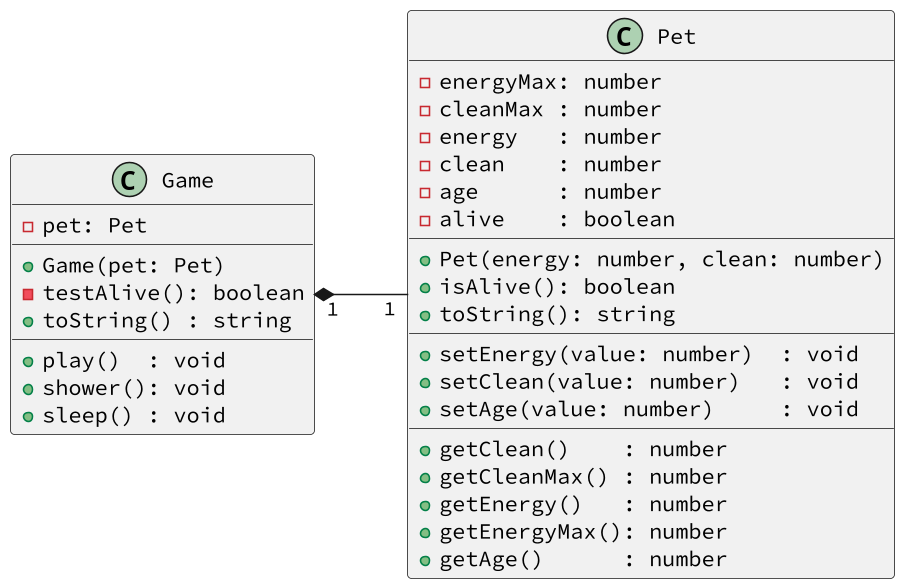

# Alimente, brinque e mate

<!-- toch -->
[Intro](#intro) | [Draft](#draft) | [Guide](#guide) | [Shell](#shell)
-- | -- | -- | --
<!-- toch -->


Você deve implementar um simulador de bichinho virtual. Ele poderá brincar, dormir e tomar banho. E eventualmente morrerá, se você não cuidar bem dele.

***

## Intro

Seu sistema deverá:

- Classe `Tamagochi`
  - É responsável por armazenar os dados relativos ao bichinho, controlar os limites permitidos para os atributos e registrar a morte.
  - Inicialização:
    - Recebe `energyMax` e `cleanMax` máximas do pet que representam os valores máximo de energia e limpeza.
    - `energy` e `clean` devem ser iniciados no máximo.
    - `age` inicia em zero e aumenta a cada turno.
    - `alive` inicia como `true` porque o bichinho inicia vivo.
  - Os métodos `set` alteram os valores dentro dos limites de 0 até o máximo permitido e se o valor em algum momento for 0, muda o valor de `alive` para false.
- Classe `Game`
  - É responsável por armazenar o bichinho.
  - É onde estão localizadas as lógicas sobre as ações de `play`, `shower` e `sleep`.
  - Cada operação causa aumento e reduções nos atributos utilizando os métodos `set` e `get` do `Tamagotchi`.
  - Antes de qualquer ação, é necessário verificar se o bicho está vivo. Pois brincar com bichos mortos não é recomendado.

***

## Draft

<!-- links .cache/draft -->
- cpp
  - [fn.hpp](.cache/draft/cpp/fn.hpp)
  - [shell.cpp](.cache/draft/cpp/shell.cpp)
- java
  - [Shell.java](.cache/draft/java/Shell.java)
- ts
  - [shell.ts](.cache/draft/ts/shell.ts)
<!-- links -->

## Guide



***

## Shell

```bash
#TEST_CASE inicio
# O comando "$init energia limpeza" recebe os valores do pet.
# O pet inicia com 0 de idade.
# Toda vez que $init é chamado, um novo pet é criado.
$init 20 15
# O comando "$show" mostra os parâmetros do Pet na seguinte ordem
# Energia/Max, Limpeza/Max, Idade
$show
E:20/20, L:15/15, I:0
$init 10 50
$show
E:10/10, L:50/50, I:0
$end
```

***

```bash
#TEST_CASE play - Brincar 
# O comando "$play" altera em -2 energia, -3 limpeza, +1 idade.
$init 20 15
$play
$show
E:18/20, L:12/15, I:1
$play
$play
$show
E:14/20, L:6/15, I:3

#TEST_CASE dormir
# O Comando "$sleep" aumenta energia até o máximo e idade aumenta do número de turnos que o pet dormiu.
$sleep
$show
E:20/20, L:6/15, I:9

#TEST_CASE tomar banho
# O comando "$shower" alteram em -3 energia, MAX na limpeza, +2 na idade.
$shower
$show
E:17/20, L:15/15, I:11

#TEST_CASE dormir sem sono
# Para dormir, precisa ter perdido pelo menos 5 unidades de energia
$sleep
fail: nao esta com sono

#TEST_CASE morrer
# Se algum atributo atingir 0, o pet morre e não poderá executar nenhuma ação
$play
$play
$play
$play
$show
E:9/20, L:3/15, I:15
$play
fail: pet morreu de sujeira
$show
E:7/20, L:0/15, I:16
$play
fail: pet esta morto
$shower
fail: pet esta morto
$sleep
fail: pet esta morto
$end
```

***

```bash
#TEST_CASE fraqueza
$init 5 10
$play
$play
$play
fail: pet morreu de fraqueza

#TEST_CASE morto de fraqueza
$play
fail: pet esta morto
$show
E:0/5, L:1/10, I:3
$end
```
