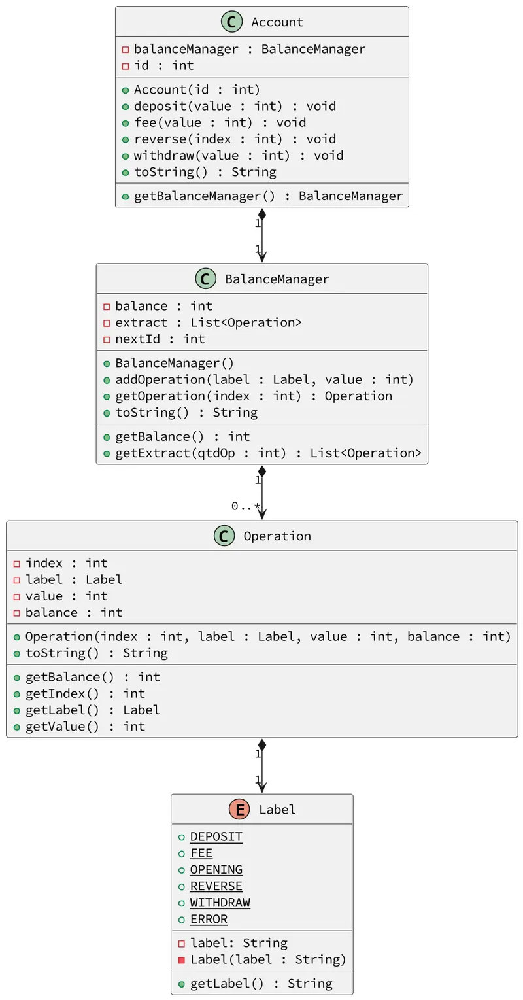

# Operações de saque, depósito, extrato

<!-- toch -->
[Intro](#intro) | [Draft](#draft) | [Guide](#guide) | [Shell](#shell)
-- | -- | -- | --
<!-- toch -->


O objetivo dessa atividade é implementar uma classe responsável por gerenciar a account bancária de um único cliente. Faremos operações de withdraw, depósito e extrato.

## Intro

- **Iniciar**
  - Iniciar a account passando número da account.
  - Se a account já existir, resete todos os valores para uma nova account.
  - Inicia a account com a operação de "abertura".
  - Para facilitar a visualização dos dados, utilize inteiros para registrar as operações financeiras.
- **Saque, Depósito e Tarifas**
  - Verifique se o valor é válido.
  - No caso da tarifa, o valor final de saldo poderá ser negativo.
  - No caso do saque, verifique se há saldo suficiente efetuar a operação.
- **Retornar o extrato**.
  - Retornar todas as movimentações da conta.
  - A descrição pode ser "opening", "withdraw", "deposit", "fee", "reverse", "error".
  - Os saques devem ter valor negativo e os depósitos positivos.
  - Se a quantidade for fornecida, retorne apenas as últimas movimentações.
- **Extornar tarifas**.
  - Deve ser possível extornar, pagando de volta, tarifas passando uma lista de índices.
  - Apenas efetue a operação de extorno dos índices válidos que forem tarifas.

***

## Draft

<!-- links .cache/drafts -->
- cpp
  - [shell.cpp](.cache/drafts/cpp/shell.cpp)
- java
  - [Shell.java](.cache/drafts/java/Shell.java)
- ts
  - [shell.ts](.cache/drafts/ts/shell.ts)
<!-- links -->

## Guide



[](https://youtu.be/KrjZsvprPq8?si=Jkc_90NZ6DrKElMH)


***

## Shell

```bash
#TEST_CASE iniciar
$init 100
$show
account:100 balance:0

#TEST_CASE depositar
$deposit 100
$show
account:100 balance:100

#TEST_CASE deposito invalido
$deposit -10
fail: invalid value
$show
account:100 balance:100

#TEST_CASE saque
$withdraw 20
$show
account:100 balance:80

#TEST_CASE taxa
$fee 10
$show
account:100 balance:70

#TEST_CASE saque muito alto
$withdraw 150
fail: insufficient balance
$show
account:100 balance:70

$withdraw 30
$show
account:100 balance:40

#TEST_CASE taxa
$fee 5
$show
account:100 balance:35

#__deposito
$deposit 5
$fee 1
$show
account:100 balance:39

#TEST_CASE extrato
#extrato mostra todas as operações desde a abertura da account
$extract 0
 0:  opening:    0:    0
 1:  deposit:  100:  100
 2: withdraw:  -20:   80
 3:      fee:  -10:   70
 4: withdraw:  -30:   40
 5:      fee:   -5:   35
 6:  deposit:    5:   40
 7:      fee:   -1:   39

#TEST_CASE extrato n
#extrato mostra as ultimas N operacoes
$extract 2
 6:  deposit:    5:   40
 7:      fee:   -1:   39

#TEST_CASE extornar
$reverse 1 5 7 50
fail: index 1 is not a fee
fail: index 50 invalid

#TEST_CASE novo extrato
$extract 0
 0:  opening:    0:    0
 1:  deposit:  100:  100
 2: withdraw:  -20:   80
 3:      fee:  -10:   70
 4: withdraw:  -30:   40
 5:      fee:   -5:   35
 6:  deposit:    5:   40
 7:      fee:   -1:   39
 8:  reverse:    5:   44
 9:  reverse:    1:   45

#TEST_CASE extrato tarifa
$fee 50
$extract 2
 9:  reverse:    1:   45
10:      fee:  -50:   -5

$end
```

***

```bash
#TEST_CASE fee
$init 107
$fee 10
$show
account:107 balance:-10
$extract 0
 0:  opening:    0:    0
 1:      fee:  -10:  -10
$end
```
