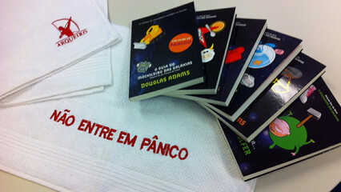
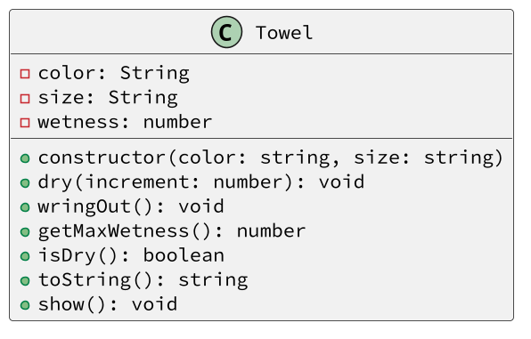

# Toalha, o item mais útil do universo



UML | Testes | Rascunho | Adapter | Esqueleto
--- | ------ | -------- | ------- | ---------
sim | não    | não      | não     | não

## Guide

- Crie uma classe `Toalha` com os atributos cor `color`, tamanho `size` e umidade `wetness`.
- Crie um construtor que inicialize todos os atributos cor e tamanho com valores recebidos como parâmetro e umidade com 0.
- Crie um método enxugar `dry` que recebe um valor inteiro `amout` e AUMENTA o atributo umidade da towel.
- Crie um método torcer `wringOut` que zera o atributo umidade da towel.
- Crie um método para pegar o máximo de umidade `getMaxWetness` que retorna o valor máximo de umidade que essa toalha pode ter.
- O máximo de umidade que uma toalha pode ter é de acordo com o tamanho dela:
  - `P` -> 10
  - `M` -> 20
  - `G` -> 30
- Crie um método que retorna se a toalha esta seca `isDry`, que retorna `true` se a umidade da toalha for 0 e `false` caso contrário.
- Faça um código de teste para validar o comportamento da classe `Toalha`.



## Exemplo

<!-- load solver.py fenced:filter:py -->

```py
class Towel:
    def __init__(self, color: str, size: str):
        self.color: str = color
        self.size: str = size
        self.wetness: int = 0
    
    def getMaxWetness(self) -> int:
    def dry(self, amount: int) -> None:
    def wringOut(self) -> None:
    def isDry(self) -> bool:
    def __str__(self) -> str:
    def show(self) -> None:
# Testes
towel = Towel("Azul", "P")
towel.show()  # Azul P 0
towel.dry(5)
towel.show()  # Azul P 5
print(towel.isDry()) # False
towel.dry(5)
towel.show()  # Azul P 10
towel.dry(5) # msg: toalha encharcada
towel.show()  # Azul P 10

towel.wringOut()
towel.show()  # Azul P 0

towel = Towel("Verde", "G")
print(towel.isDry()) # True
towel.dry(30)
towel.show()  # Verde G 30
print(towel.isDry()) # False
towel.dry(1)  # msg: toalha encharcada
```

<!-- load -->
