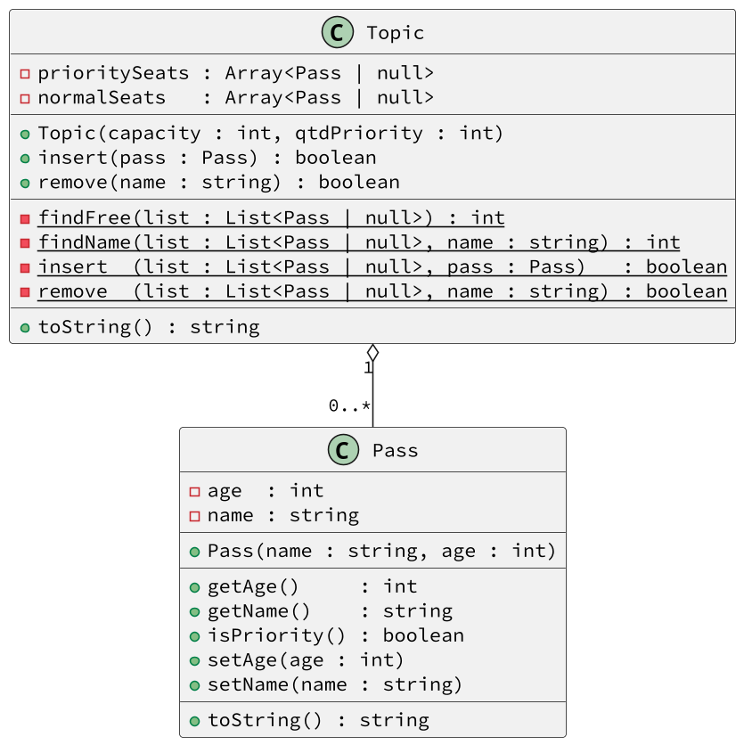

# Gerenciando assentos prioritários e normais

<!-- toch -->
[Intro](#intro) | [Shell](#shell)
-- | --
<!-- toch -->


O objetivo dessa atividade é exercitar o que vocês aprenderam no cinema com algumas variações. Aqui, vamos implementar um sistema de alocação de passageiros em uma topic. Nossa topic tem uma quantidade máxima de passageiros, mas também define alguns assentos preferenciais.

***

## Intro

Seu sistema deverá:

- **Inicializar e Mostrar.**
  - Iniciar a topic solicitando a lotação máxima e a quantidade de cadeiras preferenciais.
  - Mostrar o estado do trem
    - Coloque @ na frente das cadeiras preferenciais
    - Coloque = na frente das cadeiras normais.
- **Inserir.**
  - Inserir passageiros informando id e idade
    - Se o passageiro for idoso:
      - Se houver cadeiras preferenciais
        - O coloque na primeira cadeira preferência.
    - Senão
      - O coloque na primeira cadeira normal.
    - Se o passageiro não for idoso.
      - Se houver cadeiras não preferenciais
        - O coloque na primeira não preferencial.
      - Se não
        - O coloque na primeira cadeira preferencial.
- **Remover.**
  - Remover passageiros por id

Existe uma lista para as cadeiras normais e outra para as preferenciais. Para facilitar nas operações de busca e inserção, você deverá criar vários métodos privados para simplificar a lógica dos métodos principais.

***



***

## Shell

```bash

#######################################
#TEST_CASE Inicializar
#######################################
# init _lotacao _qtd_prioritarios
$show
[]
$init 5 2
$show
[@ @ = = =]

#TEST_CASE Embarque

$in davi 17
$show
[@ @ =davi:17 = =]

#TEST_CASE Embarque 2

$in joao 103
$show
[@joao:103 @ =davi:17 = =]

#TEST_CASE Embarque 3

$in ana 35
$show
[@joao:103 @ =davi:17 =ana:35 =]

#TEST_CASE Embarque 4

$in rex 20
$in bia 16
$show
[@joao:103 @bia:16 =davi:17 =ana:35 =rex:20]

#TEST_CASE Desembarque
$out davi
$show
[@joao:103 @bia:16 = =ana:35 =rex:20]

#__ case vaga
$in aragao 96
$show
[@joao:103 @bia:16 =aragao:96 =ana:35 =rex:20]

#TEST_CASE lotada
$in lucas 23
fail: topic lotada

#TEST_CASE não existe
$out marcelo
fail: marcelo nao esta na topic

$out ana

#TEST_CASE dobrado
$in bia 13
fail: bia ja esta na topic


#__ final
$show
[@joao:103 @bia:16 =aragao:96 = =rex:20]
$end
```
