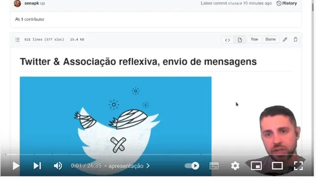
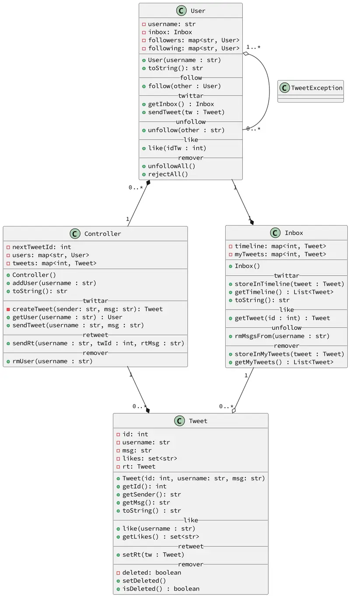

# Twitter antes de ser bloqueado

<!-- toch -->
[Vídeo](#vídeo) | [Intro](#intro) | [Draft](#draft) | [Guide](#guide) | [Shell](#shell)
-- | -- | -- | -- | --
<!-- toch -->


Vamos implementar o modelo do twitter. Os usuários se cadastram e podem follow outros usuários do sistema. Ao twittar, a mensagem vai para timeline de todas as pessoas que a seguem. Ao dar like, todos os usuários em suas timelines vêem os likes.

***

## Vídeo

[](https://www.youtube.com/watch?v=75-YyuNrOsc)

***

## Intro

- cadastrar
  - Adicionar usuário passando username.
  - Mostrar os usuários cadastrados.
- follow
  - Seguir um outro usuário cadastrado.
  - Mostrar a lista de seguidores.
  - Mostrar a lista de seguidos.
- twittar
  - Twittar um tweet com várias palavras.
    - O id de um tweet é único globalmente.
    - O tweet de um usuário vai para o início da timeline de seus seguidores.
    - O mesmo tweet vai também para sua própria timeline.
  - Mostrar a timeline de um usuário.
- like
  - Dar like num tweet da sua timeline.
- unfollow
  - Deixar de seguir um usuário.
  - Remover todos os tweets desse usuario da sua timeline.
- retweet
  - Retweetar um tweet da sua timeline.
  - Um novo tweet é criado e ele contém uma referência ao tweet original.
- remover
  - Remover um usuário do sistema.
  - Desfazer todos os vínculos de seguidores e seguidos dele.
  - Marcar todos os tweets dele no sistema como deletados.
  - Tweets deletados não aparecem nas timelines
  - Se um tweet é deletado, nos rt deve aparecer "esse tweet foi removido".

***

## Draft

<!-- links .cache/drafts -->
<!-- links -->

## Guide



## Shell

```bash
##################################
#TEST_CASE cadastrar
##################################
$add goku
$add sara
$add tina
$show
goku
  seguidos   []
  seguidores []
sara
  seguidos   []
  seguidores []
tina
  seguidos   []
  seguidores []

##################################
#TEST_CASE follow
##################################

$follow goku sara
$follow goku tina
$follow sara tina
$show
goku
  seguidos   [sara, tina]
  seguidores []
sara
  seguidos   [tina]
  seguidores [goku]
tina
  seguidos   []
  seguidores [goku, sara]

##################################
#TEST_CASE twittar
##################################
#twittar _userId _msg

$twittar sara hoje estou triste
$twittar tina ganhei chocolate
$twittar sara partiu ru
$twittar tina chocolate ruim
$twittar goku internet maldita

$timeline goku
4:goku (internet maldita)
3:tina (chocolate ruim)
2:sara (partiu ru)
1:tina (ganhei chocolate)
0:sara (hoje estou triste)

$timeline tina 
3:tina (chocolate ruim)
1:tina (ganhei chocolate)

$timeline sara
3:tina (chocolate ruim)
2:sara (partiu ru)
1:tina (ganhei chocolate)
0:sara (hoje estou triste)

##################################
#TEST_CASE like
##################################
#like _username _idTw

$like sara 1
$like goku 1
$like sara 3

$timeline sara
3:tina (chocolate ruim) [sara]
2:sara (partiu ru)
1:tina (ganhei chocolate) [goku, sara]
0:sara (hoje estou triste)

$timeline goku
4:goku (internet maldita)
3:tina (chocolate ruim) [sara]
2:sara (partiu ru)
1:tina (ganhei chocolate) [goku, sara]
0:sara (hoje estou triste)


##################################
#TEST_CASE unfollow
##################################

$unfollow goku tina
$show
goku
  seguidos   [sara]
  seguidores []
sara
  seguidos   [tina]
  seguidores [goku]
tina
  seguidos   []
  seguidores [sara]

$timeline goku
4:goku (internet maldita)
2:sara (partiu ru)
0:sara (hoje estou triste)

##################################
#TEST_CASE retweet
##################################

$timeline sara
3:tina (chocolate ruim) [sara]
2:sara (partiu ru)
1:tina (ganhei chocolate) [goku, sara]
0:sara (hoje estou triste)

$rt sara 3 olha goku, ela nao gostou do seu chocolate
$timeline sara
5:sara (olha goku, ela nao gostou do seu chocolate)
    3:tina (chocolate ruim) [sara]
3:tina (chocolate ruim) [sara]
2:sara (partiu ru)
1:tina (ganhei chocolate) [goku, sara]
0:sara (hoje estou triste)

$timeline goku
5:sara (olha goku, ela nao gostou do seu chocolate)
    3:tina (chocolate ruim) [sara]
4:goku (internet maldita)
2:sara (partiu ru)
0:sara (hoje estou triste)

##################################
#TEST_CASE erros
##################################

# lembre de tratar erros como
$timeline bruno
fail: usuario nao encontrado
$follow goku kuririm
fail: usuario nao encontrado
$like sara 4
fail: tweet nao existe

##################################
#TEST_CASE remover
##################################
$follow tina sara
$show
goku
  seguidos   [sara]
  seguidores []
sara
  seguidos   [tina]
  seguidores [goku, tina]
tina
  seguidos   [sara]
  seguidores [sara]

$rm tina
$show
goku
  seguidos   [sara]
  seguidores []
sara
  seguidos   []
  seguidores [goku]

$timeline goku
5:sara (olha goku, ela nao gostou do seu chocolate)
    3: (esse tweet foi deletado)
4:goku (internet maldita)
2:sara (partiu ru)
0:sara (hoje estou triste)

$timeline sara
5:sara (olha goku, ela nao gostou do seu chocolate)
    3: (esse tweet foi deletado)
2:sara (partiu ru)
0:sara (hoje estou triste)

$end

```
