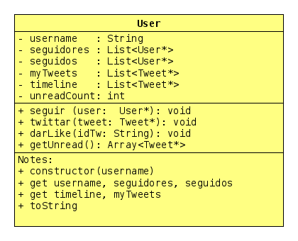

# Twitter antes de ser bloqueado

<!-- toch -->
[Vídeo](#vídeo) | [Intro](#intro) | [Draft](#draft) | [Guide](#guide) | [Shell](#shell)
-- | -- | -- | -- | --
<!-- toch -->


Vamos implementar o modelo do twitter. Os usuários se cadastram e podem follow outros usuários do sistema. Ao twittar, a mensagem vai para timeline de todas as pessoas que a seguem. Ao dar like, todos os usuários em suas timelines vêem os likes.

***

## Vídeo

[](https://www.youtube.com/watch?v=75-YyuNrOsc)

***

## Intro

- cadastrar
  - Adicionar usuário passando username.
  - Mostrar os usuários cadastrados.
- follow
  - Seguir um outro usuário cadastrado.
  - Mostrar a lista de seguidores.
  - Mostrar a lista de seguidos.
- twittar
  - Twittar um tweet com várias palavras.
    - O id de um tweet é único globalmente.
    - O tweet de um usuário vai para o início da timeline de seus seguidores.
    - O mesmo tweet vai também para sua própria timeline.
  - Mostrar a timeline de um usuário.
- like
  - Dar like num tweet da sua timeline.
- unfollow
  - Deixar de seguir um usuário.
  - Remover todos os tweets desse usuario da sua timeline.
- retweet
  - Retweetar um tweet da sua timeline.
  - Um novo tweet é criado e ele contém uma referência ao tweet original.
- remover
  - Remover um usuário do sistema.
  - Desfazer todos os vínculos de seguidores e seguidos dele.
  - Marcar todos os tweets dele no sistema como deletados.
  - Tweets deletados não aparecem nas timelines
  - Se um tweet é deletado, nos rt deve aparecer "esse tweet foi removido".

***

## Draft

- [draft.cpp](.cache/draft.cpp)

## Guide



<!-- load diagrama.puml fenced=ts:filter -->

```ts
'--
@startuml

skinparam defaultFontName Hasklig
skinparam dpi 150

class TweetException {
    '
}

'==

class Tweet {
    
    - id: int
    
    - username: str
    
    - msg: str
    
    ' guarda os username dos usuarios que deram like
    - likes: set<str>
    
    ' guarda o tweet original que foi retweetado
    - rt: Tweet
    
    __
    
    + Tweet(id: int, username: str, msg: str)
    
    + getId(): int
    
    + getSender(): str
    
    + getMsg(): str
    
    ' retorna as informacoes do tweet
    ' no modulo de likes e retweet
    ' esse método deve ser alterado conforme requisitos
    + toString() : str
    
    __like__
    
    ' adiciona o nome do usuario na lista de likes
    + like(username : str)
    
    ' retorna o nome dos usuarios que deram like
    + getLikes() : set<str>
    '
    __retweet__
    
    ' define que tw é o tweet original que está sendo retuitado
    ' o metodo toString deve mostrar o tweet original
    + setRt(tw : Tweet)
    
    __remover__
    
    ' marca se o tweet foi deletado
    - deleted: boolean
    
    ' marca o tweet como deletado
    ' substitui o texto da mensagem por "esse tweet foi deletado"
    ' apaga o username
    ' limpa a lista de likes
    + setDeleted()
    
    ' retorna true se o tweet foi deletado
    + isDeleted() : boolean
    '
}

class Inbox {
    
    - timeline: map<int, Tweet>
    
    - myTweets: map<int, Tweet>
    '
    __
    
    + Inbox()
    
    __twittar__
    
    ' adiciona um tweet na timeline
    + storeInTimeline(tweet : Tweet)
    
    ' retornam todos os tweets da timeline que não estiverem deletados
    ' os tweets mais recentes devem ficar primeiro na lista
    + getTimeline() : List<Tweet>
    
    ' retorna a timeline do usuario
    + toString(): str
    
    __like__
    
    ' obtem e retorna o tweet com o id passado da timeline
    ' ou dispara uma exceção se ele não existir
    + getTweet(id : int) : Tweet
    
    __unfollow__
    
    ' remove todos os tweets emitidos por esse usuario da sua timeline
    ' quando alguem deixa de seguir um usario, apaga todos os tweets 
    ' dele na sua timeline
    + rmMsgsFrom(username : str)
    
    __remover__
    
    ' adiciona um tweet no myTweets do usuario
    + storeInMyTweets(tweet : Tweet)
    
    ' retorna todos os tweets emitidos pelo usuario
    + getMyTweets() : List<Tweet>
    '
}

class User {
    
    - username: str
    
    - inbox: Inbox
    
    - followers: map<str, User>
    
    - following: map<str, User>
    
    __
    
    + User(username : str)
    
    ' mostra o nome dos seguidos e o nome dos seguires
    + toString(): str
    
    __follow__
    
    ' voce não pode seguir a voce mesmo
    ' se ainda nao estiver seguindo o usuario other
    '   adiciona other na lista de seguidos
    '   adiciona voce na lista de seguidores de other
    + follow(other : User)
    
    __twittar__
    
    + getInbox() : Inbox
    '
    ' coloca o tw no myTweets do usuario
    ' coloca o tw na timeline do usuario
    ' coloca o tw na timeline de todos os seguidores do usuario
    + sendTweet(tw : Tweet)
    
    __unfollow__
    
    ' se estiver seguindo esse username
    '   obtenha o objeto User correspondente na sua lista de seguidos
    '   remova ele da sua lista de seguidos
    '   remova todas as mensagens dele da sua timeline utilizando o metodo inbox.rmMsgsFrom(username)
    '   se remova da lista de seguidores dele
    + unfollow(other : str)
    
    __like__
    
    ' recupera o tweet com esse id da timeline do usuario
    ' invoca o método like do tweet
    + like(idTw : int)
    
    __remover__
    
    ' remove todos os seus seguidos
    ' se removendo também da lista de seguidores deles
    + unfollowAll()
    
    ' remove todos os seus seguidores
    ' se removendo também da lista de seguidos deles
    + rejectAll()
    '
}

class Controller {
    
    ' armazena o id para o proximo tweet a ser criado
    - nextTweetId: int
    
    ' armazena todos os usuarios do sistema
    - users: map<str, User>
    
    ' armazena todos os tweets do sistema
    - tweets: map<int, Tweet>
    
    __
    
    + Controller()
    
    ' se nao existe um usuario com esse username
    ' cria o usuario e armazena no mapa de usuarios
    + addUser(username : str)
    
    ' imprime todos os objetos usuarios do sistema
    + toString(): str
    
    __twittar__
    
    ' cria um novo objeto tweet com os dados passado
    ' utiliza o atributo nextTwId para gerar o id do tweet
    ' incrementa o atributo nextTwId
    ' armazena esse tweet no mapa de tweets
    ' retorna a referencia para o tweet criado
    - createTweet(sender: str, msg: str): Tweet
    
    ' retorna uma referencia para o objeto do usuario com esse username
    ' dispara uma excecao se o usuario nao existir
    + getUser(username : str) : User

    ' utiliza this.getUser para recuperar o objeto do usuario
    ' cria o tweet utilizando o this.createTweet e chama
    ' user.sendTweet(tweet) para entrega dos tweets nas timelines
    + sendTweet(username : str, msg : str)
    
    __retweet__
    
    ' recupera o user utilizando o this.getUser
    ' recupera o tweet original utilizando o user.getTweet
    ' cria um novo tweet com o tweet original e os outros parametros
    ' invoca user.sendTweet(tweet) para entrega dos tweets nas timelines
    + sendRt(username : str, twId : int, rtMsg : str)
    
    __remover__
    
    ' recupera o user utilizando o this.getUser
    ' remove todos os vínculos de seguidos e seguidores
    ' utilizando o user.unfollowAll() e user.rejectAll()
    ' marca todos os tweets de user.myTweets como deletados
    ' remove o user do mapa de usuarios
    + rmUser(username : str)
    
}

Controller "1" -* "0..*" Tweet
User "0..*" *- "1" Controller
User "1..*" o-- "0..*" User
User "1" --*  "1" Inbox
Inbox "1" --o "0..*" Tweet
@enduml

```

<!-- load -->

## Shell

```bash
##################################
#TEST_CASE cadastrar
##################################
$add goku
$add sara
$add tina
$show
goku
  seguidos   []
  seguidores []
sara
  seguidos   []
  seguidores []
tina
  seguidos   []
  seguidores []

##################################
#TEST_CASE follow
##################################

$follow goku sara
$follow goku tina
$follow sara tina
$show
goku
  seguidos   [sara, tina]
  seguidores []
sara
  seguidos   [tina]
  seguidores [goku]
tina
  seguidos   []
  seguidores [goku, sara]

##################################
#TEST_CASE twittar
##################################
#twittar _userId _msg

$twittar sara hoje estou triste
$twittar tina ganhei chocolate
$twittar sara partiu ru
$twittar tina chocolate ruim
$twittar goku internet maldita

$timeline goku
4:goku (internet maldita)
3:tina (chocolate ruim)
2:sara (partiu ru)
1:tina (ganhei chocolate)
0:sara (hoje estou triste)

$timeline tina 
3:tina (chocolate ruim)
1:tina (ganhei chocolate)

$timeline sara
3:tina (chocolate ruim)
2:sara (partiu ru)
1:tina (ganhei chocolate)
0:sara (hoje estou triste)

##################################
#TEST_CASE like
##################################
#like _username _idTw

$like sara 1
$like goku 1
$like sara 3

$timeline sara
3:tina (chocolate ruim) [sara]
2:sara (partiu ru)
1:tina (ganhei chocolate) [goku, sara]
0:sara (hoje estou triste)

$timeline goku
4:goku (internet maldita)
3:tina (chocolate ruim) [sara]
2:sara (partiu ru)
1:tina (ganhei chocolate) [goku, sara]
0:sara (hoje estou triste)


##################################
#TEST_CASE unfollow
##################################

$unfollow goku tina
$show
goku
  seguidos   [sara]
  seguidores []
sara
  seguidos   [tina]
  seguidores [goku]
tina
  seguidos   []
  seguidores [sara]

$timeline goku
4:goku (internet maldita)
2:sara (partiu ru)
0:sara (hoje estou triste)

##################################
#TEST_CASE retweet
##################################

$timeline sara
3:tina (chocolate ruim) [sara]
2:sara (partiu ru)
1:tina (ganhei chocolate) [goku, sara]
0:sara (hoje estou triste)

$rt sara 3 olha goku, ela nao gostou do seu chocolate
$timeline sara
5:sara (olha goku, ela nao gostou do seu chocolate)
    3:tina (chocolate ruim) [sara]
3:tina (chocolate ruim) [sara]
2:sara (partiu ru)
1:tina (ganhei chocolate) [goku, sara]
0:sara (hoje estou triste)

$timeline goku
5:sara (olha goku, ela nao gostou do seu chocolate)
    3:tina (chocolate ruim) [sara]
4:goku (internet maldita)
2:sara (partiu ru)
0:sara (hoje estou triste)

##################################
#TEST_CASE erros
##################################

# lembre de tratar erros como
$timeline bruno
fail: usuario nao encontrado
$follow goku kuririm
fail: usuario nao encontrado
$like sara 4
fail: tweet nao existe

##################################
#TEST_CASE remover
##################################
$follow tina sara
$show
goku
  seguidos   [sara]
  seguidores []
sara
  seguidos   [tina]
  seguidores [goku, tina]
tina
  seguidos   [sara]
  seguidores [sara]

$rm tina
$show
goku
  seguidos   [sara]
  seguidores []
sara
  seguidos   []
  seguidores [goku]

$timeline goku
5:sara (olha goku, ela nao gostou do seu chocolate)
    3: (esse tweet foi deletado)
4:goku (internet maldita)
2:sara (partiu ru)
0:sara (hoje estou triste)

$timeline sara
5:sara (olha goku, ela nao gostou do seu chocolate)
    3: (esse tweet foi deletado)
2:sara (partiu ru)
0:sara (hoje estou triste)

$end

##################################
# FIM FIM FIM FIM FIM FIM FIM FIM#
##################################
```
