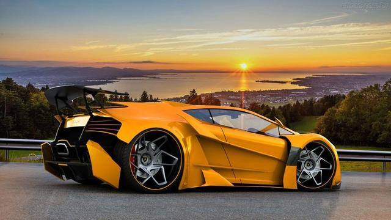

## Aluguel de Veículos
###

Sistema para alugar Carros, Motos e Caminhões.

Cadastrar Carros, Motos e Caminhões. Todos tem um id. Carros precisam do ano e se é de luxo ou basico. Motos precisam das cilindradas e do ano. Caminhões precisam do limite de peso e se sao cabine extendida.

addMoto moto1 250cc 2012
addMoto moto2 125cc 2017
addCarro corsa1 2012 basico
addCarro ferrari1 2017 luxo
addCaminhao caminhao1 6ton cabSimples
addCaminhao caminhao2  10ton cabExtendida
mostrarVeiculos
    livre Moto     id:moto1       cc:250 ano:2012
    livre Moto     id:moto2       cc:125 ano:2017
    livre Carro    id:corsa1     ano:2012 tipo:basico
    livre Carro    id:ferrari1   ano:2017 tipo:luxo
    livre Caminhao id:caminhao1 tara:6ton  tipo:cabSimples
    livre Caminhao id:caminhao2 tara:10ton tipo:cabExtendida

addCliente davi
addCliente lucar
alugar davi moto1 ferrari1

calcularAluguel moto1 5dias 500km
    valor: 500 reais
calcularAluguel moto2 5dias
    valor: 200 reais
calcularAluguel ferrari1 350km 25dias

