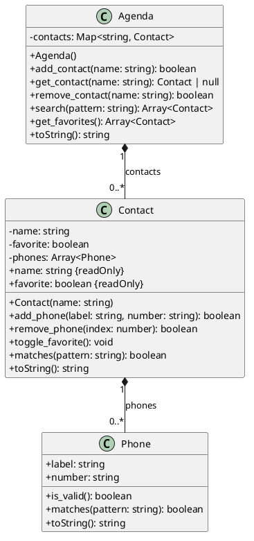

# Agenda: contatos por identidade em um mapa

<!-- toc-table -->
[Intro](#intro) | [Regras](#regras) | [Diagrama](#diagrama) | [Guide](#guide) | [Shell](#shell) | [Draft](#draft)
-- | -- | -- | -- | -- | --
<!-- toc-table -->


## Intro

O objetivo desta atividade é organizar contatos por uma identidade única. O nome funciona como chave de um mapa: ele permite localizar, alterar ou remover um contato sem depender de sua posição em uma lista.

Esta atividade continua `@contato`. Você reutilizará `Phone` e `Contact`, acrescentará a busca pelos campos que o contato encapsula e criará `Agenda` para coordenar vários contatos.

O `Shell` interpreta comandos e apresenta falhas. `Agenda` garante a unicidade dos nomes, `Contact` controla seus telefones e `Phone` valida o próprio número.

## Regras

### Modelo reutilizado

- `Phone` mantém `label` e `number`, usa o formato `label:number` e aceita somente números não vazios formados por `0123456789()-.`.
- `Phone.matches(pattern) -> bool` verifica se o padrão aparece no label ou no número.
- `Contact` mantém nome, favorito e uma coleção privada de telefones.
- `Contact.matches(pattern) -> bool` verifica o nome e delega a busca em label e número aos telefones.
- A busca diferencia letras maiúsculas e minúsculas.
- A representação permanece `- name [phones]` ou `@ name [phones]`.

### Agenda

- `Agenda` guarda seus contatos em `dict[str, Contact]`.
- O nome do contato é a chave e deve ser único.
- `add_contact(name) -> bool`
  - Cria um contato vazio e retorna `true` quando a chave ainda não existe.
  - Retorna `false` e preserva o contato existente quando o nome está duplicado.
- `get_contact(name) -> Contact | None`
  - Retorna o contato associado ao nome ou `None` quando ele não existe.
- `remove_contact(name) -> bool`
  - Remove o contato e retorna `true`, ou retorna `false` sem alterar o mapa.
- `search(pattern) -> list[Contact]`
  - Retorna uma nova lista com os contatos cujo nome, label ou número contenha o padrão.
- `get_favorites() -> list[Contact]`
  - Retorna uma nova lista apenas com os contatos favoritos.
- Busca, favoritos e exibição completa usam ordem alfabética por nome. O mapa interno continua sendo a única fonte de verdade e não precisa ser reordenado.
- A agenda não expõe o mapa interno.

### Comandos

- `addContact name`: cria um contato; exibe `fail: contact already exists` quando o nome já existe.
- `addPhone name label number`: localiza o contato e delega a inserção.
  - Exibe `fail: contact not found` quando o nome não existe.
  - Exibe `fail: invalid number` quando o telefone é recusado.
- `removePhone name index`: localiza o contato e delega a remoção.
  - Exibe `fail: contact not found` ou `fail: invalid index`, conforme a falha.
- `removeContact name`: remove pela chave ou exibe `fail: contact not found`.
- `toggleFavorite name`: alterna o favorito ou exibe `fail: contact not found`.
- `favorites`: exibe os favoritos, um por linha e em ordem alfabética.
- `search pattern`: exibe os resultados, um por linha e em ordem alfabética.
- `show`: exibe todos os contatos, um por linha e em ordem alfabética.
- `end`: encerra o programa.
- Qualquer outro comando exibe `fail: invalid command`.

Mutações bem-sucedidas e consultas sem resultados são silenciosas.

## Diagrama

`Agenda` possui contatos identificados pelo nome, e cada `Contact` possui seus telefones. `Agenda` coordena sem assumir as regras internas de `Contact` ou `Phone`.



## Guide

Comece com o modelo concluído em `@contato` e evolua apenas o que a nova responsabilidade exigir.

### 1. Acrescente buscas ao modelo existente

- Em `Phone.matches`, procure o padrão no label e no número.
- Em `Contact.matches`, procure primeiro no nome e depois delegue aos telefones.
- Não use a representação textual para buscar: prefixos, colchetes e pontuação de apresentação não são campos do domínio.

Verificação: procure separadamente por um trecho do nome, do label e do número.

### 2. Modele identidade com um mapa

- Crie `Agenda` com um dicionário privado inicialmente vazio.
- Use o nome como chave e o próprio `Contact` como valor.
- Implemente `add_contact`, `get_contact` e `remove_contact` usando a chave.
- Recuse nomes duplicados em vez de substituir silenciosamente o objeto e seus telefones.

Uma lista exigiria percorrer contatos para localizar cada nome e permitiria duplicidades acidentais. O mapa representa diretamente a identidade única, ao custo de introduzir uma nova estrutura e de ordenar os valores quando a apresentação exigir.

### 3. Preserve as responsabilidades ao coordenar

- `Agenda` conhece a associação entre nome e contato.
- Depois de localizar um contato, use `Contact.add_phone`, `remove_phone` ou `toggle_favorite`.
- Não altere a coleção de telefones dentro de `Agenda`.
- O `Shell` converte `None` e booleanos nas mensagens literais do contrato.

Verificação: tente operar sobre um contato inexistente e confira que nenhum contato foi criado como efeito colateral.

### 4. Produza consultas ordenadas

- Para `search` e `get_favorites`, percorra os valores do mapa, filtre e crie uma nova lista.
- Ordene essa lista pelo nome antes de retorná-la.
- Use o mesmo critério para a representação completa da agenda.

Não mantenha ao mesmo tempo um mapa e uma lista ordenada: seriam duas fontes de verdade que precisariam permanecer sincronizadas.

### 5. Conecte o Shell

- Use `match/case` diretamente sobre `line.split()`.
- Separe os comandos de criação do contato e adição do telefone.
- Imprima somente resultados de consultas e falhas definidas no contrato.

Perguntas de reflexão:

- Por que o nome é uma chave adequada neste problema? O que mudaria se contatos pudessem ter nomes iguais?
- Por que a busca pertence a `Contact`, mesmo sendo iniciada por `Agenda`?
- Em que situação manter uma segunda estrutura ordenada seria justificável apesar do custo de sincronização?

## Shell

### Contatos em ordem alfabética

```bash
#TEST_CASE add_and_sort
$addContact eva
$addContact ana
$addContact bia
$show
- ana []
- bia []
- eva []
$end
```

### Nome duplicado preserva o contato

```bash
#TEST_CASE duplicate_name
$addContact ana
$addPhone ana mobile 9999
$addContact ana
fail: contact already exists
$show
- ana [mobile:9999]
$end
```

### Telefones válidos e inválidos

```bash
#TEST_CASE add_phones
$addContact ana
$addPhone ana home (85)3232-1010
$addPhone ana mobile 9a99
fail: invalid number
$addPhone ana mobile 9.9999-0000
$show
- ana [home:(85)3232-1010, mobile:9.9999-0000]
$end
```

### Contato inexistente

```bash
#TEST_CASE missing_contact
$addPhone ana mobile 9999
fail: contact not found
$removePhone ana 0
fail: contact not found
$toggleFavorite ana
fail: contact not found
$removeContact ana
fail: contact not found
$show
$end
```

### Remoção de telefone

```bash
#TEST_CASE remove_phone
$addContact ana
$addPhone ana home 3434
$addPhone ana mobile 9999
$removePhone ana 0
$show
- ana [mobile:9999]
$removePhone ana -1
fail: invalid index
$removePhone ana first
fail: invalid index
$show
- ana [mobile:9999]
$end
```

### Remoção de contato

```bash
#TEST_CASE remove_contact
$addContact bia
$addContact ana
$removeContact bia
$show
- ana []
$removeContact bia
fail: contact not found
$end
```

### Favoritos ordenados

```bash
#TEST_CASE favorites
$addContact rui
$addContact ana
$addContact eva
$toggleFavorite rui
$toggleFavorite ana
$favorites
@ ana []
@ rui []
$toggleFavorite ana
$favorites
@ rui []
$end
```

### Busca por nome, label e número

```bash
#TEST_CASE search_fields
$addContact eva
$addPhone eva home 8585
$addContact ava
$addPhone ava mobile 2222
$addContact rui
$addPhone rui work 9991
$search va
- ava [mobile:2222]
- eva [home:8585]
$search work
- rui [work:9991]
$search 22
- ava [mobile:2222]
$end
```

### Busca diferencia maiúsculas e minúsculas

```bash
#TEST_CASE case_sensitive_search
$addContact Ana
$addContact ana
$search Ana
- Ana []
$search ANA
$show
- Ana []
- ana []
$end
```

### Sequência combinada e comando inválido

```bash
#TEST_CASE combined
$addContact caio
$addContact bia
$addPhone caio mobile 3333
$addPhone bia home 2222
$toggleFavorite caio
$removePhone bia 0
$list
fail: invalid command
$show
- bia []
@ caio [mobile:3333]
$end
```

## Draft

<!-- links .cache/starter -->
<!-- links -->
