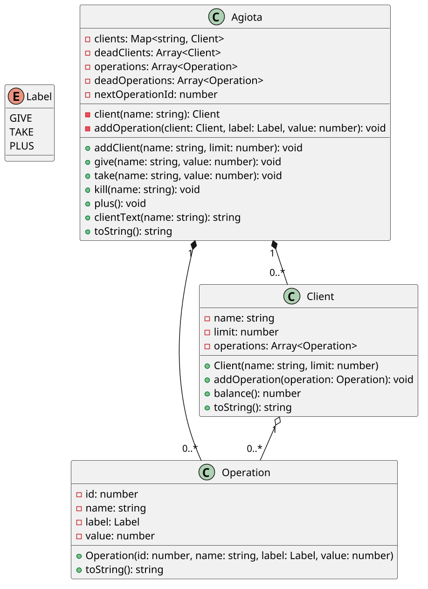

# Gerencie os empréstimos do agiota

<!-- toc-table -->
[Objetivo pedagógico](#objetivo-pedagógico) | [Regras](#regras) | [Intro](#intro) | [Draft](#draft) | [Guide](#guide) | [Shell](#shell) | [Credits](#credits)
-- | -- | -- | -- | -- | -- | --
<!-- toc-table -->


Ptolomeu é o agiota mais carismático de MoneyVille. Sem "nenhuma razão" foi denunciado e acabou indo pra cadeira. O problema foi que ele afirma que quem implementou o software de controle dos empréstimos e quem apagou os registro dos defuntos foi você.

Seu Plutolomeu é um agiota que empresta dinheiro a juros de 10%. Ele é uma pessoa "muito carismática e amiga de todos". De vez em quando os clientes dele desaparecem, mas ele diz que é só coincidência. "A vida é um sopro e basta estar vivo pra morrer", segundo ele.

Vamos abstrair um pouco da história de Plutolomeu e analisar o sistema de empréstimos que ele tinha instalado em seu computador.

***

## Objetivo pedagógico

Esta atividade dá continuidade à agenda: em vez de localizar clientes em uma
lista, o sistema usa o codenome como chave de um mapa. O objetivo principal é
perceber que a estrutura de dados deve representar a identidade usada pelo
domínio. Como objetivo secundário, as exceções separam falhas de regras de
negócio da leitura de comandos e da apresentação das mensagens.

## Regras

- O codenome identifica unicamente cada cliente ativo.
- O mapa de clientes ativos é a única fonte de verdade para cadastro e busca.
- O limite é o máximo da dívida atual.
- `give` só pode ser realizado quando a nova dívida não ultrapassar o limite.
- `take` não pode ser maior que a dívida atual.
- Os juros aumentam a dívida em 10%, arredondando para cima. Clientes sem
  dívida não geram uma operação de juros de valor zero.
- Uma operação possui valor positivo, identificador crescente e é compartilhada
  pelo histórico global e pelo histórico do cliente.
- Ao morrer, o cliente deixa o mapa de ativos. Seu histórico é movido para o
  histórico de mortos e não participa mais de juros ou novas operações.
- As classes do domínio não imprimem mensagens. Elas lançam `AgiotaError`; o
  `Shell` traduz a falha para o formato observável `fail: ...`.

## Intro

- Cadastrar Clientes
  - Cada cliente cadastrado tem um codenome único e um limite de crédito que ele pode ficar devendo ao agiota.
- Emprestar Dinheiro.
  - Empréstimos são salvos como Transações de GIVE (porque ele dá com todo carinho) e são armazenadas tanto na lista do agiota como nos objetos dos clientes.
  - Cada transação deve receber do sistema um identificador numérico crescente.
  - A primeira transação tem id 0. A segunda tem id 1 e etc.
  - Uma transação tem um id inteiro, um nome de cliente, um label e um valor numérico.
  - Os labels das transções podem ser
    - GIVE: quando o agiota dá dinheiro pra pessoa.
    - TAKE: quando o agiota "pega" o dinheiro da pessoa.
    - PLUS: quando o agiota decide que é hora de cobrar juros e as dívidas de todos aumentam em 10%.
  - Os valores das transações sempre são positivos. Ptolomeu não entende números negativos. O que define se é entrada ou saída é o label.
- Mostrar todos os clientes com o saldo de cada um.
- Mostrar o histórico de transações de Ptolomeu.
- Receber dinheiro.
  - Clientes pagam os empréstimos aos poucos. (As vezes, eles não pagam, mas seu Ptolomeu dá um jeito de pegar).
- Matar um cliente.
  - As vezes Ptolomeu dá um chá de sumiço em quem não paga suas dívidas.
    - Pra não deixar pontas soltas ele move o cliente da lista de clientes vivos para a lista de clientes mortos.
    - Também retira as transações relacionadas ao cliente morto do histórico de transações dos vivos e move para o histórico de transações dos mortos.
    - Ele disse que quando você implmentou, você queria apagar complementamente os mortos do sistema, mas ele disse que ia ficar com saudade, por isso pediu a lista dos mortos.
- O Classe cliente:
  - Não possui um objeto saldo. Para calcular o saldo, percorra o vetor de operações do cliente somando o que for entrada (GIVE) e retirando do que for saída (TAKE, PLUS).
- Na hora de efetuar os juros.
  - Se por acaso alguém, por causa dos juros, tiver devendo mais do que o limite, essa pessoa também vai pro saco. Perdão, pra lista do mortos.
- As transações:
  - O mesmo objeto transação é compartilhado entre o histórico do agiota e o histórico do cliente correspondente.
- A lista dos mortos não são mortos de verdade, estão mortos no coração de Ptolomeu apenas, porque ele desistiu de cobrar a dívida. É o que ele disse pra polícia.

## Draft

<!-- links .cache/starter -->
<!-- links -->

## Guide



[](https://youtu.be/XBJrKDd5fYY?si=HkQInss4B1x3HEYF)

Implemente em incrementos pequenos:

1. Modele `Operation` como um registro imutável do que aconteceu e `Client`
   como o objeto que guarda seu histórico e calcula a dívida.
2. Troque a busca linear por um `dict[str, Client]` em `Agiota`. A chave é o
   codenome porque essa é a identidade do cliente no problema.
3. Centralize a criação de operações em um método privado de coordenação, para
   que a numeração e o compartilhamento dos objetos não sejam duplicados.
4. Faça cada regra inválida lançar uma exceção de domínio simples. O `Shell`
   deve capturá-la e preservar as mensagens do contrato.
5. Implemente juros e morte como uma sequência verificável: os juros são
   registrados, depois o cliente que ultrapassou o limite é movido junto com
   suas operações.

Essa divisão não pretende aumentar a quantidade de classes. `Client` tem o
estado e as regras do próprio histórico; `Agiota` coordena vários clientes e
seus históricos; `Operation` apenas representa um fato. Não há necessidade de
um repositório ou serviço separado nesta etapa. A lista de operações do cliente
é exposta como uma cópia imutável para que consultas não alterem o estado.

Perguntas para revisão:

- Por que uma lista seria uma representação menos direta para buscar clientes?
- O que poderia ficar inconsistente se o saldo fosse armazenado além do
  histórico?
- Por que a operação deve ser criada uma única vez e compartilhada?
- O que deixa de acontecer com um cliente depois que ele é movido para os
  mortos?


## Shell

```bash
#TEST_CASE cadastrar
$addCli maria 500
$addCli rubia 60
$addCli maria 300
fail: cliente ja existe

#TEST_CASE emprestar
$give maria 300
$give rubia 50
$give maria 100

#TEST_CASE show
# Mostra os cliente ordenados por codenome
# Mostra as operações pela ordem que elas ocorreram
$show

:) maria 400/500
:) rubia 50/60
+ id:0 give:maria 300
+ id:1 give:rubia 50
+ id:2 give:maria 100

# __case erros no emprestimo
$give bruno 30
fail: cliente nao existe

$give rubia 30
fail: limite excedido

$take rubia 70
fail: pagamento excede divida

$show
:) maria 400/500
:) rubia 50/60
+ id:0 give:maria 300
+ id:1 give:rubia 50
+ id:2 give:maria 100

#TEST_CASE receber dinheiro
$take maria 350
$take rubia 1
$take maria 10

$show
:) maria 40/500
:) rubia 49/60
+ id:0 give:maria 300
+ id:1 give:rubia 50
+ id:2 give:maria 100
+ id:3 take:maria 350
+ id:4 take:rubia 1
+ id:5 take:maria 10

#TEST_CASE getCli
$showCli maria
maria 40/500
id:0 give:maria 300
id:2 give:maria 100
id:3 take:maria 350
id:5 take:maria 10

#TEST_CASE matar
$kill maria
$show
:) rubia 49/60
+ id:1 give:rubia 50
+ id:4 take:rubia 1
:( maria 40/500
- id:0 give:maria 300
- id:2 give:maria 100
- id:3 take:maria 350
- id:5 take:maria 10

$end
```

***

```bash
#TEST_CASE cadastrar
$addCli maria 500
$addCli rubia 60
$addCli josue 200

$give maria 430
$give josue 170
$give rubia 30

#TEST_CASE show
$show
:) josue 170/200
:) maria 430/500
:) rubia 30/60
+ id:0 give:maria 430
+ id:1 give:josue 170
+ id:2 give:rubia 30

# aumenta a divida de todos de 10%
# arredondado pra cima
#TEST_CASE rendimento
$plus

$show
:) josue 187/200
:) maria 473/500
:) rubia 33/60
+ id:0 give:maria 430
+ id:1 give:josue 170
+ id:2 give:rubia 30
+ id:3 plus:josue 17
+ id:4 plus:maria 43
+ id:5 plus:rubia 3

#TEST_CASE cobrar e matar
# se na hora do juros, o valor passar
# do limite, eles morrem

$plus

$show
:) rubia 37/60
+ id:2 give:rubia 30
+ id:5 plus:rubia 3
+ id:8 plus:rubia 4
:( josue 206/200
:( maria 521/500
- id:1 give:josue 170
- id:3 plus:josue 17
- id:6 plus:josue 19
- id:0 give:maria 430
- id:4 plus:maria 43
- id:7 plus:maria 48

$end
```

```bash
#TEST_CASE no_zero_interest
$addCli clara 0
$plus
$show
:) clara 0/0
$end
```

## Credits

- Então assim ficou Ptolomeu, depois de ir para a prisão e ver sua fortuna confiscada.
- Se foi presídio, zoológico ou hospital psiquiátrico, ninguém comenta, só sabemos que ele nunca mais foi visto. Pelo menos não em Moneyville.


