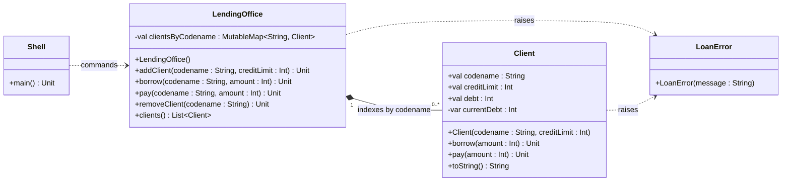

# [TRAIN] Agiota: clientes identificados por codenome

<!-- toc-table -->
[Intro](#intro) | [Regras](#regras) | [Diagrama](#diagrama) | [Guide](#guide) | [Shell](#shell) | [Draft](#draft)
-- | -- | -- | -- | -- | --
<!-- end -->


## Intro

Ptolomeu empresta dinheiro aos clientes, identificados por um codenome. O
programa precisa localizar cada cliente para conferir seu limite, registrar um
empréstimo ou receber um pagamento. Um mapa expressa diretamente essa identidade
e evita percorrer uma lista ou cadastrar o mesmo codenome duas vezes.

### Objetivo pedagógico

O objetivo principal é escolher um mapa porque o cliente é localizado por uma
chave única. Como objetivo secundário, a atividade pratica exceções para
proteger as regras da dívida e delegar cada mudança ao objeto que a possui.

## Regras

- `Client(codename: String, creditLimit: Int)` começa com dívida zero. O limite zero é válido.
- `borrow(amount: Int)` exige um valor positivo e não permite ultrapassar `creditLimit`.
- `pay(amount: Int)` exige um valor positivo e não permite pagar mais que a dívida atual.
- Falhas nas regras de dívida lançam `LoanError`; uma operação recusada não altera o cliente.
- `LendingOffice` guarda cada cliente uma vez em um `MutableMap<String, Client>` cuja chave é o codenome.
- `addClient(codename: String, creditLimit: Int)` lança `LoanError("client already exists")` se o codenome já estiver cadastrado.
- `borrow`, `pay` e `removeClient` lançam `LoanError("client not found")` para codenomes desconhecidos.
- `clients()` retorna uma lista ordenada por codenome; a lista não permite alterar o mapa interno.
- `show` exibe cada cliente como `:) codename debt/creditLimit`. Cadastro, empréstimo, pagamento e remoção bem-sucedidos não imprimem saída.
- O `Shell` aceita `addClient codename creditLimit`, `borrow codename amount`, `pay codename amount`, `removeClient codename`, `show` e `end`.
- As falhas são `fail: client already exists`, `fail: client not found`, `fail: credit limit exceeded`, `fail: payment exceeds debt`, `fail: amount must be positive` e `fail: invalid command`.
- `show` não imprime linhas quando não há clientes. O Shell ecoa cada comando com `$` antes de processá-lo.

## Diagrama

`LendingOffice` associa cada codenome a um cliente e localiza o objeto antes de
delegar uma operação. `Client` protege o limite e a dívida; não há uma lista
externa de clientes nem um estado duplicado para o saldo.


```mermaid
%%{init: {'fontFamily': 'monospace'}}%%
classDiagram
    direction LR

    class Client {
        +val codename : String
        +val creditLimit : Int
        +val debt : Int
        -var currentDebt : Int
        +Client(codename : String, creditLimit : Int)
        +borrow(amount : Int) Unit
        +pay(amount : Int) Unit
        +toString() String
    }

    class LendingOffice {
        -val clientsByCodename : MutableMap~String, Client~
        +LendingOffice()
        +addClient(codename : String, creditLimit : Int) Unit
        +borrow(codename : String, amount : Int) Unit
        +pay(codename : String, amount : Int) Unit
        +removeClient(codename : String) Unit
        +clients() List~Client~
    }

    class LoanError {
        +LoanError(message : String)
    }

    class Shell {
        +main() Unit
    }

    LendingOffice "1" *-- "0..*" Client : indexes by codename
    LendingOffice ..> LoanError : raises
    Client ..> LoanError : raises
    Shell ..> LendingOffice : commands
```

## Guide

Implemente em incrementos pequenos:

1. Crie `Client` com `codename`, `creditLimit` e dívida inicial zero. Ao final,
   o cliente deve impedir empréstimo acima do limite e pagamento acima da dívida.
2. Faça `LendingOffice` guardar clientes em um mapa indexado pelo codenome.
   Recuse duplicidades sem substituir o objeto que já foi cadastrado.
3. Implemente `borrow` e `pay` na coordenadora localizando o cliente e delegando
   a regra financeira. Uma chave desconhecida deve falhar sem criar um cliente.
4. Adicione a remoção e uma consulta ordenada de clientes. A remoção apaga a
   associação do mapa; não há histórico ou lista de clientes removidos.
5. Conecte o `Shell`: converta argumentos, chame o domínio, transforme
   `LoanError` em mensagens e formate `show`.

Antes da divisão, um único objeto teria de localizar clientes e também garantir
as regras de cada dívida. Agora `LendingOffice` conhece a identidade e a coleção;
`Client` conhece seu limite e saldo. Essa separação permite testar as regras do
cliente sem construir uma agenda inteira. Ela também tem um custo: operações
precisam passar pela coordenadora para encontrar o cliente certo.

Perguntas para revisão:

- Por que um mapa representa melhor o codenome único que uma lista?
- Por que `Client`, em vez de `LendingOffice`, valida limite e pagamento?
- O que poderia ficar inconsistente se o saldo fosse público ou atualizado no
  `Shell`?
- Se mais tarde fosse necessário guardar cada pagamento, qual classe deveria
  ser dona desse histórico e que comportamento novo justificaria esse custo?


## Shell

```bash
#TEST_CASE add_clients
$addClient maria 500
$addClient rubia 60
$addClient maria 300
fail: client already exists
$show
:) maria 0/500
:) rubia 0/60
$end
```

```bash
#TEST_CASE borrow_and_pay
$addClient maria 500
$borrow maria 300
$borrow maria 100
$pay maria 350
$show
:) maria 50/500
$end
```

```bash
#TEST_CASE credit_limit_preserves_debt
$addClient rubia 60
$borrow rubia 50
$borrow rubia 20
fail: credit limit exceeded
$addClient clara 0
$borrow clara 1
fail: credit limit exceeded
$show
:) clara 0/0
:) rubia 50/60
$end
```

```bash
#TEST_CASE payment_preserves_debt
$addClient rubia 60
$borrow rubia 50
$pay rubia 70
fail: payment exceeds debt
$show
:) rubia 50/60
$end
```

```bash
#TEST_CASE positive_amounts
$addClient nora 100
$borrow nora 0
fail: amount must be positive
$borrow nora -10
fail: amount must be positive
$borrow nora 10
$pay nora 0
fail: amount must be positive
$pay nora -1
fail: amount must be positive
$pay nora 1
$show
:) nora 9/100
$end
```

```bash
#TEST_CASE missing_client
$borrow bruno 30
fail: client not found
$pay bruno 10
fail: client not found
$removeClient bruno
fail: client not found
$show
$end
```

```bash
#TEST_CASE remove_client
$addClient maria 500
$borrow maria 300
$removeClient maria
$show
$borrow maria 1
fail: client not found
$end
```

```bash
#TEST_CASE invalid_command_and_amount
$addClient maria not-a-number
fail: invalid command
$unknown
fail: invalid command
$end
```

## Draft

<!-- links .cache/starter -->
<!-- end -->
<!-- KOTLIN -->
