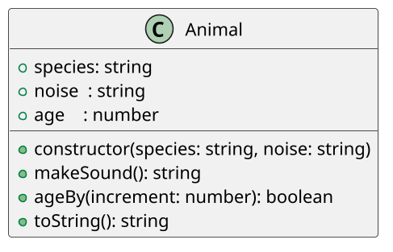

# [GUIA] Animal que nasce, cresce, morre

<!-- toc-table -->
<!-- toc-table -->


## Intro

O objetivo dessa atividade é implementar um animal que passa pelas diversas fases de crescimento até a morte.

## Regras

- O animal tem uma espécie `species`, um estágio `age` de vida e um barulho `noise` que ele faz.
- O construtor recebe a espécie e o barulho e inicia o estágio com `0`.
- O `toString` do animal deve retornar `{species}:{age}:{noise}`.
- Os estágios são: `0` Filhote, `1` Criança, `2` Adulto, `3` Idoso e `4` Morto.
- O método `ageBy` avança o estágio conforme o parâmetro `increment`.
  - Retorna `true` se o animal não morrer.
  - Retorna `false` se já estiver morto ou acabar morrendo.
  - A camada de interação mostra `warning: {nome} morreu` quando o método retornar `false`.
- O método `makeSound` retorna o som do animal.
  - Filhote emite `---`.
  - Animal morto emite `RIP`.
- A classe `Animal` não lê nem imprime dados. A camada de interação é responsável pela entrada e saída.

## Diagrama

O diagrama mostra apenas a classe `Animal`, que concentra o estado e as regras do ciclo de vida. A classe não foi dividida porque o objetivo desta atividade é praticar uma classe de domínio simples, mantendo a solução KISS.



## Guide

- Implemente a sua classe se orientando pela descrição, pelo UML(se houver) e pelos testes cadastrados.
- Começe analisando os testes e entendendo tudo que seu código precisa fazer.
- Depois que tiver uma ideia do que vai implementar, se deixe guiar pelos testes, implementando apenas o que é pedido para passar em cada teste.
- Passe para o próximo teste até implementar tudo que é pedido.

Esta atividade trabalha responsabilidade única, separação entre domínio e interface, retorno de valores e testabilidade. O `Shell` controla o loop e as mensagens; `Animal` apenas aplica as regras de idade e som.

- Na seção de [Cheat](#cheat) ou no vídeo abaixo, você pode conferir as respostas dessa atividade.

[](https://youtu.be/QZfjLVrk7p8)

## Shell

### Primeira simulação

```bash
#TEST_CASE iniciando

$init gato miau
$show
gato:0:miau

$init cachorro auau
$show
cachorro:0:auau

$init galinha cocorico
$show
galinha:0:cocorico

$end
```

### Segunda simulação

```bash
#TEST_CASE grow

$init vaca muu
$show
vaca:0:muu

$grow 2
$show
vaca:2:muu
$grow 2
warning: vaca morreu
$show
vaca:4:muu
$grow 3
warning: vaca morreu
$show
vaca:4:muu

$end
```

### Terceira simulação

```bash
#TEST_CASE noise

$init cabra beeh

$noise
---

$grow 1
$noise
beeh
$grow 3
warning: cabra morreu

$noise
RIP

$end
```

### Quarta simulação

```bash
#TEST_CASE extra

$init passaro piupiu

$show
passaro:0:piupiu

$noise
---

$grow 1
$noise
piupiu

$grow 2
$noise
piupiu

$grow 1
warning: passaro morreu

$noise
RIP

$end
```

## Draft

<!-- links .cache/starter -->
<!-- links -->

## Cheat

<!-- links .cache/cheat -->
<!-- links -->
