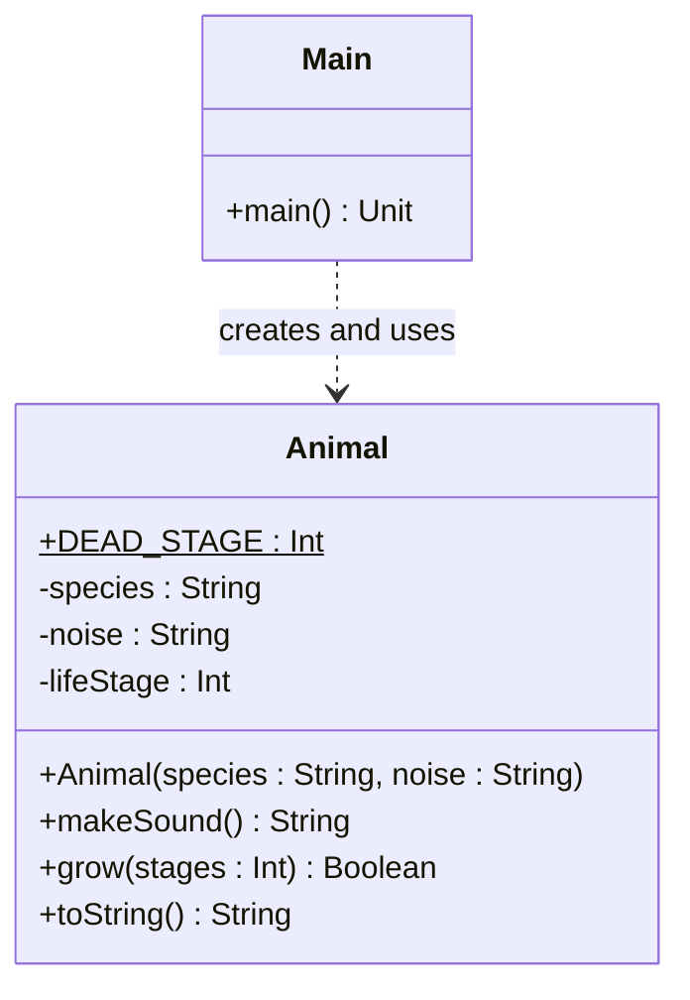

# [GUIDE] Animal que morre

<!-- toc-table -->
[Intro](#intro) | [Regras](#regras) | [Diagrama](#diagrama) | [Guide](#guide) | [Shell](#shell) | [Draft](#draft) | [Cheat](#cheat)
-- | -- | -- | -- | -- | -- | --
<!-- toc-table -->


## Intro

O objetivo dessa atividade é implementar um animal que passa pelas fases de crescimento até a morte.

O foco é modelar estado e comportamento em uma classe simples: `Animal` guarda espécie, idade e som, e seus métodos definem como esse estado aparece para a interface.

## Regras

- O animal tem uma espécie `species: String`, um estágio interno `lifeStage: Int` e um barulho `noise: String`.
- O construtor `Animal(species: String, noise: String)` inicia `lifeStage` com `0`.
- `toString(): String` retorna `{species}:{lifeStage}:{noise}`.
- Os estágios são: `0` Filhote, `1` Criança, `2` Adulto, `3` Idoso e `4` Morto.
- A classe `Animal` deve declarar a constante `DEAD_STAGE` com o valor `4`, evitando espalhar esse limite pelos métodos.
- O método `grow(stages: Int): Boolean` avança o estágio conforme o parâmetro `stages`.
  - Retorna `true` se o animal não morrer.
  - Retorna `false` se já estiver morto ou acabar morrendo.
  - A camada de interação mostra `warning: animal is dead` quando o método retornar `false`.
- O método `makeSound(): String` retorna o som do animal.
  - Filhote emite `---`.
  - Animal morto emite `RIP`.
- A classe `Animal` não lê nem imprime dados. A camada de interação é responsável pela entrada e saída.

## Diagrama

O diagrama mostra a classe `Animal`, que concentra o estado e as regras do ciclo de vida, e `Main`, que lê comandos e apresenta resultados. A classe não foi dividida porque espécie, estágio de vida e som mudam juntos neste problema.


```mermaid
%%{init: { "fontFamily": "monospace" } }%%
classDiagram
    direction TB

    class Animal {
        +DEAD_STAGE : Int$
        -species : String
        -noise : String
        -lifeStage : Int
        +Animal(species : String, noise : String)
        +makeSound() String
        +grow(stages : Int) Boolean
        +toString() String
    }

    class Main {
        +main() Unit
    }

    Main ..> Animal : creates and uses
```

## Guide

- Comece pelo construtor e por `toString()`, que permitem conferir o estado inicial.
- Depois implemente `makeSound()`, separando os casos de filhote, adulto e morto.
- Implemente `grow(stages: Int): Boolean` por último, garantindo que `lifeStage` nunca passe de `DEAD_STAGE`.
- Deixe `main()` responsável por imprimir `warning: animal is dead` quando `grow` retornar `false`.

Pergunta de reflexão: por que `Animal` retorna um booleano em vez de imprimir a mensagem de morte diretamente?

- Na seção de [Cheat](#cheat), você pode conferir as respostas dessa atividade.

## Shell

### Primeira simulação

```bash
#TEST_CASE iniciando

$init gato miau
$show
gato:0:miau

$init cachorro auau
$show
cachorro:0:auau

$init galinha cocorico
$show
galinha:0:cocorico

$end
```

### Segunda simulação

```bash
#TEST_CASE grow

$init vaca muu
$show
vaca:0:muu

$grow 2
$show
vaca:2:muu
$grow 2
warning: animal is dead
$show
vaca:4:muu
$grow 3
warning: animal is dead
$show
vaca:4:muu

$end
```

### Terceira simulação

```bash
#TEST_CASE noise

$init cabra beeh

$noise
---

$grow 1
$noise
beeh
$grow 3
warning: animal is dead

$noise
RIP

$end
```

### Quarta simulação

```bash
#TEST_CASE extra

$init passaro piupiu

$show
passaro:0:piupiu

$noise
---

$grow 1
$noise
piupiu

$grow 2
$noise
piupiu

$grow 1
warning: animal is dead

$noise
RIP

$end
```

## Draft

<!-- links .cache/starter -->
<!-- links -->

## Cheat

<!-- links .cache/cheat -->
<!-- links -->

<!-- MERMAID -->
