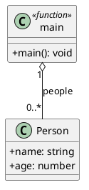

# [GUIA] Array: manipulação direta de uma coleção de pessoas

<!-- toc-table -->
[Intro](#intro) | [Regras](#regras) | [Diagrama](#diagrama) | [Guide](#guide) | [Shell](#shell) | [Draft](#draft)
-- | -- | -- | -- | -- | --
<!-- toc-table -->


## Intro

O objetivo desta atividade é praticar as operações fundamentais de uma coleção linear usando uma lista de pessoas: inserir nas extremidades, remover, buscar e filtrar.

Como conhecimento prévio, você precisará de variáveis, condicionais, laços, funções e listas básicas em Python.

Você implementará uma `dataclass Person`, que guarda o nome e a idade de uma pessoa. A função `main` manterá uma `list[Person]`, interpretará os comandos do `Shell` e aplicará as operações diretamente nessa lista.

Ainda não criaremos uma classe para gerenciar a coleção. Nesta atividade, a própria lista e suas operações são o conceito estudado; uma classe adicional esconderia justamente as manipulações que queremos observar.

## Regras

### Pessoa e coleção

- `Person` possui os campos públicos `name: str` e `age: int`.
- Uma pessoa é exibida no formato `name:age`, por exemplo, `ana:20`.
- A coleção começa vazia e é exibida entre colchetes, com as pessoas separadas por vírgula e espaço.
  - Coleção vazia: `[]`.
  - Coleção preenchida: `[ana:20, bia:15]`.

### Comandos

- `pushBack name age`
  - Cria uma pessoa e a adiciona ao final da lista.
- `pushFront name age`
  - Cria uma pessoa e a adiciona ao início da lista.
- `popBack`
  - Remove a última pessoa.
  - Se a lista estiver vazia, não altera o estado.
- `popFront`
  - Remove a primeira pessoa.
  - Se a lista estiver vazia, não altera o estado.
- `removeName name`
  - Percorre a lista da esquerda para a direita e remove apenas a primeira pessoa com o nome informado.
  - Se o nome não existir, não altera o estado.
- `removeBelowAge age`
  - Remove todas as pessoas com idade estritamente menor que o valor informado.
  - Pessoas com idade igual ao limite permanecem na lista.
- `show`
  - Exibe a coleção no formato definido acima.
- `end`
  - Encerra o programa.
- Qualquer outro comando exibe `fail: invalid command`.

Todos os comandos de alteração são silenciosos, removam ou não algum elemento. Apenas `show` exibe o estado da coleção.

## Diagrama

`Person` representa somente os dados de uma pessoa. A multiplicidade `0..*` indica que a lista mantida pela função `main` pode conter nenhuma ou várias pessoas.



## Guide

Implemente e teste uma operação de cada vez. Ao fim de cada etapa, execute os casos correspondentes da seção [Shell](#shell).

### 1. Represente e exiba pessoas

- Crie `Person` com `@dataclass` e os campos públicos `name: str` e `age: int`.
- Na `main`, crie uma variável `people: list[Person]`, inicialmente vazia.
- Implemente `show` percorrendo a lista para produzir exatamente o formato `[ana:20, bia:15]`.

Verificação: `show` deve exibir `[]` antes de qualquer inserção.

### 2. Insira nas extremidades

- Em `pushBack`, use a operação da lista que acrescenta um elemento ao final.
- Em `pushFront`, insira a nova pessoa na posição inicial.
- Observe que inserir sempre no início inverte a ordem de chegada dessas pessoas.

Verificação: insira pessoas com os dois comandos e confira a ordem usando `show`.

### 3. Remova pelas extremidades

- Antes de remover, verifique se a lista contém algum elemento.
- `popBack` retira o último elemento, enquanto `popFront` retira o primeiro.
- Não imprima falha quando a lista estiver vazia: a coleção deve apenas continuar vazia.

Verificação: remova até esvaziar a lista e tente remover novamente.

### 4. Busque pelo nome

- Em `removeName`, percorra pessoas e posições da esquerda para a direita.
- Ao encontrar o primeiro nome igual ao procurado, remova essa posição e encerre a busca.
- Não remova todas as ocorrências: pessoas diferentes podem ter o mesmo nome.

Verificação: cadastre o mesmo nome duas vezes e confirme que apenas a primeira ocorrência foi removida.

### 5. Filtre pela idade

- Em `removeBelowAge`, mantenha somente as pessoas cuja idade seja maior ou igual ao limite.
- Confira a fronteira: uma pessoa com idade igual ao argumento não deve ser removida.

Verificação: experimente um limite que preserve algumas pessoas e outro que remova todas.

Perguntas de reflexão:

- Por que `removeName` precisa interromper a busca, mas `removeBelowAge` precisa examinar a coleção inteira?
- Que custo a inserção ou remoção no início de uma lista pode ter em comparação com a mesma operação no final?
- Se várias regras próprias da coleção surgissem depois, em que momento uma classe gerenciadora passaria a ajudar?

## Shell

### Lista inicial

```bash
#TEST_CASE empty
$show
[]
$end
```

### Inserção ao final

```bash
#TEST_CASE push_back
$pushBack ana 20
$pushBack bia 15
$pushBack caio 31
$show
[ana:20, bia:15, caio:31]
$end
```

### Inserção no início

```bash
#TEST_CASE push_front
$pushFront ana 20
$pushFront bia 15
$pushFront caio 31
$show
[caio:31, bia:15, ana:20]
$end
```

### Remoção pelas extremidades

```bash
#TEST_CASE pop_ends
$popBack
$popFront
$show
[]
$pushBack ana 20
$pushBack bia 15
$pushBack caio 31
$popBack
$popFront
$show
[bia:15]
$popFront
$popFront
$show
[]
$end
```

### Remoção da primeira pessoa com o nome

```bash
#TEST_CASE remove_first_name
$pushBack ana 20
$pushBack bia 15
$pushBack ana 42
$removeName ana
$show
[bia:15, ana:42]
$end
```

### Nome inexistente

```bash
#TEST_CASE missing_name
$pushBack ana 20
$pushBack bia 15
$removeName caio
$show
[ana:20, bia:15]
$end
```

### Filtro e idade de fronteira

```bash
#TEST_CASE age_boundary
$pushBack ana 17
$pushBack bia 18
$pushBack caio 25
$removeBelowAge 18
$show
[bia:18, caio:25]
$end
```

### Filtro que remove todos

```bash
#TEST_CASE remove_all_by_age
$pushBack ana 12
$pushBack bia 17
$removeBelowAge 18
$show
[]
$end
```

### Sequência combinada

```bash
#TEST_CASE combined
$pushBack bia 15
$pushFront ana 20
$pushBack caio 12
$pushBack bia 30
$removeBelowAge 15
$removeName bia
$popBack
$pushFront dora 18
$show
[dora:18, ana:20]
$end
```

### Comando inválido

```bash
#TEST_CASE invalid_command
$clear
fail: invalid command
$show
[]
$end
```

## Draft

<!-- links .cache/starter -->
<!-- links -->
