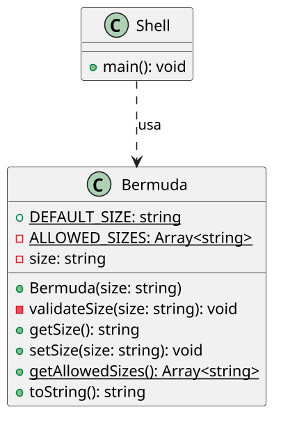

# [TRAIN] Bermuda: exceções para invariantes de tamanho

<!-- toc-table -->
[Intro](#intro) | [Regras](#regras) | [Diagrama](#diagrama) | [Guide](#guide) | [Shell](#shell) | [Draft](#draft)
-- | -- | -- | -- | -- | --
<!-- toc-table -->


## Intro

Esta atividade é uma variação de `Roupa`. A regra continua sendo proteger um
tamanho válido, mas o contrato de falha muda: em vez de retornar `false`, a
classe lança a exceção padrão `ValueError` do Python.

O objetivo é comparar duas formas de comunicar uma operação inválida. Em
`Roupa`, o cliente testa um retorno booleano. Em `Bermuda`, o domínio interrompe
a operação anômala com `ValueError`, e o `Shell` decide como apresentar a
falha.

## Regras

- `Bermuda` possui um atributo privado `size`.
- Os tamanhos permitidos são `P`, `M`, `G` e `GG`.
- O construtor recebe o tamanho inicial e lança `ValueError` se ele for inválido.
- `set_size` valida o novo tamanho antes de alterar o atributo e lança
  `ValueError` quando o valor não é permitido.
- Uma falha em `set_size` preserva o tamanho anterior.
- O comando `init` cria uma nova bermuda. Se o tamanho for inválido, a
  bermuda anterior permanece ativa.
- O comando `size` altera a bermuda atual.
- O domínio não lê entrada nem imprime mensagens. O `Shell` captura
  `ValueError` e imprime `fail: invalid size`.

## Diagrama



## Guide

Implemente em etapas:

1. Crie `Bermuda` com `DEFAULT_SIZE`, o atributo privado `size` e a coleção
   de tamanhos permitidos.
2. Faça o construtor validar o argumento e lançar `ValueError` antes de criar
   um estado inválido.
3. Faça `set_size` validar antes da atribuição. Uma exceção não deve deixar uma
   alteração parcial no objeto.
4. Mantenha `get_allowed_sizes` como uma consulta que devolve uma nova lista,
   sem expor uma coleção interna mutável.
5. No `Shell`, use `try/except ValueError`. Ao executar `init`, só substitua a
   bermuda atual depois que a nova construção terminar com sucesso.

O construtor e o setter usam a mesma validação porque ambos precisam preservar
a mesma invariante. Isso evita duplicar o conhecimento sobre os tamanhos
permitidos. Não é necessário criar uma exceção própria nesta atividade:
`ValueError` expressa adequadamente um argumento incompatível com o contrato.

Perguntas de reflexão:

- Qual é a diferença entre retornar `false` e lançar `ValueError`?
- Por que a validação precisa ocorrer antes da atribuição?
- Por que o `Shell` deve capturar a exceção em vez de `Bermuda` imprimir a falha?
- O que aconteceria se `init` substituísse a bermuda antes de validar o novo tamanho?

## Shell

```bash
#TEST_CASE initial state
$show
size: (P)

#TEST_CASE valid size
$size M
$show
size: (M)

#TEST_CASE invalid setter preserves state
$size XG
fail: invalid size
$show
size: (M)
$end
```

```bash
#TEST_CASE invalid constructor preserves previous object
$init GG
$show
size: (GG)
$init XG
fail: invalid size
$show
size: (GG)
$end
```

```bash
#TEST_CASE all allowed sizes
$init P
$size M
$size G
$size GG
$show
size: (GG)
$end
```

```bash
#TEST_CASE invalid command
$resize G
fail: invalid command
$end
```

## Draft

<!-- links .cache/starter -->
<!-- links -->
