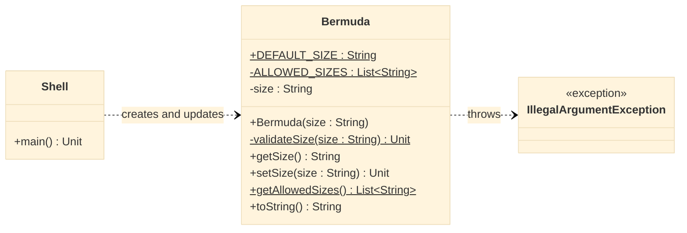

# [TRAIN] Bermuda: exceções para invariantes de tamanho

<!-- toc-table -->
[Intro](#intro) | [Regras](#regras) | [Diagrama](#diagrama) | [Guide](#guide) | [Shell](#shell) | [Draft](#draft)
-- | -- | -- | -- | -- | --
<!-- toc-table -->


## Intro

Esta atividade modela uma bermuda que precisa manter um tamanho válido. O
contrato de falha usa uma exceção padrão apropriada para argumentos inválidos:
em vez de retornar `false`, o domínio interrompe a operação inválida.

O objetivo é comunicar argumentos inválidos lançando `IllegalArgumentException`.
O `Shell` captura a exceção e decide como apresentar a falha.

## Regras

- `Bermuda` possui uma propriedade privada `size: String`.
- Os tamanhos permitidos são `P`, `M`, `G` e `GG`.
- `Bermuda(size: String)` e `setSize(size: String): Unit` validam o tamanho e lançam `IllegalArgumentException` quando ele não é permitido.
- Uma falha em `setSize` preserva o tamanho anterior.
- `getSize(): String` consulta o tamanho atual sem alterar o objeto.
- `getAllowedSizes(): List<String>` devolve uma cópia dos tamanhos permitidos.
- O comando `init` tenta criar uma nova bermuda. Se o tamanho for inválido, a bermuda anterior permanece ativa.
- O comando `size` altera a bermuda atual.
- O domínio não lê entrada nem imprime mensagens. O Shell captura a exceção e imprime `fail: invalid size`.

## Diagrama


```mermaid
%%{init: {'theme': 'base', 'fontFamily': 'monospace'}}%%
classDiagram
    direction LR

    class IllegalArgumentException {
        <<exception>>
    }

    class Bermuda {
        +DEFAULT_SIZE : String$
        -ALLOWED_SIZES : List~String~$
        -size : String
        +Bermuda(size : String)
        -validateSize(size : String) Unit$
        +getSize() String
        +setSize(size : String) Unit
        +getAllowedSizes() List~String~$
        +toString() String
    }

    class Shell {
        +main() Unit
    }

    Bermuda ..> IllegalArgumentException : throws
    Shell ..> Bermuda : creates and updates
```

## Guide

Implemente em etapas:

1. Crie `Bermuda` com `DEFAULT_SIZE`, a propriedade privada `size: String` e uma lista privada de tamanhos permitidos.
2. Implemente `validateSize(size: String): Unit` com `require(size in ALLOWED_SIZES)`. O Kotlin lança `IllegalArgumentException` quando a condição falha.
3. Faça o construtor validar antes de estabelecer o tamanho inicial e `setSize` validar antes de atribuir. Em ambos os casos, a exceção deve preservar qualquer estado válido já existente.
4. Faça `getAllowedSizes(): List<String>` retornar uma cópia, sem expor a lista interna.
5. No Shell, capture `IllegalArgumentException` ao executar `init` ou `size`. Só substitua a instância atual quando a construção terminar com sucesso.

`validateSize` existe porque o construtor e `setSize` precisam garantir a mesma
invariante: o tamanho atual deve estar na coleção de tamanhos permitidos. Ao
concentrar a regra em um método, os dois pontos não duplicam a condição. Cada
operação só altera o estado depois que a validação termina com sucesso. Não é
necessário chamar `setSize` no construtor: a validação não depende de um estado
já criado, e o construtor pode estabelecer o primeiro estado válido diretamente.

Não crie uma exceção própria nesta atividade: `IllegalArgumentException` já
comunica adequadamente um argumento incompatível com o contrato.

Perguntas de reflexão:

- Qual é a diferença entre retornar `false` e lançar `IllegalArgumentException`?
- Por que a validação precisa ocorrer antes da atribuição?
- Por que o `Shell` deve capturar a exceção em vez de `Bermuda` imprimir a falha?
- O que aconteceria se `init` substituísse a bermuda antes de validar o novo tamanho?

## Shell

```bash
#TEST_CASE initial state
$show
size: (P)

#TEST_CASE valid size
$size M
$show
size: (M)

#TEST_CASE invalid setter preserves state
$size XG
fail: invalid size
$show
size: (M)
$end
```

```bash
#TEST_CASE invalid constructor preserves previous object
$init GG
$show
size: (GG)
$init XG
fail: invalid size
$show
size: (GG)
$end
```

```bash
#TEST_CASE all allowed sizes
$init P
$size M
$size G
$size GG
$show
size: (GG)
$end
```

```bash
#TEST_CASE invalid command
$resize G
fail: invalid command
$end
```

## Draft

<!-- links .cache/starter -->
<!-- links -->
<!-- MERMAID -->
<!-- KOTLIN -->
