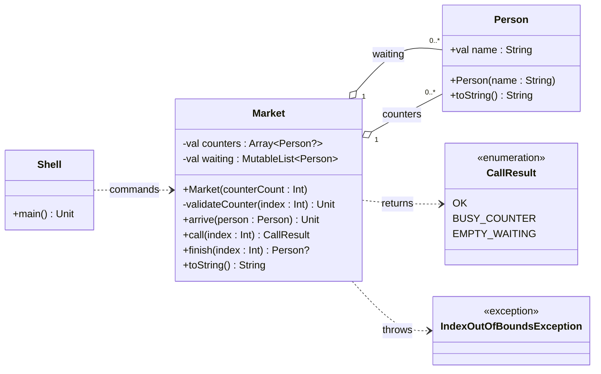

# [TRAIN] Birita: fila, caixas e exceções

<!-- toc-table -->
[Intro](#intro) | [Objetivos pedagógicos](#objetivos-pedagógicos) | [Regras](#regras) | [Exceções](#exceções) | [Diagrama](#diagrama) | [Guide](#guide) | [Shell](#shell) | [Draft](#draft)
-- | -- | -- | -- | -- | -- | -- | --
<!-- end -->


## Intro

O mercantil Birita coordena uma fila de espera que muda de tamanho e caixas de atendimento em posições fixas. Ao chamar uma pessoa, ela sai do início da fila e ocupa o caixa escolhido. Ao finalizar o atendimento, o caixa volta a ficar vazio.

Esta atividade retoma a modelagem de Budega e introduz exceções para índices que não correspondem a nenhum caixa. Caixa ocupado, fila vazia e caixa vazio são resultados possíveis de operações com índices válidos e continuam representados por valores retornados pelo domínio.

## Objetivos pedagógicos

O objetivo principal é distinguir uma entrada fora dos limites, comunicada por exceção, de resultados esperados que fazem parte do fluxo normal da atividade. A atividade também pratica a preservação do estado após operações que não podem ser concluídas.

### Conhecimentos prévios

É necessário conhecer variáveis, condicionais, laços, funções, listas, índices, objetos, `null`, enums e o uso básico de `try`/`catch`.

### Elementos observáveis

- clientes chegam ao final da fila e são chamados pelo início;
- a quantidade e a identidade das posições de caixa permanecem fixas;
- um índice inexistente é convertido pelo Shell em `fail: caixa inexistente`;
- tentar usar um caixa ocupado retorna `BUSY_COUNTER`;
- chamar sem pessoas esperando retorna `EMPTY_WAITING`;
- finalizar um caixa vazio retorna `null`, que o Shell apresenta como `fail: caixa vazio`;
- falhas não movem pessoas nem alteram as coleções.

### Invariantes

- uma posição de caixa contém no máximo uma pessoa;
- uma pessoa chamada deixa a fila antes de ocupar o caixa;
- `finish` só libera uma posição válida que esteja ocupada;
- índices inválidos não alteram a fila nem os caixas.

## Regras

- `Person` representa uma pessoa pelo nome imutável `name: String`.
- `Market` mantém `counters: Array<Person?>`, com capacidade fixa, e `waiting: MutableList<Person>`, que cresce e diminui.
- `arrive(person: Person): Unit` adiciona uma pessoa ao final da fila.
- `call(index: Int): CallResult` chama a primeira pessoa da fila para um caixa vazio.
  - índice inválido lança `IndexOutOfBoundsException`;
  - caixa ocupado retorna `CallResult.BUSY_COUNTER`;
  - fila vazia retorna `CallResult.EMPTY_WAITING`;
  - chamada concluída retorna `CallResult.OK`.
- `finish(index: Int): Person?` libera um caixa e retorna a pessoa atendida; retorna `null` se o caixa válido estiver vazio. Índice inválido lança `IndexOutOfBoundsException`.
- `toString(): String` mostra os caixas e a fila no formato usado nos testes.
- O domínio não lê entrada nem imprime mensagens. O Shell captura `IndexOutOfBoundsException` e traduz os retornos do domínio em mensagens.

### Comandos

Todos os comandos seguem o modelo `$comando arg1 arg2 ...`.

- `$show` mostra os caixas e a fila.
- `$init quantidade` reinicia o mercantil com a quantidade indicada de caixas.
- `$arrive nome` coloca uma pessoa no final da fila.
- `$call indice` tenta chamar a primeira pessoa da fila para o caixa indicado.
- `$finish indice` finaliza o atendimento do caixa indicado.

## Exceções

`Market` lança a exceção padrão `IndexOutOfBoundsException` quando `call` ou `finish` recebe um índice fora dos limites de `counters`. O Shell captura essa exceção e apresenta `fail: caixa inexistente`.

Não é necessário criar uma exceção própria: a biblioteca padrão já possui uma exceção adequada para um índice fora dos limites. Caixa ocupado, fila vazia e caixa vazio não lançam exceções porque são estados possíveis; o domínio os representa com `CallResult` ou `null`.

## Diagrama

`Market` é dono das duas coleções. A fila tem tamanho variável, enquanto o vetor de caixas mantém posições fixas. Uma operação com índice inválido lança uma exceção padrão; os outros resultados normais são retornados para o Shell.



## Guide

1. Crie `Person` com `name: String` e uma representação textual que devolva somente o nome.
2. Crie `Market` com o vetor `counters` preenchido com `null` e a fila `waiting` inicialmente vazia. Confirme que a capacidade dos caixas permanece fixa.
3. Implemente `arrive` e `toString`; verifique que as pessoas aparecem no fim da fila e que cada caixa vazio aparece como `-----`.
4. Antes de acessar `counters[index]`, valide o índice. Lance `IndexOutOfBoundsException` quando ele não estiver em `counters.indices`. Faça essa validação no início de `call` e `finish`.
5. Implemente `call`: depois da validação do índice, devolva `BUSY_COUNTER` se o caixa estiver ocupado e `EMPTY_WAITING` se não houver pessoas. Só remova a primeira pessoa da fila quando a chamada puder ser concluída.
6. Implemente `finish`: depois da validação do índice, devolva `null` se o caixa estiver vazio; caso contrário, remova e retorne a pessoa, deixando `null` naquela posição.
7. No Shell, capture `IndexOutOfBoundsException` em torno de `call` e `finish`. Converta a exceção, os enums e o retorno `null` para as mensagens do contrato.

A validação explícita garante que os dois métodos tratem os índices do mesmo modo e lancem uma exceção antes de acessar a coleção. As outras condições não representam índices impossíveis; são resultados esperados e observáveis. Pergunte-se: o que o Shell perderia se `call` devolvesse apenas `Boolean` para caixa ocupado e fila vazia? Por que `finish` pode retornar a pessoa em vez de combinar uma pessoa nullable com outro enum?

## Shell

```sh
#TEST_CASE inicializar e chegar
$init 2
$show
Caixas: [-----, -----]
Espera: []
$arrive carla
$arrive maria
$arrive rubia
$show
Caixas: [-----, -----]
Espera: [carla, maria, rubia]
$end
```

```sh
#TEST_CASE chamada e finalizacao
$init 2
$arrive carla
$arrive maria
$call 0
$show
Caixas: [carla, -----]
Espera: [maria]
$finish 0
$show
Caixas: [-----, -----]
Espera: [maria]
$end
```

```sh
#TEST_CASE resultados de chamada
$init 1
$call 0
fail: sem clientes
$arrive ana
$call 0
$call 0
fail: caixa ocupado
$show
Caixas: [ana]
Espera: []
$end
```

```sh
#TEST_CASE indices invalidos
$init 1
$arrive bia
$call 1
fail: caixa inexistente
$show
Caixas: [-----]
Espera: [bia]
$finish -1
fail: caixa inexistente
$show
Caixas: [-----]
Espera: [bia]
$end
```

```sh
#TEST_CASE finalizar caixa vazio
$init 1
$finish 0
fail: caixa vazio
$show
Caixas: [-----]
Espera: []
$end
```

```sh
#TEST_CASE comando invalido
$unknown
fail: comando invalido
$end
```

## Draft

<!-- links .cache/starter -->
<!-- end -->
<!-- MERMAID -->
<!-- KOTLIN -->
