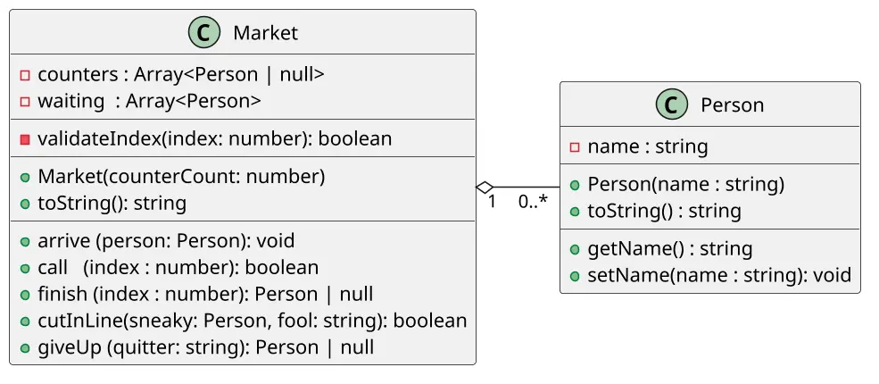

# [TRAIN] Budega: fila e posições fixas

<!-- toc-table -->
[Intro](#intro) | [Guide](#guide) | [Answers](#answers) | [Shell](#shell) | [Draft](#draft)
-- | -- | -- | -- | --
<!-- toc-table -->


## Intro

Este é um projeto de modelagem e implementação de um mercantil, que simula o funcionamento de caixas de atendimento e uma fila de espera. Para isso, serão implementadas duas classes principais: Pessoa `Person` e Mercado `Market`.

Esta atividade serve como referência para comparar dois usos de coleções no mesmo domínio. A fila de espera cresce e diminui conforme clientes chegam ou são chamados. Os caixas, por outro lado, formam um vetor de tamanho fixo: cada posição representa um caixa específico e pode estar vazia ou ocupada.

## Objetivos pedagógicos

O objetivo principal é distinguir uma fila de tamanho variável de um vetor de posições fixas e escolher a operação adequada para cada coleção. Como objetivos secundários, a atividade trabalha a coordenação entre coleções e a preservação do estado válido após operações recusadas.

### Conhecimentos prévios

É necessário conhecer variáveis, condicionais, laços, funções, listas, índices, objetos e o uso de `nil`/`None` para representar ausência. A implementação canônica desta atividade é feita em Python.

### Elementos observáveis

- cada caixa mantém sua identidade e sua posição, mesmo quando está vazio;
- clientes chegam ao final da fila e são chamados pelo início;
- `cutInLine` altera somente a ordem da fila;
- `giveUp` remove somente um cliente que ainda espera;
- falhas não removem clientes nem ocupam caixas;
- a representação de `show` permite conferir simultaneamente os caixas e a fila.

### Invariantes

- a quantidade de caixas permanece fixa até um novo `init`;
- uma posição de caixa contém no máximo um cliente;
- um cliente chamado deixa a fila antes de ocupar um caixa;
- `giveUp` não remove clientes que já estão sendo atendidos;
- operações inválidas preservam o estado anterior.

- A classe `Market` representa o estabelecimento, com atributos como caixas de atendimento `counters` e uma fila de espera de clientes `waiting`.
- Os caixas `counters` são modelados como um vetor de clientes de tamanho fixo. Uma posição do caixa terá o valor `null` para indicar que o caixa está vazio ou terá um objeto cliente.
  - typescript: `counters: (Person | null)[]`
  - java: `ArrayList<Person> counters`
  - cpp: `vector<Person*> counters`
- A fila de espera `queue` é uma lista de clientes de tamanho variável. Todo cliente que chega é inserido no final da fila. Todo cliente que é chamado para um caixa é removido do início da fila.
  - typescript: `waiting: Person[]`
  - java: `LinkedList<Person> waiting`
  - cpp: `list<Person*> waiting`
- As operações principais incluem chegar cliente `arrive`, chamar no caixa `call` e finalizar atendimento `finish`.
- As operações complementares são furar fila `cutInLine` e abandonar a fila de espera `giveUp`.

### Comandos

Todos os comandos seguem o modelo `$comando arg1 arg2 ...`. Em caso de erro, uma mensagem adequada deve ser impressa.

- `$show` - Mostra o estado atual do mercantil, incluindo os clientes nos caixas e na fila de espera.
- `$init` - Reinicia o estado do mercantil, definindo a quantidade de caixas e limpando a fila de espera.
- `$arrive` - Adiciona um cliente à fila de espera. Deve ser seguido pelo nome do cliente.
- `$call` - Chama o próximo cliente na fila de espera para um caixa disponível. Deve ser seguido pelo número do caixa.
- `$finish` - Finaliza o atendimento de um cliente em um caixa. Deve ser seguido pelo número do caixa.
- `$cutInLine` - Insere um novo cliente imediatamente antes de outro cliente da fila. Deve ser seguido pelos nomes do novo cliente e do cliente que será ultrapassado.
- `$giveUp` - Remove da fila o primeiro cliente com o nome informado.

## Guide



[](https://youtu.be/5-GqCN0VPpQ?si=SkROsibr5OC4tdnZ)

### Parte 1: Classe Cliente

- Crie a classe `Cliente` com os atributos `nome`.
- Defina os atributos como privados.
- Crie o construtor da classe que recebe o `nome` como uma string.
- Crie o método `getNome()` para retornar o nome do cliente.
- Crie o método `toString()` para retornar uma string no formato "nome".

### Parte 2: Classe Mercantil

#### Construtor

- Implemente o construtor da classe `Market`, que recebe a quantidade de caixas como parâmetro.
- Inicialize os atributos da classe, incluindo o vetor de caixas e a fila de espera.
- Preencha o vetor de caixas com `null` para indicar que todos os caixas estão vazios.

#### Método `toString()`

- Implemente o método `toString()` para retornar uma representação em string do estado atual do mercantil. Exemplo

```txt
Caixas: [-----, -----]
Espera: [carla, maria, rubia]
```

- Pesquise na sua linguagem e aprenda a utilizar os métodos map, join se existirem.
- Use a função `map()` para percorrer o vetor de caixas e a fila de espera e criar uma string que represente cada caixa e cada cliente na fila.
- Utilize if e else ou operador ternário para verificar se cada caixa está vazio ou ocupado e ajustar a representação de acordo.
- Junte as strings individuais de cada caixa e da fila de espera usando o método `join()` para criar uma representação coerente do estado do mercantil.
- Retorne a string resultante.

### Parte 3: Chegar

- Na classe `Market`, crie o método `arrive(person: Person): void` que permite que uma pessoa chegue na fila de espera.
- Adicione a pessoa ao final da fila de espera.

### Parte 4: Chamar Cliente

- Na classe `Market`, crie o método `call(index: number): void` que permite chamar o primeiro cliente da lista de espera para ser atendido em um caixa específico.
- Se não houver ninguém na fila de espera, emita a mensagem de erro "fail: sem clientes".
- Se o caixa estiver ocupado, imprima a mensagem de erro "fail: caixa ocupado".

### Parte 5: Finalizar Atendimento

- Na classe `Market`, crie o método `finish(index: number): Pessoa | null` que permite finalizar o atendimento de um cliente em um caixa específico.
- Verifique se o índice do caixa é válido e, se não for, emita a mensagem de erro `fail: caixa inexistente`.
- Verifique se há alguém sendo atendido no caixa. Se não houver, emita a mensagem de erro `fail: caixa vazio`.
- Retorne o cliente que foi atendido e libere o caixa, definindo-o como null.

### Parte 6: Furar fila e desistir

- Implemente `cutInLine(sneaky: Person, fool: string)` procurando o cliente-alvo somente na fila e inserindo o novo cliente imediatamente antes dele.
- Se o cliente-alvo não estiver esperando, não altere a fila e informe `fail: pessoa nao esta na fila`.
- Implemente `giveUp(name: string)` removendo somente a primeira ocorrência encontrada na fila.
- Se o cliente não estiver na fila, não altere caixas nem fila e informe `fail: pessoa nao esta na fila`.

Ao terminar, compare as duas coleções: inserir no meio da fila desloca posições relativas, enquanto chamar ou finalizar altera a relação entre a fila e um caixa específico.

## Answers

[Resolução](https://youtu.be/Z7karsbg1ok)

## Shell

```sh
#TEST_CASE iniciar

$init 2
$show
Caixas: [-----, -----]
Espera: []

#TEST_CASE arrive

$arrive carla
$arrive maria
$arrive rubia

$show
Caixas: [-----, -----]
Espera: [carla, maria, rubia]

#TEST_CASE call

$call 0
$show
Caixas: [carla, -----]
Espera: [maria, rubia]

#TEST_CASE finish

$finish 0
$show
Caixas: [-----, -----]
Espera: [maria, rubia]

$end

```

```sh
#TEST_CASE iniciar2

$init 3
$show
Caixas: [-----, -----, -----]
Espera: []

$arrive carla
$arrive maria

$show
Caixas: [-----, -----, -----]
Espera: [carla, maria]

#TEST_CASE call

$call 0
$call 0
fail: caixa ocupado
$show
Caixas: [carla, -----, -----]
Espera: [maria]

#TEST_CASE empty waiting

$call 2
$show
Caixas: [carla, -----, maria]
Espera: []

#TEST_CASE empty waiting

$call 1
fail: sem clientes

#TEST_CASE finish

$finish 0
$show
Caixas: [-----, -----, maria]
Espera: []

$finish 2
$show
Caixas: [-----, -----, -----]
Espera: []

#TEST_CASE error

$finish 3
fail: caixa inexistente
$finish 1
fail: caixa vazio

$end

```

```sh
#TEST_CASE operações da fila

$init 2
$arrive ana
$arrive bia
$arrive dora
$cutInLine caio dora
$show
Caixas: [-----, -----]
Espera: [ana, bia, caio, dora]

#TEST_CASE desistir no meio

$giveUp bia
$show
Caixas: [-----, -----]
Espera: [ana, caio, dora]

#TEST_CASE fila furada e desistência inválidas

$cutInLine eva rita
fail: pessoa nao esta na fila
$giveUp rita
fail: pessoa nao esta na fila
$show
Caixas: [-----, -----]
Espera: [ana, caio, dora]

#TEST_CASE desistir após atendimento

$call 0
$giveUp ana
fail: pessoa nao esta na fila
$show
Caixas: [ana, -----]
Espera: [caio, dora]
$end
```

## Draft

<!-- links .cache/starter -->
<!-- links -->
