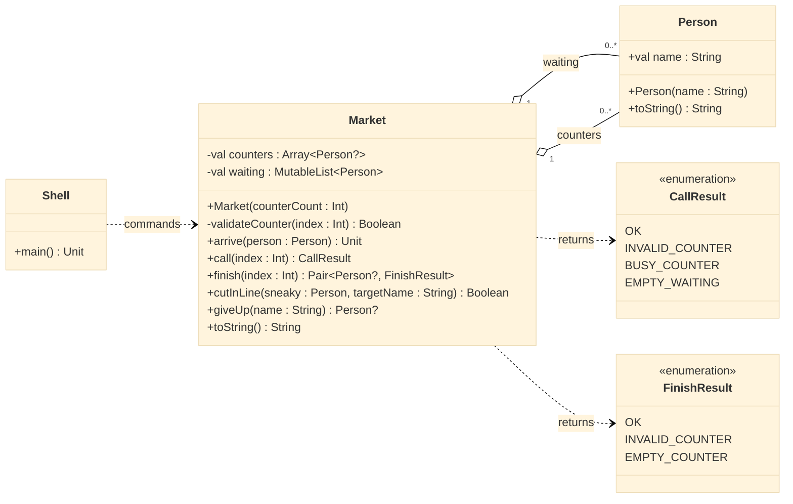

# [TRAIN] Budega: fila e posições fixas

<!-- toc-table -->
[Intro](#intro) | [Objetivos pedagógicos](#objetivos-pedagógicos) | [Diagrama](#diagrama) | [Guide](#guide) | [Answers](#answers) | [Shell](#shell) | [Draft](#draft)
-- | -- | -- | -- | -- | -- | --
<!-- toc-table -->


## Intro

Este é um projeto de modelagem e implementação de um mercantil, que simula o funcionamento de caixas de atendimento e uma fila de espera. Para isso, serão implementadas duas classes principais: Pessoa `Person` e Mercado `Market`.

Esta atividade serve como referência para comparar dois usos de coleções no mesmo domínio. A fila de espera cresce e diminui conforme clientes chegam ou são chamados. Os caixas, por outro lado, formam um vetor de tamanho fixo: cada posição representa um caixa específico e pode estar vazia ou ocupada.

## Objetivos pedagógicos

O objetivo principal é distinguir uma fila de tamanho variável de um vetor de posições fixas e escolher a operação adequada para cada coleção. Como objetivos secundários, a atividade trabalha a coordenação entre coleções e a preservação do estado válido após operações recusadas.

### Conhecimentos prévios

É necessário conhecer variáveis, condicionais, laços, funções, listas, índices, objetos e o uso de `null` para representar ausência.

### Elementos observáveis

- cada caixa mantém sua identidade e sua posição, mesmo quando está vazio;
- clientes chegam ao final da fila e são chamados pelo início;
- `cutInLine` altera somente a ordem da fila;
- `giveUp` remove somente um cliente que ainda espera;
- falhas não removem clientes nem ocupam caixas;
- a representação de `show` permite conferir simultaneamente os caixas e a fila.

### Invariantes

- a quantidade de caixas permanece fixa até um novo `init`;
- uma posição de caixa contém no máximo um cliente;
- um cliente chamado deixa a fila antes de ocupar um caixa;
- `giveUp` não remove clientes que já estão sendo atendidos;
- operações inválidas preservam o estado anterior.

- A classe `Market` representa o estabelecimento, com atributos como caixas de atendimento `counters` e uma fila de espera de clientes `waiting`.
- Os caixas `counters` são modelados como um vetor de tamanho fixo, `Array<Person?>`. Cada posição contém um cliente ou `null` quando está vazia.
- A fila de espera `waiting` é uma `MutableList<Person>` de tamanho variável. Quem chega entra no final; quem é chamado sai do início.
- `arrive(person: Person): Unit` adiciona uma pessoa ao final da fila.
- `call(index: Int): CallResult` chama a primeira pessoa da fila para um caixa disponível.
- `finish(index: Int): Pair<Person?, FinishResult>` libera um caixa e retorna a pessoa atendida junto com o resultado da operação.
- `cutInLine(sneaky: Person, targetName: String): Boolean` insere uma pessoa antes da primeira ocorrência do nome indicado; retorna `false` se o alvo não estiver na fila.
- `giveUp(name: String): Person?` remove e retorna a primeira pessoa encontrada com esse nome, ou `null` se não estiver na fila.

### Comandos

Todos os comandos seguem o modelo `$comando arg1 arg2 ...`. Em caso de erro, uma mensagem adequada deve ser impressa.

- `$show` - Mostra o estado atual do mercantil, incluindo os clientes nos caixas e na fila de espera.
- `$init` - Reinicia o estado do mercantil, definindo a quantidade de caixas e limpando a fila de espera.
- `$arrive` - Adiciona um cliente à fila de espera. Deve ser seguido pelo nome do cliente.
- `$call` - Chama o próximo cliente na fila de espera para um caixa disponível. Deve ser seguido pelo número do caixa.
- `$finish` - Finaliza o atendimento de um cliente em um caixa. Deve ser seguido pelo número do caixa.
- `$cutInLine` - Insere um novo cliente imediatamente antes de outro cliente da fila. Deve ser seguido pelos nomes do novo cliente e do cliente que será ultrapassado.
- `$giveUp` - Remove da fila o primeiro cliente com o nome informado.

## Diagrama

`Market` coordena duas coleções com comportamentos diferentes: `waiting` é uma fila variável, enquanto `counters` é um vetor fixo de posições que podem estar vazias. `Person` é criada pelo `Shell` e pode passar da fila para um caixa ou sair do atendimento.


```mermaid
%%{init: {'theme': 'base', 'fontFamily': 'monospace'}}%%
classDiagram
    direction LR

    class CallResult {
        <<enumeration>>
        OK
        INVALID_COUNTER
        BUSY_COUNTER
        EMPTY_WAITING
    }

    class FinishResult {
        <<enumeration>>
        OK
        INVALID_COUNTER
        EMPTY_COUNTER
    }

    class Person {
        +val name : String
        +Person(name : String)
        +toString() String
    }

    class Market {
        -val counters : Array~Person?~
        -val waiting : MutableList~Person~
        +Market(counterCount : Int)
        -validateCounter(index : Int) Boolean
        +arrive(person : Person) Unit
        +call(index : Int) CallResult
        +finish(index : Int) Pair~Person?, FinishResult~
        +cutInLine(sneaky : Person, targetName : String) Boolean
        +giveUp(name : String) Person?
        +toString() String
    }

    class Shell {
        +main() Unit
    }

    Market "1" o-- "0..*" Person : waiting
    Market "1" o-- "0..*" Person : counters
    Market ..> CallResult : returns
    Market ..> FinishResult : returns
    Shell ..> Market : commands
```

## Guide

### Parte 1: Classe `Person`

- Crie `Person` com a propriedade imutável `name: String`.
- Implemente `toString()` para retornar somente o nome da pessoa.

### Parte 2: Classe Mercantil

#### Construtor

- Implemente `Market(counterCount: Int)` com `counters: Array<Person?>` e `waiting: MutableList<Person>`.
- Inicialize cada posição do vetor com `null` e comece com a fila vazia.

#### Método `toString()`

- Implemente `toString()` para representar o estado atual do mercantil. Exemplo:

```txt
Caixas: [-----, -----]
Espera: [carla, maria, rubia]
```

- Use `joinToString()` para percorrer `counters` e `waiting` e montar uma representação de cada coleção.
- Para cada caixa, represente `null` por `-----` e uma posição ocupada pelo nome da pessoa.
- Retorne as linhas `Caixas: [...]` e `Espera: [...]` separadas por uma quebra de linha.

### Parte 3: Chegar

- Em `Market`, implemente `arrive(person: Person): Unit` adicionando a pessoa ao final de `waiting`.

### Parte 4: Chamar Cliente

- Implemente `call(index: Int): CallResult`. Primeiro valide o índice, depois confira se o caixa está vazio e se há alguém esperando; somente então mova a primeira pessoa para o caixa.
- Use `CallResult` para distinguir `INVALID_COUNTER`, `BUSY_COUNTER` e `EMPTY_WAITING`. O Shell converte esses resultados em mensagens.

### Parte 5: Finalizar Atendimento

- Implemente `finish(index: Int): Pair<Person?, FinishResult>`. Para índice inválido ou caixa vazio, devolva a pessoa `null` e o resultado correspondente sem alterar o estado.
- Quando houver uma pessoa no caixa, remova-a, deixando a posição como `null`, e devolva a pessoa junto com `FinishResult.OK`.

### Parte 6: Furar fila e desistir

- Implemente `cutInLine(sneaky: Person, targetName: String)` procurando o alvo somente em `waiting` e inserindo a nova pessoa antes dele. Se não houver alvo, retorne `false` sem alterar a fila.
- Implemente `giveUp(name: String): Person?` removendo somente a primeira ocorrência encontrada em `waiting`. Se não houver pessoa com esse nome, retorne `null` sem alterar o estado.
- O Shell converte os resultados de falha em `fail: pessoa nao esta na fila`.

Ao terminar, compare as duas coleções: inserir no meio da fila desloca posições relativas, enquanto chamar ou finalizar altera a relação entre a fila e um caixa específico.

`finish` usa um `Pair<Person?, FinishResult>` para devolver a pessoa atendida e o resultado em conjunto, sem criar uma classe de resposta. O Shell traduz os resultados do domínio para as mensagens do contrato externo.

## Answers

[Resolução](https://youtu.be/Z7karsbg1ok)

## Shell

```sh
#TEST_CASE iniciar

$init 2
$show
Caixas: [-----, -----]
Espera: []

#TEST_CASE arrive

$arrive carla
$arrive maria
$arrive rubia

$show
Caixas: [-----, -----]
Espera: [carla, maria, rubia]

#TEST_CASE call

$call 0
$show
Caixas: [carla, -----]
Espera: [maria, rubia]

#TEST_CASE finish

$finish 0
$show
Caixas: [-----, -----]
Espera: [maria, rubia]

$end

```

```sh
#TEST_CASE iniciar2

$init 3
$show
Caixas: [-----, -----, -----]
Espera: []

$arrive carla
$arrive maria

$show
Caixas: [-----, -----, -----]
Espera: [carla, maria]

#TEST_CASE call

$call 0
$call 0
fail: caixa ocupado
$show
Caixas: [carla, -----, -----]
Espera: [maria]

#TEST_CASE empty waiting

$call 2
$show
Caixas: [carla, -----, maria]
Espera: []

#TEST_CASE empty waiting

$call 1
fail: sem clientes

#TEST_CASE finish

$finish 0
$show
Caixas: [-----, -----, maria]
Espera: []

$finish 2
$show
Caixas: [-----, -----, -----]
Espera: []

#TEST_CASE error

$finish 3
fail: caixa inexistente
$finish 1
fail: caixa vazio

$end

```

```sh
#TEST_CASE operações da fila

$init 2
$arrive ana
$arrive bia
$arrive dora
$cutInLine caio dora
$show
Caixas: [-----, -----]
Espera: [ana, bia, caio, dora]

#TEST_CASE desistir no meio

$giveUp bia
$show
Caixas: [-----, -----]
Espera: [ana, caio, dora]

#TEST_CASE fila furada e desistência inválidas

$cutInLine eva rita
fail: pessoa nao esta na fila
$giveUp rita
fail: pessoa nao esta na fila
$show
Caixas: [-----, -----]
Espera: [ana, caio, dora]

#TEST_CASE desistir após atendimento

$call 0
$giveUp ana
fail: pessoa nao esta na fila
$show
Caixas: [ana, -----]
Espera: [caio, dora]
$end
```

## Draft

<!-- links .cache/starter -->
<!-- links -->
<!-- MERMAID -->
<!-- KOTLIN -->
