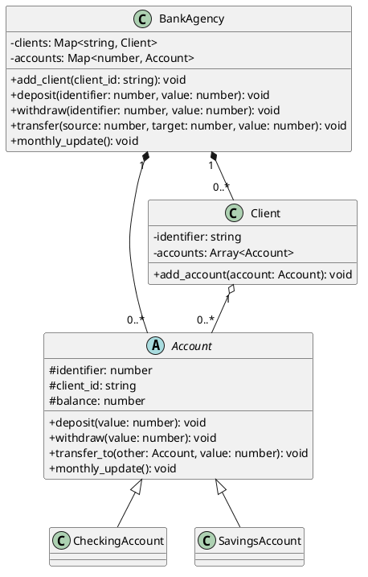

# Cadastro — contas com regras polimórficas

<toc-table />


## Intro

Uma agência cadastra clientes e abre automaticamente uma conta corrente e uma
conta poupança para cada um. As contas compartilham operações bancárias, mas
possuem regras mensais diferentes.

O objetivo principal é aplicar polimorfismo a regras de domínio: a agência
percorre contas sem conhecer sua fórmula de atualização. Como objetivo
secundário, a atividade exercita mapas para localizar contas e clientes por
identidade.

## Regras

- O `client_id` identifica um cliente; cadastrá-lo novamente não cria contas.
- Cada novo cliente recebe uma conta `CC` e uma conta `CP` em ids sequenciais.
- Depósito aumenta o saldo.
- Saque exige saldo suficiente e, quando falha, preserva o saldo.
- Transferência saca da origem e deposita no destino.
- Conta corrente reduz `R$ 20.00` no update mensal, podendo ficar negativa.
- Conta poupança aumenta o saldo em `1%` no update mensal.
- Conta inexistente produz `fail: conta nao encontrada`.

## Diagrama



## Guide

1. Modele `Account` com identidade, cliente, saldo e operações comuns. Faça a
   atualização mensal ser abstrata, pois essa regra realmente varia por tipo.
2. Crie `CheckingAccount` e `SavingsAccount`. A agência deve chamar o mesmo
   método em ambas; não deve decidir o tipo com condicionais.
3. Modele `Client` como dono da relação com suas contas e `BankAgency` como
   coordenadora dos mapas de busca. Os mapas evitam percorrer toda a coleção
   para encontrar uma identidade.
4. Implemente transferência buscando as duas contas antes do saque. Assim uma
   conta de destino ausente não produz uma retirada parcial.
5. Mantenha o `Shell` limitado a conversão, chamadas e apresentação de falhas.
   Teste as regras das contas diretamente, sem simular o terminal.

A divisão acompanha razões reais para mudança: uma conta muda quando sua regra
financeira muda, enquanto a agência muda quando o cadastro ou a coordenação
muda. O custo é manter subclasses e referências cruzadas; o benefício é que um
novo tipo de conta pode implementar `monthly_update` sem alterar a agência.

## Verificação

Execute `python3 -m unittest discover src/py` e confira criação idempotente de
clientes, operações, falhas, transferência atômica e atualização mensal de cada
tipo de conta.

## Shell

```sh
#TEST_CASE basic
$addCli Ana
$deposito 0 100
$deposito 1 200
$transf 0 1 25
$update
$show
- Clients
Ana [0, 1]
- Accounts
0:Ana:55.00:CC
1:Ana:227.25:CP
$end
```
