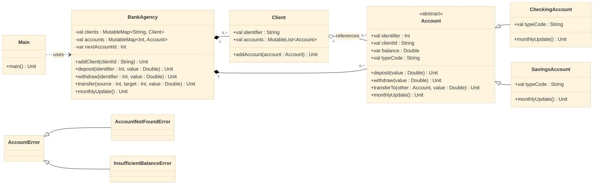

# Cadastro — contas com regras polimórficas

<!-- toc-table -->
[Intro](#intro) | [Regras](#regras) | [Diagrama](#diagrama) | [Guide](#guide) | [Verificação](#verificação) | [Shell](#shell)
-- | -- | -- | -- | -- | --
<!-- end -->


## Intro

Uma agência cadastra clientes e abre automaticamente uma conta corrente e uma
conta poupança para cada um. As contas compartilham operações bancárias, mas
possuem regras mensais diferentes.

O objetivo principal é aplicar polimorfismo a regras de domínio: a agência
percorre contas sem conhecer sua fórmula de atualização. Como objetivo
secundário, a atividade exercita mapas para localizar contas e clientes por
identidade.

## Regras

- `Account` é abstrata e possui `identifier : Int`, `clientId : String`, `balance : Double`, `typeCode : String` e `monthlyUpdate() : Unit`.
- Cada `clientId` cadastrado em `BankAgency` cria uma `CheckingAccount` (`CC`) e uma `SavingsAccount` (`CP`) com identifiers sequenciais; repetir o cadastro não altera as contas.
- `deposit(value : Double)` aumenta o saldo; `withdraw(value : Double)` exige saldo suficiente e lança `InsufficientBalanceError` sem alterar o saldo se falhar.
- `transferTo(other : Account, value : Double)` saca da origem e deposita no destino. `BankAgency.transfer` localiza ambas as contas antes de iniciar a transferência.
- A atualização mensal de `CheckingAccount` subtrai `20.0`, podendo deixar o saldo negativo; `SavingsAccount` multiplica o saldo por `1.01`.
- Conta inexistente lança `AccountNotFoundError` com a mensagem `fail: conta nao encontrada`.
- O Shell apresenta a falha de saldo como `fail: saldo insuficiente` e argumentos numéricos inválidos como `fail: argumento invalido`.

## Diagrama


```mermaid
%%{init: {"theme": "base", "themeVariables": {"fontFamily": "monospace"}}}%%
classDiagram
    direction LR

    class Account {
        <<abstract>>
        +val identifier : Int
        +val clientId : String
        +var balance : Double
        +val typeCode : String
        +deposit(value : Double) Unit
        +withdraw(value : Double) Unit
        +transferTo(other : Account, value : Double) Unit
        +monthlyUpdate() Unit
    }

    class CheckingAccount {
        +val typeCode : String
        +monthlyUpdate() Unit
    }

    class SavingsAccount {
        +val typeCode : String
        +monthlyUpdate() Unit
    }

    class Client {
        +val identifier : String
        +val accounts : MutableList~Account~
        +addAccount(account : Account) Unit
    }

    class BankAgency {
        -val clients : MutableMap~String, Client~
        -val accounts : MutableMap~Int, Account~
        -var nextAccountId : Int
        +addClient(clientId : String) Unit
        +deposit(identifier : Int, value : Double) Unit
        +withdraw(identifier : Int, value : Double) Unit
        +transfer(source : Int, target : Int, value : Double) Unit
        +monthlyUpdate() Unit
    }

    class Main {
        +main() Unit
    }

    class AccountError
    class AccountNotFoundError
    class InsufficientBalanceError

    Account <|-- CheckingAccount
    Account <|-- SavingsAccount
    AccountError <|-- AccountNotFoundError
    AccountError <|-- InsufficientBalanceError
    Client "1" o-- "0..*" Account : references
    BankAgency "1" *-- "0..*" Client
    BankAgency "1" *-- "0..*" Account
    Main ..> BankAgency : uses
```

## Guide

1. Modele `Account` com `identifier : Int`, `clientId : String`,
   `balance : Double` e as operações comuns. Faça `monthlyUpdate()` abstrato,
   pois essa regra realmente varia por tipo.
2. Crie `CheckingAccount` e `SavingsAccount`. A agência deve chamar o mesmo
   método em ambas; não deve decidir o tipo com condicionais.
3. Modele `Client` como dono da relação com suas contas e `BankAgency` como
   coordenadora dos mapas de busca. Os mapas evitam percorrer toda a coleção
   para encontrar uma identidade.
4. Implemente transferência buscando as duas contas antes do saque. Assim uma
   conta de destino ausente não produz uma retirada parcial.
5. Mantenha o `Shell` limitado a conversão, chamadas e apresentação de falhas.
   Teste as regras das contas diretamente, sem simular o terminal.

A divisão acompanha razões reais para mudança: uma conta muda quando sua regra
financeira muda, enquanto a agência muda quando o cadastro ou a coordenação
muda. O custo é manter subclasses e referências cruzadas; o benefício é que um
novo tipo de conta pode implementar `monthlyUpdate()` sem alterar a agência.

## Verificação

Execute `tko run . -l kt` para conferir criação idempotente de clientes,
operações, falhas, transferência atômica e atualização mensal de cada tipo de
conta.

## Shell

```sh
#TEST_CASE basic
$addCli Ana
$deposito 0 100
$deposito 1 200
$transf 0 1 25
$update
$show
- Clients
Ana [0, 1]
- Accounts
0:Ana:55.00:CC
1:Ana:227.25:CP
$end
```

```sh
#TEST_CASE failures preserve balances
$addCli Ana
$saque 0 1
fail: saldo insuficiente
$transf 0 9 10
fail: conta nao encontrada
$show
- Clients
Ana [0, 1]
- Accounts
0:Ana:0.00:CC
1:Ana:0.00:CP
$end
```

<!-- KOTLIN -->
