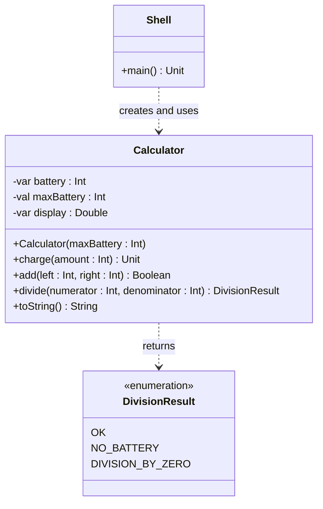

# [CHECK] Calculadora à bateria

<!-- toc-table -->
[Intro](#intro) | [Regras](#regras) | [Diagrama](#diagrama) | [Guide](#guide) | [Shell](#shell) | [Draft](#draft) | [Cheat](#cheat)
-- | -- | -- | -- | -- | -- | --
<!-- toc-table -->


## Intro

O objetivo dessa atividade é implementar uma calculadora que utiliza bateria. Se há bateria, ela executa operações de soma e divisão. É possível também mostrar a quantidade de bateria e recarregar a calculadora. Ela avisa quando está sem bateria e se há tentativa de divisão por 0.

O foco é separar a regra da calculadora das mensagens do `Shell`: a calculadora altera `display` e `battery`, enquanto o `Shell` mostra as falhas. Cada operação usa o retorno que melhor descreve suas possibilidades: `add(left: Int, right: Int): Boolean` só pode falhar por falta de bateria, e `divide(numerator: Int, denominator: Int): DivisionResult` possui dois tipos de falha.

## Regras

- Descrição
  - A calculadora possui um display `display: Double` e uma bateria `battery: Int`. Ela guarda o valor atual da bateria e o valor máximo `maxBattery: Int`.
  - O display é onde o resultado das operações é armazenado.
  - A bateria é a quantidade de energia que a calculadora possui.
  - Cada operação gasta um ponto de bateria.
  - A calculadora não pode realizar operações se não houver bateria.
  - A calculadora não pode realizar divisões por zero.
- Construtor
  - Requisição `$init maxBattery`
  - Receba o máximo de bateria como parâmetro no construtor `Calculator(maxBattery: Int)`.
- `toString`
  - Deve ser invocado na requisição `$show`.
  - Retorna a representação da calculadora no formato:
    - `display = {display:.2f}, battery = {battery}`
    - Exemplo: `display = 0.00, battery = 0`
- Recarregar
  - Requisição: `$charge amount`
  - Adiciona `amount` à bateria, mas não pode ultrapassar `maxBattery`.
  - Valores negativos não alteram a bateria.
- Somar
  - Requisição: `$sum left right`
  - Soma dois valores e guarda no display.
  - Se não houver bateria, emita a mensagem `fail: insufficient battery`.
  - O método `add(left: Int, right: Int): Boolean` retorna `true` quando realiza a soma e `false` quando não há bateria. Em caso de falha, mantém o display.
- Divisão
  - Requisição: `$div numerator denominator`
  - Divide dois valores e guarda no display.
  - Se não houver bateria, emita a mensagem `fail: insufficient battery`.
  - Se houver divisão por zero, consome um ponto de bateria, mantém o display anterior e emite a mensagem `fail: division by zero`.
  - O método `divide(numerator: Int, denominator: Int): DivisionResult` retorna `OK`, `NO_BATTERY` ou `DIVISION_BY_ZERO`.
- Separe as responsabilidades:
  - A classe Calculadora não deve conter nenhuma operação de impressão.
  - A classe Shell não deve ter lógica de negócios.

## Diagrama

`Calculator` permanece como uma classe coesa nesta etapa: bateria, display e operações fazem parte da simulação de uma calculadora. Extrair `Battery` será uma evolução possível em outro bloco, quando o ciclo de vida do componente for um objetivo explícito.


```mermaid
%%{init: { "fontFamily": "monospace" } }%%
classDiagram
    direction TB

    class DivisionResult {
        <<enumeration>>
        OK
        NO_BATTERY
        DIVISION_BY_ZERO
    }

    class Calculator {
        -var battery : Int
        -val maxBattery : Int
        -var display : Double
        +Calculator(maxBattery : Int)
        +charge(amount : Int) Unit
        +add(left : Int, right : Int) Boolean
        +divide(numerator : Int, denominator : Int) DivisionResult
        +toString() String
    }

    class Shell {
        +main() Unit
    }

    Calculator ..> DivisionResult : returns
    Shell ..> Calculator : creates and uses
```

## Guide

- Comece pelo construtor, garantindo que `display` e `battery` iniciem em `0`.
- Implemente `charge(amount: Int)` limitando a bateria a `maxBattery` e ignorando valores negativos.
- Implemente `add(left: Int, right: Int): Boolean` e `divide(numerator: Int, denominator: Int): DivisionResult`.
- No `Shell`, traduza o `false` de `add` e cada valor de `DivisionResult` para a mensagem literal definida nas regras.

Pergunta de reflexão: por que a divisão por zero mantém o `display`, mas ainda consome bateria?

- Para manter o ponto decimal independentemente da localidade do sistema, formate o display com `Locale.US`.

```kotlin
override fun toString(): String {
    return String.format(Locale.US, "display = %.2f, battery = %d", display, battery)
}
```

## Shell

### Primeira simulação

```bash
#TEST_CASE init show and charge

$init 5
$show
display = 0.00, battery = 0

```

```bash
#TEST_CASE charge

$charge 3
$show
display = 0.00, battery = 3
$charge 1
$show
display = 0.00, battery = 4
```

```bash
#TEST_CASE boundary

$charge 2
$show
display = 0.00, battery = 5
```

```bash
#TEST_CASE negative charge

$charge -2
$show
display = 0.00, battery = 5
```

```bash
#TEST_CASE reset

$init 4
$charge 2
$show
display = 0.00, battery = 2
$charge 3
$show
display = 0.00, battery = 4

```

```bash
$end
```

### Segunda simulação

```bash
#TEST_CASE sum

$init 2
$charge 2
$sum 4 3
$show
display = 7.00, battery = 1
```

```bash
#TEST_CASE drain battery

$sum 2 3
$show
display = 5.00, battery = 0
```

```bash
#TEST_CASE no battery

$sum -4 -1
fail: insufficient battery
```

```bash
#TEST_CASE recharge

$charge 1
$show
display = 5.00, battery = 1
$sum -4 -2
$show
display = -6.00, battery = 0
```

```bash
$end
```

### Terceira simulação

```bash
#TEST_CASE division

$init 3
$charge 3
$div 6 3
$show
display = 2.00, battery = 2
```

```bash
#TEST_CASE division by zero drains battery

$div 7 0
fail: division by zero
$show
display = 2.00, battery = 1
```

```bash
#TEST_CASE drain battery

$div 7 2
$div 10 2
fail: insufficient battery
$show
display = 3.50, battery = 0
```

```bash
$end
```

## Draft

<!-- links .cache/starter -->
<!-- links -->

## Cheat

<!-- links .cache/cheat -->
<!-- links -->

<!-- MERMAID -->
